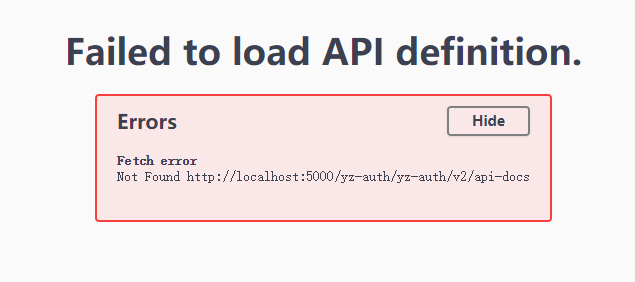
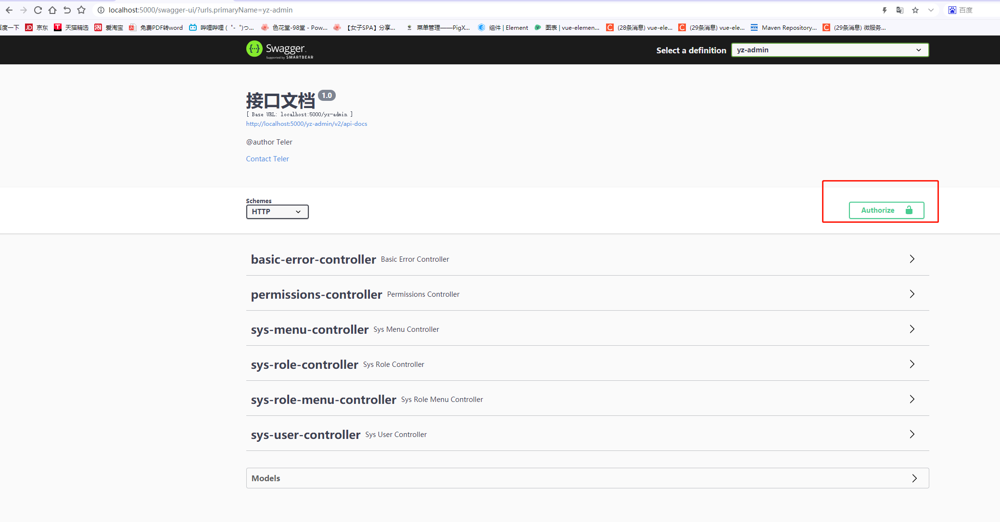

## 场景
* 在多应用的环境中，都存在网关，网关作为入口统一管理swagger会更好。这样就可以通过网关的ip:port来直接获取各个服务的文档

## 示例项目简介
* 示例项目模块介绍
  * yz-auth：服务1，无关紧要，只是一个普通的服务，继承yz-swagger
  * yz-admin：服务2，无关紧要，只是一个普通的服务，继承yz-swagger
  * yz-swagger：swagger相关
  * yz-gateway：网关模块，继承yz-swagger

## 代码继承
* 参考文档 https://blog.csdn.net/qq_41988504/article/details/120482493，但写不是很详细
* 首先一定是引入依赖，由于yz-swagger是底部的依赖，所以将依赖写入到该模块中，此处使用的版本是3.0.0
    ~~~xml
        <dependency>
                <groupId>io.springfox</groupId>
                <artifactId>springfox-swagger-ui</artifactId>
                <version>3.0.0</version>
        </dependency>
        <dependency>
            <groupId>io.springfox</groupId>
                <artifactId>springfox-boot-starter</artifactId>
                <version>3.0.0</version>
        </dependency>
        <!-- 要引入该包，而不能引入spring的web包，因为网关会报错 -->
        <dependency>
                <groupId>org.springframework</groupId>
                <artifactId>spring-web</artifactId>
                <version>5.3.10</version>
        </dependency>
    ~~~
* 在yz-swagger模块中，添加一个swagger的配置文件
    ~~~java
    package com.yongzheng;

    import org.springframework.http.HttpMethod;
    import org.springframework.beans.factory.annotation.Value;
    import org.springframework.boot.autoconfigure.condition.ConditionalOnProperty;
    import org.springframework.context.annotation.Bean;
    import org.springframework.context.annotation.Configuration;
    import springfox.documentation.builders.ApiInfoBuilder;
    import springfox.documentation.builders.PathSelectors;
    import springfox.documentation.builders.RequestHandlerSelectors;
    import springfox.documentation.service.*;
    import springfox.documentation.spi.DocumentationType;
    import springfox.documentation.spi.service.contexts.SecurityContext;
    import springfox.documentation.spring.web.plugins.Docket;

    import java.util.*;
    /**
    * @author ：liwuming
    * @date ：Created in 2022/2/15 16:19
    * @description ：
    * @modified By：
    * @version:
    */
    @Configuration
    @ConditionalOnProperty(name = "swagger.enabled", matchIfMissing = true)
    public class SwaggerConfig {

    //    @Value("${swagger.enable:true}")
    //    private Boolean enable;

        @Bean
        public Docket api() {
            return new Docket(DocumentationType.OAS_30)
                    .globalResponses(HttpMethod.GET, new ArrayList<>())
                    .globalResponses(HttpMethod.PUT, new ArrayList<>())
                    .globalResponses(HttpMethod.POST, new ArrayList<>())
                    .globalResponses(HttpMethod.DELETE, new ArrayList<>())
                    //是否启动
                    .enable(true)
                    //头部信息
                    .apiInfo(apiInfo())
                    .select()
                    /**
                    * RequestHandlerSelectors,配置要扫描接口的方式
                    * basePackage指定要扫描的包
                    * any()扫描所有，项目中的所有接口都会被扫描到
                    * none()不扫描
                    * withClassAnnotation()扫描类上的注解
                    * withMethodAnnotation()扫描方法上的注解
                    */
                    .apis(RequestHandlerSelectors.any())
                    //过滤某个路径
                    .paths(PathSelectors.any())
                    .build()
                    //协议
                    .protocols(newHashSet("https", "http"))
                    .securitySchemes(securitySchemes())
                    .securityContexts(securityContexts());
        }

        /**
        * API 页面上半部分展示信息
        */
        private ApiInfo apiInfo() {
            return new ApiInfoBuilder()
                    .title("接口文档")
                    .description("@author Teler")
                    .contact(new Contact("Teler", null, "123@qq.com"))
                    .version("1.0")
                    .build();
        }

        /**
        * 设置接口单独的授权信息
        */
        private List<SecurityScheme> securitySchemes() {
            return Collections.singletonList(new ApiKey("Authorization", "Authorization", "header"));
        }

        /**
        * 授权信息全局应用
        */
        private List<SecurityContext> securityContexts() {
            return Collections.singletonList(
                    SecurityContext.builder()
                            .securityReferences(
                                    Collections.singletonList(new SecurityReference("BASE_TOKEN",
                                            new AuthorizationScope[]{new AuthorizationScope("global", "")}
                                    )))
                            //.forPaths(PathSelectors.any())
                            .build()
            );
        }

        @SafeVarargs
        private final <T> Set<T> newHashSet(T... ts) {
            if (ts.length > 0) {
                return new LinkedHashSet<>(Arrays.asList(ts));
            }
            return null;
        }
    }
    ~~~
* 如上的代码中 List<SecurityScheme> securitySchemes() 该函数需要注意，这个函数是在接口含有权限验证时候需要传递的token字段的信息，如接口需要验证token,那么需要把对应的头字段更改为自己想要的，此处后端验证的头部字段为 Authorization。
* 配置完成以后需要配置网关，所以在yz-gateway模块中添加一个配置文件
    ~~~java
    package com.yongzheng.config;

    import org.springframework.beans.factory.annotation.Autowired;
    import org.springframework.beans.factory.annotation.Value;
    import org.springframework.cloud.gateway.route.RouteLocator;
    import org.springframework.context.annotation.Primary;
    import org.springframework.stereotype.Component;
    import org.springframework.util.CollectionUtils;
    import springfox.documentation.swagger.web.SwaggerResource;
    import springfox.documentation.swagger.web.SwaggerResourcesProvider;

    import java.util.ArrayList;
    import java.util.HashSet;
    import java.util.List;
    import java.util.Set;
    import java.util.regex.Matcher;
    import java.util.regex.Pattern;

    /**
    * @author ：liwuming
    * @date ：Created in 2022/4/29 14:12
    * @description：
    * @modified By：
    * @version:
    */
    @Component
    @Primary
    public class GatewaySwaggerResourcesProvider implements SwaggerResourcesProvider {

        /**
        * swagger3默认的url后缀 v3时默认不会拼接路由前缀 请求子服务时会缺少buseUrl
        */
        public static final String SWAGGER2URL = "/v2/api-docs";
        /**
        * 网关路由
        */
        private final RouteLocator routeLocator;

        /**
        * 网关应用名称
        */
        @Value("${spring.application.name}")
        private String self;

        @Autowired
        public GatewaySwaggerResourcesProvider(RouteLocator routeLocator) {
            this.routeLocator = routeLocator;
        }

        /**
        * 对于gateway来说这块比较重要 让swagger能找到对应的服务
        *
        * @return
        */
        @Override
        public List<SwaggerResource> get() {
            List<SwaggerResource> resources = new ArrayList<>();
            List<String> routeHosts = new ArrayList<>();
            // 获取所有可用的host：serviceId
            routeLocator.getRoutes().filter(route -> route.getUri().getHost() != null)
                    .filter(route -> !self.equals(route.getUri().getHost()))
                    // 解决不会拼接路由里面的 pattern 打开swagger时无显示问题
                    .subscribe(route -> routeHosts.add(getData(route.getPredicate().toString())+"/"+route.getUri().getHost()));
    //                .subscribe(route -> routeHosts.add(route.getUri().getHost()));

            // 记录已经添加过的server
            Set<String> dealed = new HashSet<>();
            routeHosts.forEach(instance -> {
                // 拼接url
                String url = "/" + instance.toLowerCase() + SWAGGER2URL;
                if (!dealed.contains(url)) {
                    dealed.add(url);
                    SwaggerResource swaggerResource = new SwaggerResource();
                    swaggerResource.setUrl(url);
                    swaggerResource.setName(instance);
                    swaggerResource.setSwaggerVersion("3.0.n");
                    resources.add(swaggerResource);
                }
            });
            return resources;
        }

        /**
        * 获取配置的路由name
        * @param data
        * @return
        */
        public static String getData(String data) {
            List<String> list = new ArrayList<>();
            Pattern p = Pattern.compile("(\\[[^\\]]*\\])");
            Matcher m = p.matcher(data);
            while (m.find()) {
                list.add(m.group().substring(1, m.group().length() - 1));
            }
            if (!CollectionUtils.isEmpty(list)) {
                String s = list.get(0);
                return s.substring(s.indexOf("/") + 1, s.lastIndexOf("/"));
            }
            return null;
        }
    }

    ~~
* 如上代码中有个大坑：.subscribe(route -> routeHosts.add(getData(route.getPredicate().toString())+"/"+route.getUri().getHost())); 这一句，这个可能需要根据网关的配置来决定，如果在访问的时候出现404找不到的情况下，需要debug查看一下，先跳过继续往下介绍
* 当然，如果想要访问yz-admin和yz-auth的接口，需要在对应的启动类上都加上注解 @EnableSwagger2，非常重要
* 网关的配置如下，由于可能影响swagger,所以也贴出来
    ~~~yaml
    spring:
    cloud:
        gateway:
        routes:
            - id: yz-auth
            uri: lb://yz-auth
            predicates:
                - Path=/yz-auth/**
            filters:
                - StripPrefix=1
            - id: yz-admin
            uri: lb://yz-admin
            predicates:
                - Path=/yz-admin/**
            filters:
                - StripPrefix=1
    ~~~
* 此时便可以访问了，请求地址如下：http://localhost:5000/swagger-ui/ ，此处的http://localhost:5000是网关地址
* 但是很有可能会报错，如下图：
* 
* 此时出现这个原因，就需要修改之前所说的那个问题，GatewaySwaggerResourcesProvider该类
    ~~~java
    .subscribe(route -> routeHosts.add(getData(route.getPredicate().toString())+"/"+route.getUri().getHost()));
    ~~~
* 更改为
    ~~~java
    .subscribe(route -> routeHosts.add(route.getUri().getHost()));
    ~~~
* 此时应该就可以正常访问了，但是直接说道的权限验证的问题，可以在此处添加token来发起请求
* 
* 然后填入token即可