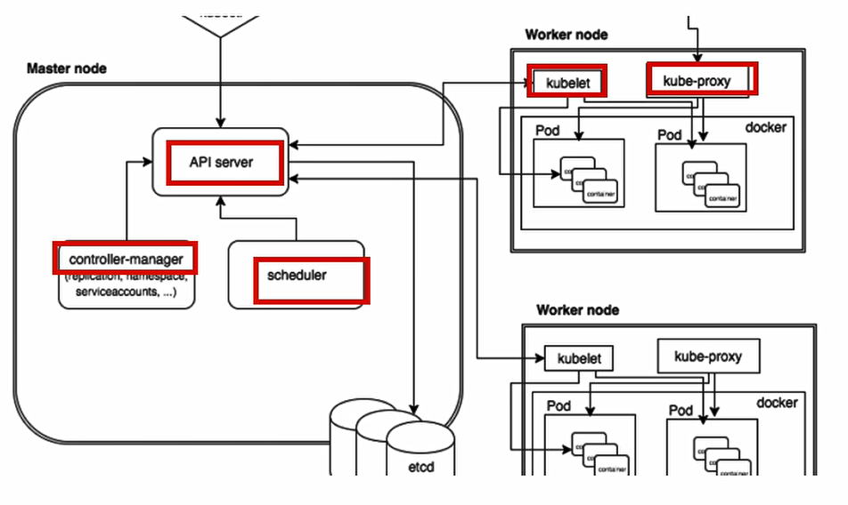
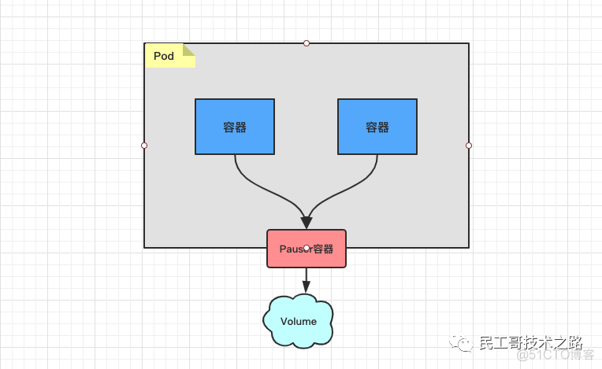
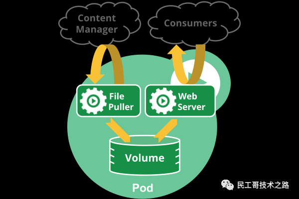
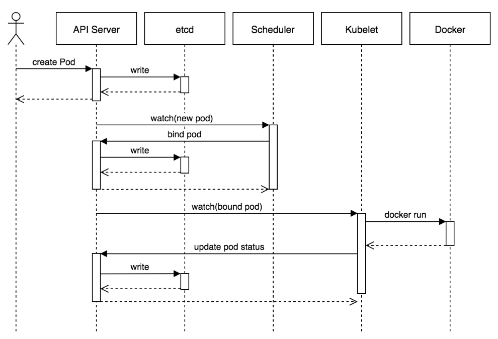

<head>
  <style>
    .c{
      font-size: 14px;
    }
    hl{
      background:#3E74;
      display:inline-block;
      padding:1px
    }
  </style>
</head>

[toc]

<font class=c>

### k8s概念
* 全称：Kubernetes
* k8s进行容器化部署
### 特性
* 自动装箱：构建于容器之上，基于资源依赖及其他约束自动完成容器部署且不影响其可用性，并通过调度机制混合关键型应用和非关键型应用的工作负载于同一节点以提升资源利用率。
* 自我修复（自我治愈）：支持容器故障后自动重启、节点故障后重新调度容器，以及其他可用节点、健康状态检查失败后关闭容器并重新创建等自我修复机制。
* 水平扩展：支持通过简单命令或UI手动水平扩展，以及基于CPU等资源负载率的自动水平扩展机制。
* 服务发现和负载均衡：k8s通过其附件组件之一的KubeDNS(或CoreDNS)为系统内置了服务发现功能，它会为每个service配置DNS名称，并允许集群内的客户端直接使用此名称发出访问请求，而service则通过iptables或ipvs内建立负载均衡机制。
* 自动发布和回滚：k8s支持“灰度”更新应用程序或其配置信息，监控更新过程中应用程序的健康状态，以确保不会同一时间杀掉所有实例，在这个过程中一旦出现故障，立马进行回滚操作。
* 密钥和配置管理：k8s的configMap实现了参数配置和Docker镜像的解耦，修改配置时无需重新build镜像，这为应用开发部署带来了很大的灵活性。另外，对于应用依赖的一些敏感数据，如用户名和密码、令牌、密钥等，k8s专门提供了Secret对象为其解耦。
* 存储编排：k8s支持Pod对象按需自动挂载不同类型的存储系统,包括节点的本地存储系统，云存储（AWS），网络存储系统（NFS、GlusterFS）。
* 批量处理执行：除了服务型应用，k8s还支持批处理作业及CI(持续集成)，如果需要，一样可用实现容器故障后恢复
### 组件

* **Master**:主控节点
  * <font color = 'red'>apiServer</font>：集群统一入口，以Restful方式，交给etcd存储，类似于网关
  * <font color = 'red'>scheduler</font>：节点调度，选择node节点应用部署
  * <font color = 'red'>controller-manager</font>：处理集群中常规的后台任务，一个资源对应一个控制器
  * <font color = 'red'>etcd</font>：存储系统，用于保存集群中相关的数据
* **Node**:工作节点
  * kubelet：Master派遣到Node上的节点代表，管理本机中的容器
  * kube-proxy：提供网络代理，负载均衡等操作

### 核心概念
  * **pod** 
    * 最小部署单位
    * 一组容器的集合
    * pod之间的容器是共享网络的
    * 生命周期是短暂的
  * **Controller**
    * 能够确保预期的pod副本数量
    * 无状态应用部署：可以简单理解为可以直接使用的容器
    * 有状态应用部署：可以简单理解为需要满足特定条件才可以使用的容器
    * 确保所有的Node运行同一个pod
    * 一次性任务和定时任务
  * **service** 
    * 定义一组pod的访问规则
    * 简单流程来讲：service作为入口，通过controller来创建pod进行部署
### 集群的部署（kubeamd方式，推荐）
  1. 集群的结构为1个Master+2个Node
  2. Master：192.168.25.128，Node：192.168.25.129，192.168.25.130
  3. 关闭selinux，一种为临时关闭，另一种为永久关闭，建议两种都用
      * 临时关闭：setenforce 0  
      * 永久关闭：sed -i '/SELINUX/s/enforcing/disabled/' /etc/selinux/config ，<font color = 'red'>**需要重启**</font>  
  4. 使用命令：sestatus查看状态
  5. 关闭swap分区，同样有临时和永久关闭两种
      * 临时关闭：swapoff -a
      * 永久关闭：sed -ri 's/.*swap.*/#&/' /etc/fstab
  6. 为三台服务器设置对用的host名称，好区分
      * Master服务器：hostnamectl set-hostname k8smaster
      * Node服务器（129）：hostnamectl set-hostname k8snode1
      * Node服务器（130）：hostnamectl set-hostname k8snode2
  7. <font color=red>在Master服务器</font>上更改hosts文件，追加三台服务器的地址和名称
     ```
     cat >> /etc/hosts <<EOF 
     192.168.25.128 k8smaster
     192.168.25.129 k8snode1
     192.168.25.130 k8snode2
     EOF
     ``` 
 8. 时间同步
    * 安装插件：yum install ntpdate -y 
    * 同步：ntpdate time.windows.com
 9. 在三台服务器上都安装Docker(可以参看印象笔记中的docker安装)
10. 在三台服务器上都安装kubelet,kubeadm,kubectl
    * 如果yum没有更改过yum源，则需要更改，此处以阿里的源为主
    * ```
      cat > /etc/yum.repos.d/kubernetes.repo << EOF 
      [kubernetes]
      name=Kubernetes
      baseurl=https://mirrors.aliyun.com/kubernetes/yum/repos/kubernetes-el7-x86_64
      enabled=1
      gpgcheck=0
      repo_gpgcheck=0
      gpgkey=https://mirrors.aliyun.com/kubernetes/yum/doc/yum-key.gpg https://mirrors.aliyun.com/kubernetes/yum/doc/rpm-package-key.gpg
      EOF
      ```
    * yum install -y kubelet-1.18.0 kubeadm-1.18.0 kubectl-1.18.0
    * 安装完成后设置为开机启动：systemctl enable kubelet
11. <font color = red>**在Master服务器上**</font>执行初始化操作
 
    ```
    kubeadm init --apiserver-advertise-address=192.168.25.128 --image-repository registry.aliyuncs.com/google_containers --kubernetes-version v1.18.0 --service-cidr=10.96.0.0/12 --pod-network-cidr=10.244.0.0/16
    ```
    * --apiserver-advertise-address=192.168.25.128：即Master的地址
    * --image-repository registry.aliyuncs.com/google_containers：镜像地址，就用阿里的
    * --kubernetes-version v1.18.0：kubernetes的版本号，即刚才yum安装指定的版本
    * --service-cidr=10.96.0.0/12：就用这个就可以了，好像挺随意的
    * --pod-network-cidr=10.244.0.0/16：就用这个就可以了，好像挺随意的
    * <hl>执行以上命令以后可能会失败，注意是有硬件要求的。至少必须是2核以上的处理器</hl>
    * 完成后可以使用docker images查看，多出很多镜像
    * 还是会有可能失败的，若容易出现的错误就是kubelet-check] Initial timeout of 40s passed.如果出现这个错误，先使用<font color=red>**kubeadm reset**</font>命令重置，然后再执行kubeadm init --kubernetes-version v1.18.0 --service-cidr=10.96.0.0/12 --pod-network-cidr=10.244.0.0/16，和原本的命令基本一样，至是去掉了两个参数--image-repository和--apiserver-advertise-address
    * 在正常执行之后是可以看到一句成功的初始化提示的
      ~~~shell
      Your Kubernetes control-plane has initialized successfully!
      ~~~
    * 然后还能看到几句建议
      ~~~shell
        mkdir -p $HOME/.kube
        sudo cp -i /etc/kubernetes/admin.conf $HOME/.kube/config
        sudo chown $(id -u):$(id -g) $HOME/.kube/config
      ~~~
    * 依次执行如上指令，这些操作还是在Master服务器上执行的，并不是Node节点上
    * 执行完成后，我们可以通过指令来查看当前的节点信息,由于目前只有一个Master节点，所以肯定也只会显示一个
      ~~~shell
        kubectl get nodes
      ~~~
  1. 分别将Node节点加入到kubeadm 
     * 想要加入到kubeadm，首先需要生成一个token,该token的生成需要在<hl>Master服务器上</hl>操作
       ~~~shell
       kubeadm token generate
       ~~~
     * 复制生成的结果，此处是 ptolu1.nkk17ae9ypd7y20a，执行如下指令：
       ~~~shell
        kubeadm token create ptolu1.nkk17ae9ypd7y20a --print-join-command --ttl=0
       ~~~ 
     * 输出的结果中就是加入kubeadm的指令，输出如下：
        ~~~shell
        kubeadm join 192.168.25.128:6443 --token ptolu1.nkk17ae9ypd7y20a     --discovery-token-ca-cert-hash sha256:3ef09ca87d986772fbe9a6645772d0a2b49b475f7e81ecc908cf78df653cfd91 
        ~~~ 
     * 在<hl>两个Node服务器中</hl>输入如上的指令，来加入kubeadm
     * 此时在Master服务器中再次输入查看节点指令，即能看到Node节点数据
        ~~~shell
        kubectl get nodes
        ~~~ 
  1. 此时获取到的状态都是NotReady，需要部署CNI网络插件
     * 由于国内网络访问国外网络的限制，需要先配置一下hosts，vi /etc/hosts
     * 将 185.199.109.133 raw.githubusercontent.com 加入进去，然后在<hl>Master服务器</hl>中执行 
       ~~~shell
       kubectl apply –f https://raw.githubusercontent.com/coreos/flannel/master/Documentation/kube- flannel.yml
       ~~~ 
     * 正常执行完成以后，输入kubectl get pods -n kube-system，可以看到一堆东西在Running,并且此时再次输入 kubectl get nodes ，所有的状态都变成了Ready

### 集群测试
* 此处以Nginx为例进行测试
  ~~~shell
  kubectl create deployment nginx --image=nginx
  ~~~
* 查看镜像下载的情况，如果是Running则表示完成了
  ~~~shell
  kubectl get pod
  ~~~
  ~~~shell
  NAME                    READY   STATUS    RESTARTS   AGE
  nginx-f89759699-b8s5v   1/1     Running   0          34s
  ~~~
* 对外暴露端口
  ~~~shell
  kubectl expose deployment nginx --port=80 --type=NodePort
  ~~~
* 查看映射的端口
  ~~~shell
  kubectl get pod,svc
  ~~~
  ~~~shell
  NAME                        READY   STATUS    RESTARTS   AGE
  pod/nginx-f89759699-b8s5v   1/1     Running   0          3m58s

  NAME                 TYPE        CLUSTER-IP     EXTERNAL-IP   PORT(S)        AGE
  service/kubernetes   ClusterIP   10.96.0.1      <none>        443/TCP        4h39m
  service/nginx        NodePort    10.98.94.126   <none>        80:30239/TCP   80s
  ~~~
* 此时访问映射的端口，此处的话是30239，通过浏览器直接访问IP:30239即可访问Nginx的主页。此处的IP可以是Master节点也可以是Node节点的IP

### 集群的部署（二进制方式）
* 参考文档,最好两边结合看：https://blog.csdn.net/qq_44078641/article/details/120049473
* <hl>后续所有操作目录尽量都不要修改，非常复杂，不然非常容易出问题</hl>
* 此方式很复杂，所以新建了两个虚拟机来完成，192.168.25.131（Master）,192.168.25.132(两个Node节点)
* 首先还是在Master和Node做系统的初始化，关闭防火墙
  ~~~shell
  systemctl stop firewalld.service
  systemctl disable firewalld.service
  systemctl status firewalld.service
  ~~~
* 关闭selinux
  ~~~shell
  setenforce 0
  sed -i '/SELINUX/s/enforcing/disabled/' /etc/selinux/config
  ~~~
* 关闭swap分区
  ~~~shell
  swapoff -a
  sed -ri 's/.swap./#&/' /etc/fstab
  ~~~
* 分别设置主机名称，Master主机名设置为m1,Node主机名设置为n1
  ~~~shell
  hostnamectl set-hostname m1
  ~~~
  ~~~shell
  hostnamectl set-hostname n1
  ~~~
* 在<hl>Master</hl>中修改Hosts信息
  ~~~shell
  cat >> /etc/hosts <<EOF 
  192.168.25.131 m1
  192.168.25.132 n1
  EOF
  ~~~
* 在<hl>Master和Node服务器中</hl>将桥接的 IPv4 流量传递到 iptables 的链，虽然不是很明白，照做
  ~~~shell
  cat > /etc/sysctl.d/k8s.conf << EOF 
  net.bridge.bridge-nf-call-ip6tables = 1
  net.bridge.bridge-nf-call-iptables = 1
  EOF
  ~~~
* 刷新生效
  ~~~shell
  sysctl --system
  ~~~
* 时间同步
  ~~~shell
  yum install ntpdate -y
  ntpdate time.windows.com
  ~~~
* 准备 cfssl 证书生成工具
  * cfssl 是一个开源的证书管理工具，使用 json 文件生成证书，相比 openssl 更方便使用。 找任意一台服务器操作，这里用 Master 节点。随便新建一个临时存放下载的目录，将下载一些文件
    ~~~shell
    wget https://pkg.cfssl.org/R1.2/cfssl_linux-amd64 
    wget https://pkg.cfssl.org/R1.2/cfssljson_linux-amd64 
    wget https://pkg.cfssl.org/R1.2/cfssl-certinfo_linux-amd64 
    chmod +x cfssl_linux-amd64 cfssljson_linux-amd64 cfssl-certinfo_linux-amd64 
    mv cfssl_linux-amd64 /usr/local/bin/cfssl 
    mv cfssljson_linux-amd64 /usr/local/bin/cfssljson 
    mv cfssl-certinfo_linux-amd64 /usr/bin/cfssl-certinfo
    ~~~
  * 创建一个工作目录并且进入
    ~~~shell
    mkdir -p ~/TLS/{etcd,k8s}
    cd ~/TLS/etcd/
    ~~~ 
  * 生成自签CA配置，注意是在~/TLS/etcd下
    ~~~shell
    cat > ca-config.json << EOF
    {
      "signing": {
        "default": {
          "expiry": "87600h"
        },
        "profiles": {
          "www": {
            "expiry": "87600h",
            "usages": [
                "signing",
                "key encipherment",
                "server auth",
                "client auth"
            ]
          }
        }
      }
    }
    EOF

    cat > ca-csr.json << EOF
    {
        "CN": "etcd CA",
        "key": {
            "algo": "rsa",
            "size": 2048
        },
        "names": [
            {
                "C": "CN",
                "L": "YuMingYu",
                "ST": "YuMingYu"
            }
        ]
    }
    EOF
    ~~~
  * 生成证书
    ~~~shell
    cfssl gencert -initca ca-csr.json | cfssljson -bare ca -
    ~~~ 
  * 执行完成以后该目录下会生成两个文件 ca.pem和ca-key.pem
  * 创建证书生成文件,由于只用到了两个虚拟机，所以hosts中只有两个，这个按实际情况修改
    ~~~shell
    cat > server-csr.json << EOF
    {
        "CN": "etcd",
        "hosts": [
        "192.168.25.131",
        "192.168.25.132"
        ],
        "key": {
            "algo": "rsa",
            "size": 2048
        },
        "names": [
            {
                "C": "CN",
                "L": "YuMingYu",
                "ST": "YuMingYu"
            }
        ]
    }
    EOF

    ~~~
* 生成证书
  ~~~shell
  cfssl gencert -ca=ca.pem -ca-key=ca-key.pem -config=ca-config.json -profile=www server-csr.json | cfssljson -bare server
  ~~~
* 执行完成将会生成 server.pem 和 server-key.pem 这两个文件
#### 部署etcd集群
* <hl>以下操作都在Master进行</hl>
* 在任意目录下下载ETC
  ~~~shell
  wget https://github.com/etcd-io/etcd/releases/download/v3.4.9/etcd-v3.4.9- linux-amd64.tar.gz
  ~~~
* 创建一个工作目录
  ~~~shell
  mkdir /opt/etcd/{bin,cfg,ssl} -p
  ~~~
* 解压下载的文件
  ~~~shell
  tar zxvf etcd-v3.4.9-linux-amd64.tar.gz
  ~~~
* 将解压的文件移动到工作目录中
  ~~~shell
  mv etcd-v3.4.9-linux-amd64/{etcd,etcdctl} /opt/etcd/bin/
  ~~~
* 创建etcd的配置文件
  ~~~shell
  cat > /opt/etcd/cfg/etcd.conf << EOF
  #[Member]
  ETCD_NAME="etcd-1"
  ETCD_DATA_DIR="/var/lib/etcd/default.etcd"
  ETCD_LISTEN_PEER_URLS="https://192.168.25.131:2380"
  ETCD_LISTEN_CLIENT_URLS="https://192.168.25.131:2379"

  #[Clustering]
  ETCD_INITIAL_ADVERTISE_PEER_URLS="https://192.168.25.131:2380"
  ETCD_ADVERTISE_CLIENT_URLS="https://192.168.25.131:2379"
  ETCD_INITIAL_CLUSTER="etcd-1=https://192.168.25.131:2380,etcd-2=https://192.168.25.132:2380"
  ETCD_INITIAL_CLUSTER_TOKEN="etcd-cluster"
  ETCD_INITIAL_CLUSTER_STATE="new"
  EOF
  ~~~
* 以上配置文件除了ETCD_INITIAL_CLUSTER是写了Master和Node的地址，其他几个配置都是Master的地址，详细参数介绍如下
  |属性|说明|
  |:---:|:---:|
  |ETCD_NAME|节点名称，集群中唯一|
  |ETCD_DATA_DIR|数据目录|
  |ETCD_LISTEN_PEER_URLS|集群通信监听地址|
  |ETCD_LISTEN_CLIENT_URLS|客户端访问监听地址|
  |ETCD_INITIAL_ADVERTISE_PEER_URLS|集群通告地址|
  |ETCD_ADVERTISE_CLIENT_URLS|客户端通告地址|
  |ETCD_INITIAL_CLUSTER|集群节点地址|
  |ETCD_INITIAL_CLUSTER_TOKEN|集群 Token|
  |ETCD_INITIAL_CLUSTER_STATE|加入集群的当前状态，new 是新集群，existing 表示加入 已有集群|
* systemd管理etcd
  ~~~shell
  cat > /usr/lib/systemd/system/etcd.service << EOF
  [Unit]
  Description=Etcd Server
  After=network.target
  After=network-online.target
  Wants=network-online.target

  [Service]
  Type=notify
  EnvironmentFile=/opt/etcd/cfg/etcd.conf
  ExecStart=/opt/etcd/bin/etcd \
  --cert-file=/opt/etcd/ssl/server.pem \
  --key-file=/opt/etcd/ssl/server-key.pem \
  --peer-cert-file=/opt/etcd/ssl/server.pem \
  --peer-key-file=/opt/etcd/ssl/server-key.pem \
  --trusted-ca-file=/opt/etcd/ssl/ca.pem \
  --peer-trusted-ca-file=/opt/etcd/ssl/ca.pem \
  --logger=zap
  Restart=on-failure
  LimitNOFILE=65536

  [Install]
  WantedBy=multi-user.target
  EOF
  ~~~
* 将之前生成的一系列证书复制到/opt/etcd/ssl目录下
  ~~~shell
  cp ~/TLS/etcd/{ca,server,server-key}.pem /opt/etcd/ssl/
  ~~~
* 此时/opt/etcd下的三个文件夹应该都已经有内容了
* <hl>将Master中的/opt/etcd整个文件夹复制到各个Node节点，此示例我们只有一个Node节点</hl>
  ~~~shell
  scp -r /opt/etcd/ root@192.168.25.132:/opt/
  ~~~
* 完成以后在<hl>Node服务器</hl>的/opt/目录下就能看到一个etcd文件夹
* <hl>将Master中的/usr/lib/systemd/system/etcd.service复制到各个Node节点，此示例我们只有一个Node节点</hl>
  ~~~shell
  scp /usr/lib/systemd/system/etcd.service root@192.168.25.132:/usr/lib/systemd/system/
  ~~~
* 在<hl>各个Node节点上</hl>修改/opt/etcd/cfg/etcf.conf，除了ETCD_INITIAL_CLUSTER属性不用修改，其他IP地址都修改成当前Node的IP地址，<hl>并且ETCD_NAME不能与Master中的名字一样</hl>
  ~~~shell
  vi /opt/etcd/cfg/etcd.conf
  ~~~
  ~~~shell
  #[Member]
  ETCD_NAME="etcd-2"
  ETCD_DATA_DIR="/var/lib/etcd/default.etcd"
  ETCD_LISTEN_PEER_URLS="https://192.168.25.132:2380"
  ETCD_LISTEN_CLIENT_URLS="https://192.168.25.132:2379"

  #[Clustering]
  ETCD_INITIAL_ADVERTISE_PEER_URLS="https://192.168.25.132:2380"
  ETCD_ADVERTISE_CLIENT_URLS="https://192.168.25.132:2379"
  ETCD_INITIAL_CLUSTER="etcd-1=https://192.168.25.131:2380,etcd-2=https://192.168.25.132:2380"
  ETCD_INITIAL_CLUSTER_TOKEN="etcd-cluster"
  ETCD_INITIAL_CLUSTER_STATE="new"
  ~~~
* 此时分别在<hl>Master和Node</hl>都开启服务并设置开机启动
  ~~~shell
  systemctl daemon-reload
  systemctl start etcd
  systemctl enable etcd
  ~~~
* 如果没有报错，那可以来查看下运行状态
  ~~~shell
  systemctl status etcd.service
  ~~~
#### Docker的安装
* 该步骤直接参照印象笔记的Docker即可
* 设置Docker的开机启动
  ~~~shell
  systemctl daemon-reload
  systemctl start docker
  systemctl enable docker
  ~~~
#### 部署Master节点
* <hl>以下操作在Master完成</hl>
* 自签证书颁发机构（CA）
  ~~~shell
  cd ~/TLS/k8s
  ~~~
  ~~~shell
  cat > ca-config.json << EOF
  {
    "signing": {
      "default": {
        "expiry": "87600h"
      },
      "profiles": {
        "kubernetes": {
          "expiry": "87600h",
          "usages": [
              "signing",
              "key encipherment",
              "server auth",
              "client auth"
          ]
        }
      }
    }
  }
  EOF
  cat > ca-csr.json << EOF
  {
      "CN": "kubernetes",
      "key": {
          "algo": "rsa",
          "size": 2048
      },
      "names": [
          {
              "C": "CN",
              "L": "Beijing",
              "ST": "Beijing",
              "O": "k8s",
              "OU": "System"
          }
      ]
  }
  EOF
  ~~~
* 生成证书,完成后目录下会生成 ca.pem 和 ca-key.pem
  ~~~shell
  cfssl gencert -initca ca-csr.json | cfssljson -bare ca -
  ~~~
* 使用自签CA签发kube-apiserver https证书，创建证书申请文件,<hl>hosts中的IP地址不要去乱删，把Master和Node都添加进去</hl>
  ~~~shell
  cat > server-csr.json << EOF
  {
      "CN": "kubernetes",
      "hosts": [
        "10.0.0.1",
        "127.0.0.1",
        "192.168.25.131",
        "192.168.25.132",
        "kubernetes",
        "kubernetes.default",
        "kubernetes.default.svc",
        "kubernetes.default.svc.cluster",
        "kubernetes.default.svc.cluster.local"
      ],
      "key": {
          "algo": "rsa",
          "size": 2048
      },
      "names": [
          {
              "C": "CN",
              "L": "BeiJing",
              "ST": "BeiJing",
              "O": "k8s",
              "OU": "System"
          }
      ]
  }
  EOF
  ~~~
* 生成证书,完成后当前目录下会生成server.pem 和 server-key.pem文件
  ~~~shell
  cfssl gencert -ca=ca.pem -ca-key=ca-key.pem -config=ca-config.json -profile=kubernetes server-csr.json | cfssljson -bare server
  ~~~
* 需要下载一个kubernetes-server-linux-amd64
  ~~~shell
  wget https://dl.k8s.io/v1.20.15/kubernetes-server-linux-amd64.tar.gz
  ~~~
* 解压
  ~~~shell
  tar zxvf kubernetes-server-linux-amd64.tar.gz 
  ~~~
* 进入到解压出的文件的bin目录
  ~~~shell
  cd kubernetes/server/bin
  ~~~
* 新建一个文件夹
  ~~~shell
  mkdir -p /opt/kubernetes/{bin,cfg,ssl,logs} 
  ~~~
* 将kubernetes/server/bin下的几个文件复制到新建的工作目录中
  ~~~shell
  cp kube-apiserver kube-scheduler kube-controller-manager /opt/kubernetes/bin
  ~~~
* 并且把kubectl复制到/usr/bin下
  ~~~shell
  cp kubectl /usr/bin/
  ~~~
* 新建配置文件,配置说明在下面
  ~~~shell
  cat > /opt/kubernetes/cfg/kube-apiserver.conf << EOF
  KUBE_APISERVER_OPTS="--logtostderr=false \\
  --v=2 \\
  --log-dir=/opt/kubernetes/logs \\
  --etcd-servers=https://192.168.25.131:2379,https://192.168.25.132:2379 \\
  --bind-address=192.168.25.131 \\
  --secure-port=6443 \\
  --advertise-address=192.168.25.131 \\
  --allow-privileged=true \\
  --service-cluster-ip-range=10.0.0.0/24 \\
  --enable-admission-plugins=NamespaceLifecycle,LimitRanger,ServiceAccount,ResourceQuota,NodeRestriction \\
  --authorization-mode=RBAC,Node \\
  --enable-bootstrap-token-auth=true \\
  --token-auth-file=/opt/kubernetes/cfg/token.csv \\
  --service-node-port-range=30000-32767 \\
  --kubelet-client-certificate=/opt/kubernetes/ssl/server.pem \\
  --kubelet-client-key=/opt/kubernetes/ssl/server-key.pem \\
  --tls-cert-file=/opt/kubernetes/ssl/server.pem  \\
  --tls-private-key-file=/opt/kubernetes/ssl/server-key.pem \\
  --client-ca-file=/opt/kubernetes/ssl/ca.pem \\
  --service-account-key-file=/opt/kubernetes/ssl/ca-key.pem \\
  --service-account-issuer=api \\
  --service-account-signing-key-file=/opt/kubernetes/ssl/server-key.pem \\
  --etcd-cafile=/opt/etcd/ssl/ca.pem \\
  --etcd-certfile=/opt/etcd/ssl/server.pem \\
  --etcd-keyfile=/opt/etcd/ssl/server-key.pem \\
  --requestheader-client-ca-file=/opt/kubernetes/ssl/ca.pem \\
  --proxy-client-cert-file=/opt/kubernetes/ssl/server.pem \\
  --proxy-client-key-file=/opt/kubernetes/ssl/server-key.pem \\
  --requestheader-allowed-names=kubernetes \\
  --requestheader-extra-headers-prefix=X-Remote-Extra- \\
  --requestheader-group-headers=X-Remote-Group \\
  --requestheader-username-headers=X-Remote-User \\
  --enable-aggregator-routing=true \\
  --audit-log-maxage=30 \\
  --audit-log-maxbackup=3 \\
  --audit-log-maxsize=100 \\
  --audit-log-path=/opt/kubernetes/logs/k8s-audit.log"
  EOF
  ~~~
* 需要修改的就是etcd-servers要设置Master和Node,bind-address和advertise-address要设置成Master
* 具体属性配置说明如下：
  |属性|说明|
  |:-:|:-:|
  |--logtostderr|启用日志|
  |--v|日志等级|
  |--log-dir|日志目录|
  |--etcd-servers|etcd集群地址|
  |--bind-address|监听地址|
  |--secure-port |https安全端口|
  |--advertise-address|集群通告地址|
  |--allow-privileged|启动授权|
  |--service-cluster-ip-range|Service虚拟IP地址段|
  |--enable-admission-plugins|准入控制模块|
  |--authorization-mode|认证授权,启用RBAC授权和节点自管理|
  |--enable-bootstrap-token-auth|启用TLS bootstrap机制|
  |--token-auth-file|bootstrap token文件|
  |--service-node-port-range|Service nodeport类型默认分配端口范围|
  |--kubelet-client-xxx|apiserver访问kubelet客户端证书|
  |--tls-xxx-file|apiserver https证书|
  |1.20版本必须加的参数|--service-account-issuer,--service-account-signing-key-file|
  |--etcd-xxxfile|连接etcd集群证书|
  |--audit-log-xxx|审计日志|
* 将之前生成的证书都复制到/opt/kubernetes/ssl/
  ~~~shell
  cp ~/TLS/k8s/ca*pem ~/TLS/k8s/server*pem /opt/kubernetes/ssl/
  ~~~
* 启用TLS bootstrapping机制，创建Token文件
  ~~~shell
  cat > /opt/kubernetes/cfg/token.csv << EOF
  4136692876ad4b01bb9dd0988480ebba,kubelet-bootstrap,10001,"system:node-bootstrapper"
  EOF
  ~~~
* 上述的4136692876ad4b01bb9dd0988480ebba是token,可以自己生成来替换
  ~~~shell
  head -c 16 /dev/urandom | od -An -t x | tr -d ' '
  ~~~
* systemd管理apiserver
  ~~~shell
  cat > /usr/lib/systemd/system/kube-apiserver.service << EOF
  [Unit]
  Description=Kubernetes API Server
  Documentation=https://github.com/kubernetes/kubernetes

  [Service]
  EnvironmentFile=/opt/kubernetes/cfg/kube-apiserver.conf
  ExecStart=/opt/kubernetes/bin/kube-apiserver \$KUBE_APISERVER_OPTS
  Restart=on-failure

  [Install]
  WantedBy=multi-user.target
  EOF
  ~~~
* 启动并设置开机启动
  ~~~shell
  systemctl daemon-reload
  systemctl start kube-apiserver 
  systemctl enable kube-apiserver
  ~~~
* 查看是否启动成功
  ~~~shell
  ps aux|grep kube
  ~~~
* 部署kube-controller-manager，创建配置文件
  ~~~shell
  cat > /opt/kubernetes/cfg/kube-controller-manager.conf << EOF
  KUBE_CONTROLLER_MANAGER_OPTS="--logtostderr=false \\
  --v=2 \\
  --log-dir=/opt/kubernetes/logs \\
  --leader-elect=true \\
  --kubeconfig=/opt/kubernetes/cfg/kube-controller-manager.kubeconfig \\
  --bind-address=127.0.0.1 \\
  --allocate-node-cidrs=true \\
  --cluster-cidr=10.244.0.0/16 \\
  --service-cluster-ip-range=10.0.0.0/24 \\
  --cluster-signing-cert-file=/opt/kubernetes/ssl/ca.pem \\
  --cluster-signing-key-file=/opt/kubernetes/ssl/ca-key.pem  \\
  --root-ca-file=/opt/kubernetes/ssl/ca.pem \\
  --service-account-private-key-file=/opt/kubernetes/ssl/ca-key.pem \\
  --cluster-signing-duration=87600h0m0s"
  EOF
  ~~~
* 配置参数说明如下：
  |属性|说明|
  |:-:|:-:|
  |--kubeconfig|连接apiserver配置文件|
  |--leader-elect |当该组件启动多个时,自动选举(HA)|
  |--cluster-signing-cert-file|自动为kubelet颁发证书的CA,apiserver保持一致|
  |--cluster-signing-key-file|自动为kubelet颁发证书的CA,apiserver保持一致|
* 生成kubeconfig文件,切换到 ~/TLS/k8s下
  ~~~shell
  cd ~/TLS/k8s
  ~~~
* 创建证书请求文件
  ~~~shell
  cat > kube-controller-manager-csr.json << EOF
  {
    "CN": "system:kube-controller-manager",
    "hosts": [],
    "key": {
      "algo": "rsa",
      "size": 2048
    },
    "names": [
      {
        "C": "CN",
        "L": "BeiJing", 
        "ST": "BeiJing",
        "O": "system:masters",
        "OU": "System"
      }
    ]
  }
  EOF
  ~~~
* 生成证书
  ~~~shell
  cfssl gencert -ca=ca.pem -ca-key=ca-key.pem -config=ca-config.json -profile=kubernetes kube-controller-manager-csr.json | cfssljson -bare kube-controller-manager
  ~~~
* 生成kubeconfig文件(以下是shell命令,直接在shell终端执行,一次性复制进去执行)，<hl>KUBE_APISERVER地址换成Master的地址</hl>
  ~~~shell
  KUBE_CONFIG="/opt/kubernetes/cfg/kube-controller-manager.kubeconfig"
  KUBE_APISERVER="https://192.168.25.131:6443"

  kubectl config set-cluster kubernetes \
    --certificate-authority=/opt/kubernetes/ssl/ca.pem \
    --embed-certs=true \
    --server=${KUBE_APISERVER} \
    --kubeconfig=${KUBE_CONFIG}
    
  kubectl config set-credentials kube-controller-manager \
    --client-certificate=./kube-controller-manager.pem \
    --client-key=./kube-controller-manager-key.pem \
    --embed-certs=true \
    --kubeconfig=${KUBE_CONFIG}
    
  kubectl config set-context default \
    --cluster=kubernetes \
    --user=kube-controller-manager \
    --kubeconfig=${KUBE_CONFIG}
    
  kubectl config use-context default --kubeconfig=${KUBE_CONFIG}

  ~~~
* systemd管理controller-manager
  ~~~shell
  cat > /usr/lib/systemd/system/kube-controller-manager.service << EOF
  [Unit]
  Description=Kubernetes Controller Manager
  Documentation=https://github.com/kubernetes/kubernetes

  [Service]
  EnvironmentFile=/opt/kubernetes/cfg/kube-controller-manager.conf
  ExecStart=/opt/kubernetes/bin/kube-controller-manager \$KUBE_CONTROLLER_MANAGER_OPTS
  Restart=on-failure

  [Install]
  WantedBy=multi-user.target
  EOF
  ~~~
* 启动并设置开机自启
  ~~~shell
  systemctl daemon-reload
  systemctl start kube-controller-manager
  systemctl enable kube-controller-manager
  ~~~
* 检查是否正常启动
  ~~~shell
  ps aux|grep kube-controller-manager
  ~~~
* 部署kube-scheduler，创建配置文件
  ~~~shell
  cat > /opt/kubernetes/cfg/kube-scheduler.conf << EOF
  KUBE_SCHEDULER_OPTS="--logtostderr=false \\
  --v=2 \\
  --log-dir=/opt/kubernetes/logs \\
  --leader-elect \\
  --kubeconfig=/opt/kubernetes/cfg/kube-scheduler.kubeconfig \\
  --bind-address=127.0.0.1"
  EOF
  ~~~
  |属性|说明|
  |:-:|:-:|
  |--kubeconfig|连接apiserver配置文件|
  |--leader-elect |当该组件启动多个时,自动选举(HA)。|
* 生成kubeconfig文件
* 切换到工作目录
  ~~~shell
  cd ~/TLS/k8s
  ~~~
* 创建证书请求文件
  ~~~shell
  cat > kube-scheduler-csr.json << EOF
  {
    "CN": "system:kube-scheduler",
    "hosts": [],
    "key": {
      "algo": "rsa",
      "size": 2048
    },
    "names": [
      {
        "C": "CN",
        "L": "BeiJing",
        "ST": "BeiJing",
        "O": "system:masters",
        "OU": "System"
      }
    ]
  }
  EOF
  ~~~
* 生成证书
  ~~~shell
  cfssl gencert -ca=ca.pem -ca-key=ca-key.pem -config=ca-config.json -profile=kubernetes kube-scheduler-csr.json | cfssljson -bare kube-scheduler
  ~~~
* 生成kubeconfig文件,<hl>KUBE_APISERVER要修改成Master的地址</hl>，直接一整段复制执行即可
  ~~~shell
  KUBE_CONFIG="/opt/kubernetes/cfg/kube-scheduler.kubeconfig"
  KUBE_APISERVER="https://192.168.25.131:6443"

  kubectl config set-cluster kubernetes \
    --certificate-authority=/opt/kubernetes/ssl/ca.pem \
    --embed-certs=true \
    --server=${KUBE_APISERVER} \
    --kubeconfig=${KUBE_CONFIG}
    
  kubectl config set-credentials kube-scheduler \
    --client-certificate=./kube-scheduler.pem \
    --client-key=./kube-scheduler-key.pem \
    --embed-certs=true \
    --kubeconfig=${KUBE_CONFIG}
    
  kubectl config set-context default \
    --cluster=kubernetes \
    --user=kube-scheduler \
    --kubeconfig=${KUBE_CONFIG}
    
  kubectl config use-context default --kubeconfig=${KUBE_CONFIG}

  ~~~
* systemd管理scheduler
  ~~~shell
  cat > /usr/lib/systemd/system/kube-scheduler.service << EOF
  [Unit]
  Description=Kubernetes Scheduler
  Documentation=https://github.com/kubernetes/kubernetes

  [Service]
  EnvironmentFile=/opt/kubernetes/cfg/kube-scheduler.conf
  ExecStart=/opt/kubernetes/bin/kube-scheduler \$KUBE_SCHEDULER_OPTS
  Restart=on-failure

  [Install]
  WantedBy=multi-user.target
  EOF
  ~~~
* 启动并设置开机自启
  ~~~shell
  systemctl daemon-reload
  systemctl start kube-scheduler
  systemctl enable kube-scheduler
  ~~~
* 检查是否启动成功
  ~~~shell
  ps aux|grep kube-scheduler
  ~~~
* 生成kubectl连接集群的证书 
  ~~~shell
  cat > admin-csr.json <<EOF
  {
    "CN": "admin",
    "hosts": [],
    "key": {
      "algo": "rsa",
      "size": 2048
    },
    "names": [
      {
        "C": "CN",
        "L": "BeiJing",
        "ST": "BeiJing",
        "O": "system:masters",
        "OU": "System"
      }
    ]
  }
  EOF
  ~~~
* 生成证书
  ~~~shell
  cfssl gencert -ca=ca.pem -ca-key=ca-key.pem -config=ca-config.json -profile=kubernetes admin-csr.json | cfssljson -bare admin
  ~~~
* 生成kubeconfig文件,<hl>KUBE_APISERVER需要修改成Master的ID</hl>
  ~~~shell
  mkdir /root/.kube

  KUBE_CONFIG="/root/.kube/config"
  KUBE_APISERVER="https://192.168.25.131:6443"

  kubectl config set-cluster kubernetes \
    --certificate-authority=/opt/kubernetes/ssl/ca.pem \
    --embed-certs=true \
    --server=${KUBE_APISERVER} \
    --kubeconfig=${KUBE_CONFIG}
    
  kubectl config set-credentials cluster-admin \
    --client-certificate=./admin.pem \
    --client-key=./admin-key.pem \
    --embed-certs=true \
    --kubeconfig=${KUBE_CONFIG}
    
  kubectl config set-context default \
    --cluster=kubernetes \
    --user=cluster-admin \
    --kubeconfig=${KUBE_CONFIG}
    
  kubectl config use-context default --kubeconfig=${KUBE_CONFIG}

  ~~~
* 查看集群的状态
  ~~~shell
  kubectl get cs
  ~~~
* <hl>有一个坑，如果虚拟机的内存太小，那么将会出现kubectl TLS handshake timeout，需要调整虚拟机的内存大小</hl>
* 有可能出现一些异常，如下
  ~~~shell
  Warning: v1 ComponentStatus is deprecated in v1.19+
  NAME                 STATUS      MESSAGE                                                                                               ERROR
  etcd-0               Unhealthy   Get "https://192.168.25.131:2379/health": dial tcp 192.168.25.131:2379: connect: connection refused   
  scheduler            Healthy     ok                                                                                                    
  controller-manager   Healthy     ok                                                                                                    
  etcd-1               Unhealthy   HTTP probe failed with statuscode: 503 
  ~~~
* 显示的是etcd0和etcd1有问题，一般这种关闭防火墙，并且重新启动即可
  ~~~shell
  systemctl restart etcd
  ~~~
* 正常运行结果如下
  ~~~shell
  NAME                 STATUS    MESSAGE             ERROR
  controller-manager   Healthy   ok                  
  scheduler            Healthy   ok                  
  etcd-0               Healthy   {"health":"true"}   
  etcd-1               Healthy   {"health":"true"}  
  ~~~
* 授权kubelet-bootstrap用户允许请求证书
  ~~~shell
  kubectl create clusterrolebinding kubelet-bootstrap \
  --clusterrole=system:node-bootstrapper \
  --user=kubelet-bootstrap
  ~~~
#### 部署Work Node
* <hl>在Node中新建一个工作目录</hl>
  ~~~shell
  mkdir -p /opt/kubernetes/{bin,cfg,ssl,logs} 
  ~~~
* <hl>在Master中</hl>进入到之前下载的kubernetes文件夹，此处是/usr/local/下，这个文件是之前kubernetes-server-linux-amd64.tar.gz解压出来的
  ~~~shell
  cd /usr/local/tmp/kubernetes/server/bin/
  ~~~
* 发送kubelet  kube-proxy到Node节点
  ~~~shell
  scp kubelet  kube-proxy root@192.168.25.132:/opt/kubernetes/bin/
  ~~~
* 同时也要复制一份到本机
  ~~~shell
  cp  kubelet  kube-proxy /opt/kubernetes/bin/
  ~~~
* <hl>以下操作都将在Master节点中完成</hl>
* 创建配置文件,<hl>需要注意的是--hostname-override不能重复，此处Node只有一个所以问题不大</hl>
  ~~~shell
  cat > /opt/kubernetes/cfg/kubelet.conf << EOF
  KUBELET_OPTS="--logtostderr=false \\
  --v=2 \\
  --log-dir=/opt/kubernetes/logs \\
  --hostname-override=m1 \\
  --network-plugin=cni \\
  --kubeconfig=/opt/kubernetes/cfg/kubelet.kubeconfig \\
  --bootstrap-kubeconfig=/opt/kubernetes/cfg/bootstrap.kubeconfig \\
  --config=/opt/kubernetes/cfg/kubelet-config.yml \\
  --cert-dir=/opt/kubernetes/ssl \\
  --pod-infra-container-image=registry.cn-hangzhou.aliyuncs.com/google-containers/pause-amd64:3.0"
  EOF
  ~~~
  |属性|说明|
  |:-:|:-:|
  |--hostname-override|显示名称,集群唯一(不可重复)|
  |--network-plugin|启用CNI|
  |--kubeconfig|空路径,会自动生成,后面用于连接apiserver|
  |--bootstrap-kubeconfig|首次启动向apiserver申请证书|
  |--config|配置文件参数|
  |--cert-dir|kubelet证书目录|
  |--pod-infra-container-image|管理Pod网络容器的镜像 init container|
* 创建yaml文件
  ~~~shell
  cat > /opt/kubernetes/cfg/kubelet-config.yml << EOF
  kind: KubeletConfiguration
  apiVersion: kubelet.config.k8s.io/v1beta1
  address: 0.0.0.0
  port: 10250
  readOnlyPort: 10255
  cgroupDriver: cgroupfs
  clusterDNS:
  - 10.0.0.2
  clusterDomain: cluster.local 
  failSwapOn: false
  authentication:
    anonymous:
      enabled: false
    webhook:
      cacheTTL: 2m0s
      enabled: true
    x509:
      clientCAFile: /opt/kubernetes/ssl/ca.pem 
  authorization:
    mode: Webhook
    webhook:
      cacheAuthorizedTTL: 5m0s
      cacheUnauthorizedTTL: 30s
  evictionHard:
    imagefs.available: 15%
    memory.available: 100Mi
    nodefs.available: 10%
    nodefs.inodesFree: 5%
  maxOpenFiles: 1000000
  maxPods: 110
  EOF
  ~~~
* 生成kubelet初次加入集群引导kubeconfig文件，<hl>KUBE_APISERVER是Master的IP，TOKEN是之前定义的TOKEN</hl>
  ~~~shell
  KUBE_CONFIG="/opt/kubernetes/cfg/bootstrap.kubeconfig"
  KUBE_APISERVER="https://192.168.25.131:6443" # apiserver IP:PORT
  TOKEN="4136692876ad4b01bb9dd0988480ebba" # 与token.csv里保持一致  /opt/kubernetes/cfg/token.csv 

  # 生成 kubelet bootstrap kubeconfig 配置文件
  kubectl config set-cluster kubernetes \
    --certificate-authority=/opt/kubernetes/ssl/ca.pem \
    --embed-certs=true \
    --server=${KUBE_APISERVER} \
    --kubeconfig=${KUBE_CONFIG}
    
  kubectl config set-credentials "kubelet-bootstrap" \
    --token=${TOKEN} \
    --kubeconfig=${KUBE_CONFIG}
    
  kubectl config set-context default \
    --cluster=kubernetes \
    --user="kubelet-bootstrap" \
    --kubeconfig=${KUBE_CONFIG}
    
  kubectl config use-context default --kubeconfig=${KUBE_CONFIG}

  ~~~
* systemd管理kubelet
  ~~~shell
  cat > /usr/lib/systemd/system/kubelet.service << EOF
  [Unit]
  Description=Kubernetes Kubelet
  After=docker.service

  [Service]
  EnvironmentFile=/opt/kubernetes/cfg/kubelet.conf
  ExecStart=/opt/kubernetes/bin/kubelet \$KUBELET_OPTS
  Restart=on-failure
  LimitNOFILE=65536

  [Install]
  WantedBy=multi-user.target
  EOF
  ~~~
* 启动并设置开机自启
  ~~~shell
  systemctl daemon-reload
  systemctl start kubelet
  systemctl enable kubelet
  ~~~
* 查看运行结果
  ~~~shell
  kubectl get csr
  ~~~
* 此处出现了一个错误，提示No Resources found，检查kubelet是否启动成功
  ~~~shell
  systemctl status kubelet
  ~~~
* 发现kubelet启动失败了，这个时候就要查看日志来判断哪里错误
  ~~~shell
  journalctl -u kubelet --no-pager
  ~~~
* 输出了一大堆，核心的几句
  ~~~shell
  Jun 28 22:07:11 m1 systemd[5536]: Failed at step EXEC spawning /opt/kubernetes/bin/kubelet: No such file or directory
  Jun 28 22:07:11 m1 systemd[1]: kubelet.service: main process exited, code=exited, status=203/EXEC
  Jun 28 22:07:11 m1 systemd[1]: Unit kubelet.service entered failed state.
  Jun 28 22:07:11 m1 systemd[1]: kubelet.service failed.
  Jun 28 22:07:12 m1 systemd[1]: kubelet.service holdoff time over, scheduling restart.
  Jun 28 22:07:12 m1 systemd[1]: Stopped Kubernetes Kubelet.
  Jun 28 22:07:12 m1 systemd[1]: start request repeated too quickly for kubelet.service
  ~~~
* 很明显是/opt/kubernetes/bin没有找到对应的执行文件，添加进入再次启动即可
  ~~~shell
  systemctl start kubelet
  ~~~
* 再次查看未授权的信息,这边的输出结果截图是已经授权后的了，不用在意
  ~~~shell
  kubectl get csr
  ~~~
  ~~~shell
  NAME                                                   AGE   SIGNERNAME                                    REQUESTOR           CONDITION
  node-csr-fv4jkgp1x4nGsL11St3bbOVZfJYXSpC5KNbe680daGQ   21m   kubernetes.io/kube-apiserver-client-kubelet   kubelet-bootstrap   Approved,Issued
  ~~~
* 允许kubelet节点申请，node-csr开头的字符串也就是上图中对应的Name字段
  ~~~shell
  kubectl certificate approve  node-csr-fv4jkgp1x4nGsL11St3bbOVZfJYXSpC5KNbe680daGQ
  ~~~
* 查看节点状态
  ~~~shell
  kubectl get nodes
  ~~~~
  ~~~shell
  NAME   STATUS     ROLES    AGE   VERSION
  m1     NotReady   <none>   18m   v1.20.15
  ~~~
#### 部署kube-proxy
* 创建配置文件
  ~~~shell
  cat > /opt/kubernetes/cfg/kube-proxy.conf << EOF
  KUBE_PROXY_OPTS="--logtostderr=false \\
  --v=2 \\
  --log-dir=/opt/kubernetes/logs \\
  --config=/opt/kubernetes/cfg/kube-proxy-config.yml"
  EOF
  ~~~
* 配置参数文件
  ~~~shell
  cat > /opt/kubernetes/cfg/kube-proxy-config.yml << EOF
  kind: KubeProxyConfiguration
  apiVersion: kubeproxy.config.k8s.io/v1alpha1
  bindAddress: 0.0.0.0
  metricsBindAddress: 0.0.0.0:10249
  clientConnection:
    kubeconfig: /opt/kubernetes/cfg/kube-proxy.kubeconfig
  hostnameOverride: k8s-master1
  clusterCIDR: 10.244.0.0/16
  EOF
  ~~~
* 生成kube-proxy证书文件
  ~~~shell
  cd ~/TLS/k8s
  ~~~
  ~~~shell
  cat > kube-proxy-csr.json << EOF
  {
    "CN": "system:kube-proxy",
    "hosts": [],
    "key": {
      "algo": "rsa",
      "size": 2048
    },
    "names": [
      {
        "C": "CN",
        "L": "BeiJing",
        "ST": "BeiJing",
        "O": "k8s",
        "OU": "System"
      }
    ]
  }
  EOF
  ~~~
  ~~~shell
  cfssl gencert -ca=ca.pem -ca-key=ca-key.pem -config=ca-config.json -profile=kubernetes kube-proxy-csr.json | cfssljson -bare kube-proxy
  ~~~
* 生成kube-proxy.kubeconfig文件
  ~~~shell
  KUBE_CONFIG="/opt/kubernetes/cfg/kube-proxy.kubeconfig"
  KUBE_APISERVER="https://192.168.25.131:6443"

  kubectl config set-cluster kubernetes \
    --certificate-authority=/opt/kubernetes/ssl/ca.pem \
    --embed-certs=true \
    --server=${KUBE_APISERVER} \
    --kubeconfig=${KUBE_CONFIG}
    
  kubectl config set-credentials kube-proxy \
    --client-certificate=./kube-proxy.pem \
    --client-key=./kube-proxy-key.pem \
    --embed-certs=true \
    --kubeconfig=${KUBE_CONFIG}
    
  kubectl config set-context default \
    --cluster=kubernetes \
    --user=kube-proxy \
    --kubeconfig=${KUBE_CONFIG}
    
  kubectl config use-context default --kubeconfig=${KUBE_CONFIG}

  ~~~
* systemd管理kube-proxy
  ~~~shell
  cat > /usr/lib/systemd/system/kube-proxy.service << EOF
  [Unit]
  Description=Kubernetes Proxy
  After=network.target

  [Service]
  EnvironmentFile=/opt/kubernetes/cfg/kube-proxy.conf
  ExecStart=/opt/kubernetes/bin/kube-proxy \$KUBE_PROXY_OPTS
  Restart=on-failure
  LimitNOFILE=65536

  [Install]
  WantedBy=multi-user.target
  EOF
  ~~~
* 启动并设置开机自启
  ~~~shell
  systemctl daemon-reload
  systemctl start kube-proxy
  systemctl enable kube-proxy
  ~~~
#### 部署网络组件(Calico)
* Calico是一个纯三层的数据中心网络方案，是目前Kubernetes主流的网络方案。
* 下载一个yaml文件，此处临时存放在/usr/local/tmp下
  ~~~shell
  wget https://docs.projectcalico.org/v3.10/manifests/calico.yaml
  kubectl apply -f calico.yaml
  kubectl get pods -n kube-system
  ~~~
  ~~~shell
  NAME                                       READY   STATUS    RESTARTS   AGE
  calico-kube-controllers-7854b85cf7-95btc   1/1     Running   0          2m49s
  calico-node-fgj2x                          1/1     Running   0          2m55s
  calico-node-sgxgh                          1/1     Running   0          2m55s
  ~~~
* 再次查看节点状态已经变成了Ready
  ~~~shell
  kubectl get nodes
  ~~~
  ~~~shell
  NAME   STATUS   ROLES    AGE   VERSION
  m1     Ready    <none>   56m   v1.20.15
  ~~~
* 授权apiserver访问kubelet
  ~~~shell
  cat > apiserver-to-kubelet-rbac.yaml << EOF
  apiVersion: rbac.authorization.k8s.io/v1
  kind: ClusterRole
  metadata:
    annotations:
      rbac.authorization.kubernetes.io/autoupdate: "true"
    labels:
      kubernetes.io/bootstrapping: rbac-defaults
    name: system:kube-apiserver-to-kubelet
  rules:
    - apiGroups:
        - ""
      resources:
        - nodes/proxy
        - nodes/stats
        - nodes/log
        - nodes/spec
        - nodes/metrics
        - pods/log
      verbs:
        - "*"
  ---
  apiVersion: rbac.authorization.k8s.io/v1
  kind: ClusterRoleBinding
  metadata:
    name: system:kube-apiserver
    namespace: ""
  roleRef:
    apiGroup: rbac.authorization.k8s.io
    kind: ClusterRole
    name: system:kube-apiserver-to-kubelet
  subjects:
    - apiGroup: rbac.authorization.k8s.io
      kind: User
      name: kubernetes
  EOF
  ~~~
  ~~~shell
  kubectl apply -f apiserver-to-kubelet-rbac.yaml
  ~~~
#### 新增WorkNode节点
* <hl>这个步骤就是将Master的文件传到Node上</hl>
  ~~~shell
  scp -r /opt/kubernetes root@192.168.25.132:/opt/
  scp -r /usr/lib/systemd/system/{kubelet,kube-proxy}.service root@192.168.25.132:/usr/lib/systemd/system
  scp -r /opt/kubernetes/ssl/ca.pem root@192.168.25.132:/opt/kubernetes/ssl/
  ~~~
* <hl>在各个Node节点上</hl>删除证书文件
  ~~~shell
  rm -f /opt/kubernetes/cfg/kubelet.kubeconfig 
  rm -f /opt/kubernetes/ssl/kubelet*
  ~~~
* 修改主机名
  ~~~shell
  vi /opt/kubernetes/cfg/kubelet.conf
  ~~~
* 其实只要修改一个参数：--hostname-override，每个节点的名称必须不同，修改后如下
  ~~~text
  KUBELET_OPTS="--logtostderr=false \
  --v=2 \
  --log-dir=/opt/kubernetes/logs \
  --hostname-override=n1 \
  --network-plugin=cni \
  --kubeconfig=/opt/kubernetes/cfg/kubelet.kubeconfig \
  --bootstrap-kubeconfig=/opt/kubernetes/cfg/bootstrap.kubeconfig \
  --config=/opt/kubernetes/cfg/kubelet-config.yml \
  --cert-dir=/opt/kubernetes/ssl \
  --pod-infra-container-image=registry.cn-hangzhou.aliyuncs.com/google-containers/pause-amd64:3.0"
  ~~~
* 同时yaml中也要修改
  ~~~shell
  vi /opt/kubernetes/cfg/kube-proxy-config.yml
  ~~~
  ~~~yaml
  kind: KubeProxyConfiguration
  apiVersion: kubeproxy.config.k8s.io/v1alpha1
  bindAddress: 0.0.0.0
  metricsBindAddress: 0.0.0.0:10249
  clientConnection:
    kubeconfig: /opt/kubernetes/cfg/kube-proxy.kubeconfig
  hostnameOverride: n1
  clusterCIDR: 10.244.0.0/16
  ~~~
* 启动并设置开机自启
  ~~~shell
  systemctl daemon-reload
  systemctl start kubelet kube-proxy
  systemctl enable kubelet kube-proxy
  ~~~
* 此时在<hl>Master上查看未授权的证书申请</hl>,可以看到多出来一条信息
  ~~~shell
  kubectl get csr
  ~~~
  ~~~shell
  NAME                                                   AGE   SIGNERNAME                                    REQUESTOR           CONDITION
  node-csr-fv4jkgp1x4nGsL11St3bbOVZfJYXSpC5KNbe680daGQ   98m   kubernetes.io/kube-apiserver-client-kubelet   kubelet-bootstrap   Approved,Issued
  node-csr-ndvq1aTCncleLJwc6IOaNUJ3yetBiFxDuzNukH7jTqw   50s   kubernetes.io/kube-apiserver-client-kubelet   kubelet-bootstrap   Pending
  ~~~
* 授权
  ~~~shell
  kubectl certificate approve node-csr-ndvq1aTCncleLJwc6IOaNUJ3yetBiFxDuzNukH7jTqw
  ~~~
* 此时再查看节点信息，<hl>注意需要等待一会,好几分钟</hl>
  ~~~shell
  kubectl get nodes
  ~~~
  ~~~shell
  NAME   STATUS   ROLES    AGE     VERSION
  m1     Ready    <none>   85m     v1.20.15
  n1     Ready    <none>   4m41s   v1.20.15
  ~~~
* 测试k8s集群
  ~~~shell
  kubectl create deployment nginx --image=nginx
  kubectl expose deployment nginx --port=80 --type=NodePort
  kubectl get pod,svc
  ~~~
  ~~~shell
  NAME                         READY   STATUS    RESTARTS   AGE
  pod/nginx-6799fc88d8-dkppb   1/1     Running   0          21m

  NAME                 TYPE        CLUSTER-IP   EXTERNAL-IP   PORT(S)        AGE
  service/kubernetes   ClusterIP   10.0.0.1     <none>        443/TCP        26h
  service/nginx        NodePort    10.0.0.127   <none>        80:30800/TCP   21m
  ~~~
* 此时通过浏览器访问 http://192.168.25.132:30800/ 或者 http://192.168.25.131:30800/ 就可以看到Nginx的主页面了

### Kubernetes集群命令工具kubectl
#### kubectl概述
* kubectl是Kubernetes的集群命令行工具，通过kubectl能对集群本身进行管理，并能在集群上进行容器化应用部署和安装
#### 命令
* 讲解几个比较重要的命令
* 删除pod，比较特殊，如果直接删除pod会自动重启，可以删除deployment/nodeport/statefulset解决,这三个分别是三种控制器，后面会学到，以deployment为例
  ~~~shell
  kubectl get deployment
  kubectl delete deployment [deployment_name]
  ~~~
* 查询所有的service服务
  ~~~shell
  kubectl get svc
  ~~~
* 删除指定的Service
  ~~~shell
  kubectl delete service [service_name]
  ~~~
* 由于命令较多，参看
* >https://blog.csdn.net/qq_27184497/article/details/121765335

### yaml文件初了解
* 通常来讲，一般是不会使用 kubectl create 指令去创建资源的，而是通过yaml的形式，如下是一个简单yaml示例，该形式也叫做资源清单文件
    ~~~yaml
    # API版本号，可以通过 kubectl api-versions来获取版本
    APIVersion: apps/v1
    # 资源类型：可以通过 kubectl api-resources 来获取资源类型
    kind: Deployment
    # 资源元数据
    Metadata:
      name: Nginx-deployment
      labels:
        app: Nginx
    # 资源规格
    spec:
      # 副本数量
      replicas: 3
      # 标签选择器
      selector:
        matchLabels:
          app: Nginx
      # Pod模板
      template:
        Metadata:
          labels:
            app: Nginx
        # Pod规格
        spec:
          # 容器配置
          containers:
          - name: Nginx
            image: Nginx:1.15.4
            ports:
            - containerPort: 80
    ~~~
* 快速编写yaml文件(方式一)
  ~~~shell
  kubectl create deployment web --image=nginx -o yaml --dry-run
  ~~~
* kubectl create deployment web --image=nginx 表示生成一个名为web的资源，-o yaml表示输出yaml文件，--dry-run表示尝试，并不是真正执行
* 输出结果如下
    ~~~yaml
    apiVersion: apps/v1
    kind: Deployment
    metadata:
      creationTimestamp: null
      labels:
        app: web
      name: web
    spec:
      replicas: 1
      selector:
        matchLabels:
          app: web
      strategy: {}
      template:
        metadata:
          creationTimestamp: null
          labels:
            app: web
        spec:
          containers:
          - image: nginx
            name: nginx
            resources: {}
    status: {}
    ~~~
* 如果想要以文件形式输出，那么也可以追加一段输出的指令
  ~~~shell
  kubectl create deployment web --image=nginx -o yaml --dry-run > my.yaml
  ~~~
* 快速编写yaml文件(方式二)
* 该方式的前提是已经安装了资源,输出到文件my.yaml，如果只想要打印出来去掉 --export > my.yaml即可
  ~~~shell
  kubectl get deployment nginx -o=yaml --export > my.yaml
  ~~~~

### Pod详解
#### Pod的基本概念
* Pod是k8s中的最小部署单元
* k8s不会直接处理容器，而是Pod，Pod是由一个或多个容器组成的
* 一个Pod中的容器共享网络命名空间
* Pod是短暂的，每次启动都会生成一个新的ID

#### Pod存在的意义
* Pod是多进程设计，即每个Pod中包含多个容器，每个容器中包含一个应用
* Pod存在也是为了亲密性应用。即Pod中的应用之间能够互相交互。同时也满足网络间的调用

#### Pod实现机制
* 共享网络机制
  * 
  * 一个Pod中含有多个业务容器，在每个业务容器生成后都会将信息加入到根容器（Pause）之中
  * 根容器（Pause）自己拥有独立的IP和Namespace
  * 这样的话所有的容器都能在同一个Namespace下共享网络
* 共享存储机制
  * 
  * Pod中将会存在一个数据卷，而所有的容器都将通过这个共享的数据卷来共享存储

#### Pod镜像拉取策略
* pod镜像拉取策略可以通过imagePullPolicy字段配置镜像拉取策略
    ~~~yaml
    spec:
      containers:
        - name: nginx
          image: nginx:1.14
          imagePullPolicy: Always
    ~~~
  |值|说明|
  |:-:|:-:|
  |IfNotPresent|默认值，镜像在宿主机上不存在时才拉取|
  |Always|每次创建pod都会重新拉取一次镜像|
  |Never|永远不会主动拉取镜像，使用本地镜像，需要你手动拉取镜像下来|
#### <span id="11">Pod 资源限制</span>
* 顾名思义，在Master和Node之间的节点，可能性能不大一样。
* Pod可以对节点进行要求限制，看如下的yaml
    ~~~yaml
    apiVersion: v1
    kind: Pod
    metadata:
      name: stress-pod
    spec:
      containers:
      - name: stress
        image: ikubernetes/stress-ng
        command: ["/usr/bin/stress-ng", "-c 1", "-m 1", "--metrics-brief"]
        resources:
          requests: #下阈值，最小阈值
            memory: "128Mi"
            cpu: "200m"
          limits:  #上阈值，最大阈值
            memory: "512Mi"
            cpu: "400m"
    ~~~
* 它限定了CPU和内存的上下阈值，request是最低保障，服务节点必须得满足该条件，limits 是限制，表示内存和CPU的使用不允许超过该限制，CPU的值是以m为单位的，简单理解200M=0.2核，400m=0.4核

#### Pod重启策略
* 即容器的退出后，需要做什么
    ~~~yaml
    apiVersion: v1
    kind: Pod
    metadata:
      name: nginx-pod
    spec:
      restartPolicy: Always
      containers:
        - name: nginx-pod
          image: nginx
    ~~~
  |值|说明|
  |:-:|:-:|
  |Always|pod中容器不论如何停止都将自动重启|
  |OnFailure|Pod中容器非正常停止会自动重启，正常停止不会重启|
  |Never|Pod中容器不论以任何方式停止，都不会自动重启|

#### 容器的健康检查
* Pod中容器的声明周期的两个钩子函数， PostStart 与 PreStop，其中， PostStart 是在容器创建后立即执行的，而 preStop 这个钩子函数则是在容器终止之前执行的，除了上面两个钩子函数之外，还有一项配置会影响到容器的生命周期，那就是健康检查的探针。
* 在 Kubernetes 集群中，我们可以通过配置 liveness probe（存活探针）和 readingess probe（可读性探针）来影响容器的生存周期
* liveness probe（存活探针）：
  * 该探针主要功能是确定你的应用程序是否正在运行，通俗点将就是是否还活着。一般来说，如果你的程序一旦崩溃了， Kubernetes 就会立刻知道这个程序已经终止了，继而杀死该程序，而后会根据上面所提到过的Pod重启策略来进行后续的操作
  * 其支持三种方式的健康检查
    |值|说明|
    |:-:|:-:|
    |exec|执行一段Shell命令,返回码为0则表示成功|
    |http|检测某个 http 请求|
    |tcpSocket|使用此配置， kubelet 将尝试在指定端口上打开容器的套接字。如果可以建立连接，容器被认为是健康的，如果不能就认为是失败的。实际上就是检查端口|
  * 如下就是三种的示例 
    ~~~yaml
    apiVersion: v1
    kind: Pod
    metadata:
      name: liveness-exec
      labels:
        test: liveness
    spec:
      containers:		//容器
      - name: liveness	//容器名字
        image: busybox		//镜像
        args:			//args
        - /bin/sh
        - -c
        - touch /tmp/healthy; sleep 30; rm -rf /tmp/healthy; sleep 600
        livenessProbe:	//存活检查
          exec:
            command:	//命令
            - cat
            - /tmp/healthy
          initialDelaySeconds: 5	 // 延迟探测时间
          periodSeconds: 5			// 执行探测频率
    ~~~ 
  * 如上的配置代表：初次启动时延后5秒，之后每隔5秒执行一次cat /tmp/healthy 命令，如果命令执行成功了，则返回0，kubelet 就会认为当前这个容器是存活 
    ~~~yaml
    apiVersion: v1
    kind: Pod
    metadata:
      labels:
        test: liveness
      name: liveness-http
    spec:
      containers:
      - name: liveness
        image: cnych/liveness
        args:
        - /server
        livenessProbe:
          httpGet:
            path: /healthz	//路径
            port: 8080	//端口
            httpHeaders:
            - name: X-Custom-Header	//headers 名称
              value: Awesome	//headers value
          initialDelaySeconds: 3	 // 延迟探测时间
          periodSeconds: 3	// 执行探测频率
    ~~~
  *  如上的配置代表：初次启动时延后3秒，之后每隔3秒执行一次，向该探针将向容器中的 server 的8080端口发送一个 HTTP GET 请求，如果 server 的 /heathyz 路径的 handler 返回一个成功的返回码，kubelet 就会认定该容器是活着
      ~~~yaml
      apiVersion: v1
      kind: Pod
      metadata:
        name: goproxy
        labels:
          app: goproxy
      spec:
        containers:
        - name: goproxy
          image: cnych/goproxy
          ports:
          - containerPort: 8080
          readinessProbe:
            tcpSocket:
              port: 8080
            initialDelaySeconds: 5
            periodSeconds: 10
          livenessProbe:
            tcpSocket:
              port: 8080
            initialDelaySeconds: 15
            periodSeconds: 20
      ~~~      
    * 如上，同时使用了readingess probe 和 liveness probe，容器启动后5秒后，kubelet将发送第一个readiness probe（可读性探针）。 该探针会去连接容器的8080端，如果连接成功，则该 Pod 将被标记为就绪状态。然后Kubelet将每隔10秒钟执行一次该检查。除了readiness probe之外，该配置还包括liveness probe。 容器启动15秒后，kubelet将运行第一个 liveness probe。 就像readiness probe一样，这将尝试去连接到容器的8080端口。如果liveness probe失败，容器将被杀死
* readingess probe（可读性探针）： 
  * 确定容器是否已经就绪可以接收流量过来了。这个探针通俗点讲就是说是否准备好了，现在可以开始工作了。只有当 Pod 中的容器都处于就绪状态的时候kubelet 才会认定该 Pod 处于就绪状态，因为一个 Pod 下面可能会有多个容器。如果处于非就绪状态就会将他从我们的工作队列中移除

#### Pod的创建
* 先查看下Pod的时序图
* 
* 用户提交创建Pod请求，可以通过API Server的Rest API,也可用kubectl命令行工具，支持json和yaml
* API Server处理用户请求，并将Pod数据存储到Etcd数据库中
* Schedeuler通过API Server的watch机制，监听到要创建新的Pod
* Schedeuler通过算法给pod分配节点，并将pod和对应节点绑定的信息交给apiserver，apiserver写到etcd。
* kubelet从apiserver获取需要创建的pod信息，调用CNI接口给pod创建pod网络，调用CRI接口去启动容器，调用CSI进行存储卷的挂载。
* kubelet调用Docker去创建容器，并将状态返回给API Server,在etcd中进行存储

#### 影响Pod调度的因素
* Pod的调度是指 Scheduler调度Pod到某一个节点之上，而有几个因素会影响到调度的结果
* Pod 资源限制，也就是之前提到的 <hl>[资源限制](#11)</hl>,它会淘汰一部分不满足的节点
* 节点选择器：简单理解，不同的节点被分成了不同的组，如environment:dev/prd/deloy，我们可以指定选择器来避开一些不满足的节点,environment并不是固定的，可以是任意键值对，如下：nodeSelector
    ~~~yaml
    apiVersion: v1
    kind: Pod
    metadata:
      name: podexample
    spec:
      nodeSelector:
        environment: dev    #自定义 k/v形式
      containers:
      - name: nginx
        image: nginx:1.15
    ~~~
* 如上就是节点选择器，当然前提是各个节点都有对应的K-V标签,这个需要去设置。首先是获取Node信息
  ~~~shell
  kubectl get nodes -o wide
  ~~~
  ~~~shell
  NAME        STATUS   ROLES    AGE    VERSION   INTERNAL-IP      EXTERNAL-IP   OS-IMAGE                KERNEL-VERSION           CONTAINER-RUNTIME
  k8smaster   Ready    master   4d6h   v1.18.0   192.168.25.128   <none>        CentOS Linux 7 (Core)   3.10.0-1160.el7.x86_64   docker://20.10.17
  k8snode1    Ready    <none>   4d4h   v1.18.0   192.168.25.129   <none>        CentOS Linux 7 (Core)   3.10.0-1160.el7.x86_64   docker://20.10.17
  k8snode2    Ready    <none>   4d4h   v1.18.0   192.168.25.130   <none>        CentOS Linux 7 (Core)   3.10.0-1160.el7.x86_64   docker://20.10.17
  ~~~
* 设置标签，k8smaster就是上面的对应的Name属性
  ~~~shell
  kubectl label node  k8smaster environment=dev
  ~~~
* 查看结果，其中有一段就是environment=dev
  ~~~shell
  kubectl get nodes --show-labels
  ~~~
  ~~~shell
  k8smaster   Ready    master   4d6h   v1.18.0   beta.kubernetes.io/arch=amd64,beta.kubernetes.io/os=linux,environment=dev,kubernetes.io/arch=amd64,kubernetes.io/hostname=k8smaster,kubernetes.io/os=linux,node-role.kubernetes.io/master=
  k8snode1    Ready    <none>   4d4h   v1.18.0   beta.kubernetes.io/arch=amd64,beta.kubernetes.io/os=linux,kubernetes.io/arch=amd64,kubernetes.io/hostname=k8snode1,kubernetes.io/os=linux
  k8snode2    Ready    <none>   4d4h   v1.18.0   beta.kubernetes.io/arch=amd64,beta.kubernetes.io/os=linux,kubernetes.io/arch=amd64,kubernetes.io/hostname=k8snode2,kubernetes.io/os=linux
  ~~~
* 节点亲和性：有点类似于节点选择器，但是功能更为强大一些，且支持匹配
  * 硬亲和（requiredDuringSchedulingIgnoredDuringExecutio）：必须满足约束条件，否则失败
    ~~~yaml
    apiVersion: v1
    kind: Pod
    metadata:
      name: nodeaffinity #pod名称
      namespace: dev
    spec:
      containers:
      - name: nginx
        image: nginx: latest
      affinity:  #亲和性设置
        nodeAffinity: #设置node亲和性
          requiredDuringSchedulingIgnoredDuringExecution: # 硬限制
            nodeSelectorTerms:
            - matchExpressions: # 匹配env的值在["aa","bb"]中的标签
              - key: nodeenv
                operator: In
                values: ["aa","bb"]
    ~~~ 
  * 软亲和（preferredDuringSchedulingIgnoredDuringExecution）：如果有对应标签则优先运行到该节点，如果没有则随机
    ~~~yaml
    apiVersion: v1
    kind: Pod
    metadata:
      name: with-node-affinity-pre
    spec:
      affinity:
        nodeAffinity:
          preferredDuringSchedulingIgnoredDuringExecution: #软亲和
          - weight: 1
            preference:
              matchExpressions:
              - key: group
                operator: In 
                values:
                - otherprod
      containers:
      - name: webdemo
        image: nginx:1.15
    ~~~
  * 污点/容忍度：该属性其实是节点本身的属性，为节点添加污点属性，来让Pod避免分配到不适合的节点上
    * 查看节点的污点属性
      ~~~shell
      kubectl describe node k8smaster | grep Taint
      ~~~ 
    * 污点值有三个：
      * NoSchedule：一定不被调度
      * PreferNoSchdule：尽量不被调度
      * NoExecute：不会调度，同时也会驱逐该节点上已经存在的Pod
    * 为某个节点添加污点,env_role=yes是自定义的K-V形式（目前看下来是用于污点容忍），NoSchedule也就是上面提到的三种类型
        ~~~shell
        kubectl taint node k8snode1 env_role=yes:NoSchedule
        ~~~ 
    * 此时再次创建pod，就会发现不会在k8snode1上创建
      ~~~shell
      kubectl create deployment web --image=nginx
      kubectl get pods -o wide
      ~~~ 
      ~~~shell
      NAME                    READY   STATUS    RESTARTS   AGE   IP           NODE       NOMINATED NODE   READINESS GATES
      nginx-f89759699-b8s5v   1/1     Running   2          10d   10.244.2.4   k8snode2   <none>           <none>
      web-5dcb957ccc-pdj58    1/1     Running   0          46s   10.244.2.5   k8snode2   <none>           <none>
      ~~~
    * 如果想要删除污点，格式有点奇怪，注意最后有个-
      ~~~shell
      kubectl taint node k8snode1 env_role:NoSchedule-
      ~~~ 
    * 污点容忍介绍：该配置还是在pod的yaml中完成，先给出一个示例,
        ~~~yaml
        apiVersion: v1
        kind: Namespace
        metadata:
          name: dev

        ---

        apiVersion: v1
        kind: Pod
        metadata:
          name: nginx-pod
          namespace: dev
        spec:
          containers:
          - name: nginx
            image: nginx:1.17.1
          # 污点容忍
          tolerations:
            #自定义的Key
          - key: "env_role"
            #条件
            operator: "Equal"
            value: "yes"
            effect: "NoSchedule"
        ~~~
    * 如上，即使配置了污点：NoSchedule，但是只要在Pod配置了污点容忍，那还是会有可能被调度到该节点上  


### Controller
#### 概念
* controller是在集群上管理和运行容器的对象，pod通过controller来实现应用的运维比如伸缩，滚动升级等。pod和controller之间通过label标签建立联系。

#### deployment控制器
* 该Controller是最常用的一个，它的主要应用场景：
  * 部署无状态的应用
  * 管理Pod和ReplicaSet
  * 部署，滚动升级等功能
* 最简单的部署方式,但这种只会在测试使用，一般都会使用yaml形式
  ~~~shell
  kubectl create deployment web --image=nginx
  ~~~
* 使用导出查看nginx镜像所使用的yaml文件
  ~~~shell
  kubectl create deployment web --image=nginx -o yaml --dry-run >web.yaml
  ~~~
* 获得如下
    ~~~yaml
    apiVersion: apps/v1
    kind: Deployment
    metadata:
      creationTimestamp: null
      labels:
        app: web
      name: web
    spec:
      replicas: 1
      selector:
        matchLabels:
          app: web
      strategy: {}
      template:
        metadata:
          creationTimestamp: null
          labels:
            app: web
        spec:
          containers:
          - image: nginx
            name: nginx
            resources: {}
    status: {}
    ~~~
* 核心的部分是 <hl>spec.selector.matchLabels 和 spec.template.metadata.labels</hl> 这两个属性，所以Controller与Pod是通过label去关联的，这两个值必须匹配
* 通过指令加载yaml来完成部署
  ~~~shell
  kubectl apply -f web.yaml 
  ~~~
* 此时外网是无法访问的，需要对外发布，测试的时候可以使用指令来发布，但是正常情况下还是通过yaml形式，我们先输出一份示例的yaml
  ~~~shell
  kubectl expose deployment web --port=80 --type=NodePort --target-port=80 --name=web1 -o yaml >web1.yaml
  ~~~
    ~~~yaml
    apiVersion: v1
    kind: Service
    metadata:
      creationTimestamp: "2022-07-12T03:02:15Z"
      labels:
        app: web
      managedFields:
      - apiVersion: v1
        fieldsType: FieldsV1
        fieldsV1:
          f:metadata:
            f:labels:
              .: {}
              f:app: {}
          f:spec:
            f:externalTrafficPolicy: {}
            f:ports:
              .: {}
              k:{"port":80,"protocol":"TCP"}:
                .: {}
                f:port: {}
                f:protocol: {}
                f:targetPort: {}
            f:selector:
              .: {}
              f:app: {}
            f:sessionAffinity: {}
            f:type: {}
        manager: kubectl
        operation: Update
        time: "2022-07-12T03:02:14Z"
      name: web1
      namespace: default
      resourceVersion: "1188263"
      selfLink: /api/v1/namespaces/default/services/web1
      uid: 467b933b-4bcb-4253-abe4-19c5c882eaec
    spec:
      clusterIP: 10.96.86.75
      externalTrafficPolicy: Cluster
      ports:
      - nodePort: 31388
        port: 80
        protocol: TCP
        targetPort: 80
      selector:
        app: web
      sessionAffinity: None
      type: NodePort
    status:
      loadBalancer: {}
    ~~~
* 同样，也要加载yaml来使之生效
  ~~~shell
  kubectl apply -f web1.yaml
  ~~~ 
* 启动完成后可以查看服务的端口等信息
  ~~~shell
  kubectl get pods,svc
  ~~~
  ~~~shell
  NAME                 TYPE        CLUSTER-IP     EXTERNAL-IP   PORT(S)        AGE
  service/kubernetes   ClusterIP   10.96.0.1      <none>        443/TCP        16d
  service/nginx        NodePort    10.98.94.126   <none>        80:30239/TCP   15d
  service/web1         NodePort    10.96.86.75    <none>        80:31388/TCP   26h
  ~~~
* 此时就可以通过ip:31388来访问该Nginx了

#### SatefulSet控制器
* 首先先介绍一下无状态和有状态服务的差异
* 无状态
  * 多个服务实例对于同一个用户请求的响应结果是完全一致的
  * 服务之间没有依赖关系，停止启动都不会影响其他pod
  * 多个Pod创建的顺序是没有顺序的
  * 可以任意的伸缩和扩容
* 有状态
  * 每个Pod会被分配一个唯一序号
  * Pod启动,更新,销毁是按顺序进行
  * 稳定的网络标识: Pod主机名,DNS地址不会随着Pod被重新调度而发生变化
  * 稳定的持久化存储: Pod被重新调度后,仍然能挂载原有的PV,从而保证了数据的完整性和一致性
* 创建一个有状态的应用，示例sts.yaml如下，<hl>这种yaml中间带三个横线是表示多个不同的yaml文件，其实就是把创建Pod和Service服务的yaml放在了一个文件里，所以执行这段之后既会创建Pod也会创建Service服务</hl>
    ~~~yaml
    apiVersion: v1
    kind: Service
    metadata:
      name: nginx
      labels:
        app: nginx
    spec:
      ports:
      - port: 80
        name: web
        #此处必须是None
      clusterIP: None
      selector:
        app: nginx

    ---

    apiVersion: apps/v1
    # 需要加上这一段
    kind: StatefulSet
    metadata:
      name: nginx-statefulset
      namespace: default
    spec:
      # 指定使用的service
      serviceName: nginx
      replicas: 3
      selector:
        matchLabels:
          app: nginx
      template:
        metadata:
          labels:
            app: nginx
        spec:
          containers:
          - name: nginx
            image: nginx:latest
            ports:
            - containerPort: 80
    ~~~
* 创建pod
  ~~~shell
  kubectl apply -f sts.yaml
  ~~~
* 查看
  ~~~shell
  kubectl get pods,svc
  ~~~
  ~~~shell
  NAME                   READY   STATUS    RESTARTS   AGE
  nginx-statefulset-0    1/1     Running   0          2m41s
  nginx-statefulset-1    1/1     Running   0          2m5s
  nginx-statefulset-2    1/1     Running   0          14s
  web-5dcb957ccc-9drxt   1/1     Running   0          3d23h

  
  NAME                 TYPE        CLUSTER-IP      EXTERNAL-IP   PORT(S)        AGE
  service/kubernetes   ClusterIP   10.96.0.1       <none>        443/TCP        21d
  service/nginx        ClusterIP   None            <none>        80/TCP         21m
  service/web          NodePort    10.103.99.111   <none>        80:31738/TCP   157m
  ~~~
* 如上，三个Pod都有各自唯一的名称，且名为nginx的服务中CLUSTER-IP为None,这种也被称为无头Service

#### DaemonSet控制器
* DaemonSet确保集群中每个（部分）node运行一份pod副本，当node加入集群时创建pod，当node离开集群时回收pod。如果删除DaemonSet，其创建的所有pod也被删除，DaemonSet中的pod覆盖整个集群。
* 如上概念，这个控制器的应用场景如 日志收集logstash
* 以下是一份网上给出的yaml示例，此处先要了解该控制器的特点为主
    ~~~yaml
    apiVersion: apps/v1
    kind: DaemonSet
    metadata:
      name: nginx-daemonset
      labels:
        app: nginx
    spec:
      selector:
        matchLabels:
          app: nginx
      template:
        metadata:
          labels:
            app: nginx
        spec:
          containers:
          - name: nginx
            image: nginx:1.13.12
            ports:
            - containerPort: 80

    ~~~
* 创建容器
  ~~~shell
  kubectl apply -f ds.yaml
  ~~~
* 查看
  ~~~shell
  kubectl get pods -o wide
  ~~~
  ~~~shell
  NAME                    READY   STATUS    RESTARTS   AGE     IP            NODE       NOMINATED NODE   READINESS GATES
  nginx-daemonset-p24v9   1/1     Running   0          6m55s   10.244.1.16   k8snode1   <none>           <none>
  nginx-daemonset-sb5st   1/1     Running   0          6m55s   10.244.2.20   k8snode2   <none>           <none>
  ~~~
* 如上发现了一个问题，即并没有在主节点上创建Pod,这个是因为官方并不推荐在主节点上去创建，如果想要在主节点也创建，则需要加入一个字段
    ~~~yaml
    apiVersion: apps/v1
    kind: DaemonSet
    metadata:
      name: nginx-daemonset
      labels:
        app: nginx
    spec:
      selector:
        matchLabels:
          app: nginx
      template:
        metadata:
          labels:
            app: nginx
        spec:
          containers:
          - name: nginx
            image: nginx:1.13.12
            ports:
            - containerPort: 80
          tolerations:
          - key: node-role.kubernetes.io/master
            effect: NoSchedule
    ~~~
* 当然需要先删除之前创建的Pod
  ~~~shell
  kubectl delete daemonset --all
  ~~~
* 再依次执行刚才的操作
  ~~~shell
  kubectl apply -f ds.yaml
  kubectl get pods -o wide
  ~~~
  ~~~shell
  NAME                    READY   STATUS    RESTARTS   AGE    IP            NODE        NOMINATED NODE   READINESS GATES
  nginx-daemonset-94wj5   1/1     Running   0          5m3s   10.244.0.5    k8smaster   <none>           <none>
  nginx-daemonset-n4vsb   1/1     Running   0          5m3s   10.244.2.21   k8snode2    <none>           <none>
  nginx-daemonset-nczm8   1/1     Running   0          5m3s   10.244.1.17   k8snode1    <none>           <none>
  ~~~
* 很明显，DaemonSet是会在每个节点上都创建一个Pod,由于没有环境去测试，正常来讲如果删除或者新增节点，它会自动在新节点上添加该Pod

#### 升级
* 所谓升级，即应用的版本升级，而在创建应用的时候是可以指定应用的版本的，还是以nginx的yaml为示例
    ~~~yaml
    apiVersion: apps/v1
    kind: Deployment
    metadata:
      creationTimestamp: null
      labels:
        app: web
      name: web
    spec:
      replicas: 1
      selector:
        matchLabels:
          app: web
      strategy: {}
      template:
        metadata:
          creationTimestamp: null
          labels:
            app: web
        spec:
          containers:
          - image: nginx:1.14
            name: nginx
            resources: {}
    status: {}
    ~~~
* 此处指定了nginx的版本为 1.14
* 创建应用
  ~~~shell
  kubectl apply -f web.yaml
  ~~~
* 升级指令
  ~~~shell
  kubectl set image deployment web nginx=nginx:1.15
  ~~~
* 查看升级是否成功
  ~~~shell
  kubectl rollout status deployment web
  ~~~
* 结果如下表示成功
  ~~~shell
  deployment "web" successfully rolled out
  ~~~

#### 版本回滚
* 首先查看历史的版本
  ~~~shell
  kubectl rollout history deployment web
  ~~~
* 结果如下,由于在创建的时候并没有指定record所以都是None
  ~~~shell
  REVISION  CHANGE-CAUSE
  1         <none>
  2         <none>
  ~~~
* 如果想回退到上一个版本，直接使用
  ~~~shell
  kubectl rollout undo deployment web
  ~~~
* 如果想指定到回滚到指定的版本,to-revision也就是上面查询的历史版本的REVISION字段
  ~~~shell
  kubectl rollout undo deployment web --to-revision=2
  ~~~

#### 弹性伸缩
* 所谓弹性伸缩，其实也就是副本数量的增加与减少，简单理解为启动/减少一个相同的应用，一个简单的示例，副本数修改为3个
  ~~~shell
  kubectl scale deployment web --replicas=3
  ~~~
* 此时再次查看pod信息
  ~~~shell
  kubectl get pods
  ~~~
  ~~~shell
  NAME                   READY   STATUS    RESTARTS   AGE
  web-7d9697b7f8-c45h8   1/1     Running   0          63s
  web-7d9697b7f8-nt7q9   1/1     Running   0          3m49s
  web-7d9697b7f8-snrwn   1/1     Running   0          63s
  ~~~

### Service
#### 概念
* 其实简而言之，Service的作用就是服务发现，即和Dubbo和nacos等是类似的功能。每个Pod都会将自己的IP注册到Service,从而实现服务的发现和负载均衡

#### Service与Pod的关系
* Service和Controller类型，同样是以标签 Label Selector 来访问Pod组

#### 常用Service类型
* ClusterIp：默认类型，自动分配一个仅Cluster内部可以访问的虚拟IP
* NodePort：在ClusterIP基础上为Service在每台机器上绑定一个端口，这样就可以通过: NodePort来访问该服务。其实这个操作也就是暴露端口的操作，如上面提到的nginx端口暴露出来给浏览器访问
* LoadBalancer：在NodePort的基础上，借助Cloud Provider创建一个外部负载均衡器，并将请求转发到NodePort
* 先新建一个pod,由于是测试，所以不通过yaml来创建了，直接指令形式创建
  ~~~shell
  kubectl create deployment web --image=nginx
  ~~~
* 如果想指定Service的类型，那么也需要在yaml中指定，先获取网络配置的yaml文件
  ~~~shell
  kubectl expose deployment web --port=80 --target-port=80 -o yaml --dry-run > service.yaml
  ~~~
    ~~~yaml
    apiVersion: v1
    kind: Service
    metadata:
      creationTimestamp: null
      labels:
        app: web
      name: web
    spec:
      ports:
      - port: 80
        protocol: TCP
        targetPort: 80
      selector:
        app: web
    status:
      loadBalancer: {}
    ~~~ 
* 通过yaml的形式去暴露端口
  ~~~shell
  kubectl apply -f service.yaml
  ~~~
  ~~~shell
  NAME         TYPE        CLUSTER-IP     EXTERNAL-IP   PORT(S)   AGE
  kubernetes   ClusterIP   10.96.0.1      <none>        443/TCP   21d
  web          ClusterIP   10.106.3.144   <none>        80/TCP    8s
  ~~~
* 此时就能看到一条web的Service,其中TYPE的类型是默认的ClusterIP，接下来验证一下是否只能内部访问，我们可以获取到启动应用的虚拟IP地址
  ~~~shell
  kubectl get pods -o wide
  ~~~
  ~~~shell
  NAME                   READY   STATUS    RESTARTS   AGE     IP            NODE       NOMINATED NODE   READINESS GATES
  web-5dcb957ccc-9drxt   1/1     Running   0          9m24s   10.244.2.13   k8snode2   <none>           <none>
  ~~~
* 然后可以通过另一台子节点的虚拟机（192.168.25.129)
  ~~~shell
  curl 10.244.2.13
  ~~~
  ~~~shell
  <!DOCTYPE html>
  <html>
  <head>
  <title>Welcome to nginx!</title>
  <style>
  html { color-scheme: light dark; }
  body { width: 35em; margin: 0 auto;
  font-family: Tahoma, Verdana, Arial, sans-serif; }
  </style>
  </head>
  <body>
  <h1>Welcome to nginx!</h1>
  <p>If you see this page, the nginx web server is successfully installed and
  working. Further configuration is required.</p>

  <p>For online documentation and support please refer to
  <a href="http://nginx.org/">nginx.org</a>.<br/>
  Commercial support is available at
  <a href="http://nginx.com/">nginx.com</a>.</p>

  <p><em>Thank you for using nginx.</em></p>
  </body>
  </html>
  ~~~
* 如上即表示可以正常访问
* 接下来测试NodePort类型，修改service.yaml文件如下
    ~~~yaml
    apiVersion: v1
    kind: Service
    metadata:
      creationTimestamp: null
      labels:
        app: web
      name: web
    spec:
      ports:
      - port: 80
        protocol: TCP
        targetPort: 80
      selector:
        app: web
      type: NodePort
    status:
      loadBalancer: {}
    ~~~
* 由于之前测试的时候service已经启动了，所以先删除一下
  ~~~shell
  kubectl get svc
  kubectl delete service web
  ~~~
* 重新暴露一下服务
  ~~~shell
  kubectl apply -f service.yaml
  ~~~
* 查看Service信息
  ~~~shell
  kubectl get svc
  ~~~~
  ~~~shell
  NAME         TYPE        CLUSTER-IP      EXTERNAL-IP   PORT(S)        AGE
  kubernetes   ClusterIP   10.96.0.1       <none>        443/TCP        21d
  web          NodePort    10.103.99.111   <none>        80:31738/TCP   7s
  ~~~
* 如上，TYPE类型为NodePort，且在PORT下有对应的映射端口，直接通过外部浏览器访问即可，此处就不做过多说明
* 最后一种类型 LoadBalancer ，需要配合共有云服务，由于没有该环境，所以此处不做过多赘述，需要的时候自行百度