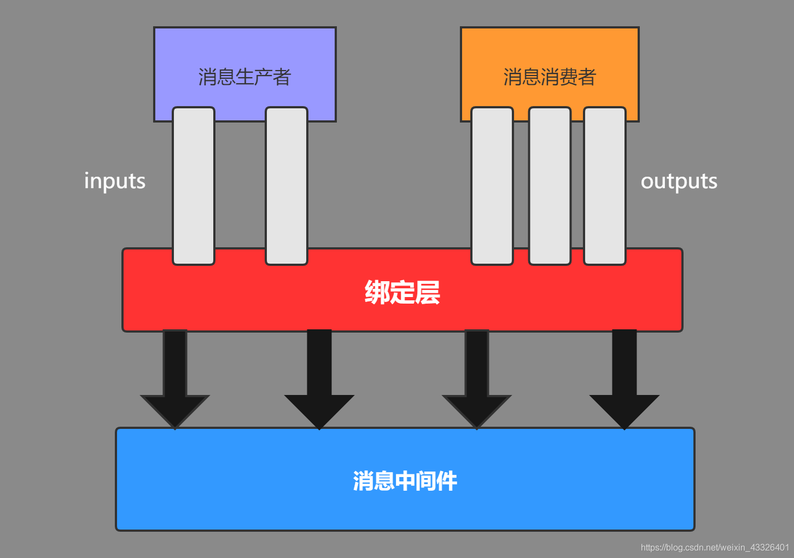

<head>
  <style>
    .c{
      font-size: 14px;
    }
    hl{
      background:#3E74;
      display:inline-block;
      padding:1px
    }
  </style>
</head>

<font class= 'c'>

[toc]

#### 前置环境(可以不参看项目)
1. Node.js安装
2. 需要注册小程序服务，进入到微信平台https://mp.weixin.qq.com/wxamp/thirdtools/extend?token=674389291&lang=zh_CN，此时可以登录，用的是小号的微信，注册的邮箱是552427758@qq.com，密码：1e2ghj89,进入到开发管理->开发设置中，将APPID复制到前端项目的porject.config.json对应的appid属性上
3. 下载小程序开发工具
4. 统计目录包含一个前端项目，需要使用node.js运行
5. 进入到项目的根目录，执行npm --registry https://registry.npm.taobao.org install
6. 安装完成后就可以运行项目了：npm run dev
7. 打开小程序工具，将项目导入到工具中边可以运行

### Spring Cloud Alibaba
##### 版本与兼容
 | springboot版本 | Spring Cloud版本 |
 | :--------------:|:----------------:|
 | 1.2.x          |Angel版本        |
 | 1.3.x         |	Brixton版本       |
 | 1.4.x stripes  |Camden版本       |
 | 1.5.x          |Dalston版本、Edgware版本|
 | 2.0.x          |Finchley版本        |
 | 2.1.x          |Greenwich版本        |
1. <hl>本示例使用的版本如下</hl>
   |springboot | spring cloid alibaba | spring cloud |
   |:--:|:--:|:--:|
   |2.2.0.RELEASE|2.2.0.RELEASE|Hoxton.SR1|

2. 项目中需要先添加依赖，注意是放在dependencyManagement标签内
    ```
    <!--    dependencyManagement标签并不会真正引入依赖-->
    <dependencyManagement>
        <dependencies>
            <dependency>
                <groupId>com.alibaba.cloud</groupId>
                <artifactId>spring-cloud-alibaba-dependencies</artifactId>
                <version>2.2.0.RELEASE</version>
                <type>pom</type>
                <scope>import</scope>
            </dependency>
            <dependency>
                <groupId>org.springframework.cloud</groupId>
                <artifactId>spring-cloud-dependencies</artifactId>
                <version>Hoxton.SR1</version>
                <type>pom</type>
                <scope>import</scope>
            </dependency>
        </dependencies>
    </dependencyManagement>
    </dependencyManagement>
    ```
3. 服务的注册与发现(Nacos)
    * 添加依赖
      ```
      <!--nacos依赖，不需要指定版本，因为在dependencyManagement标签中已经指定过了-->
        <dependency>
            <groupId>com.alibaba.cloud</groupId>
            <artifactId>spring-cloud-starter-alibaba-nacos-discovery</artifactId>
        </dependency>
      ``` 
    * 
### nacos
1. Nacos = Spring Cloud Eureka + Spring Cloud Config
2. 安装
   * 下载之前需要先确认对应的版本，可以在pom文件中spring-cloud-alibaba-dependencies依赖点击进入，找到<hl><nacos.client.version></hl>标签所对应的版本
   * 可以从github上下载：https://github.com/alibaba/nacos ，版本尽量对应
   * 解压文件并进入到bin目录下
   * 环境需要JDK1.8
   * 执行启动指令：`sh startup.sh -m standalone`
   * 如果是Windows系统，则执行执行cmd文件即可
   * 此时可以访问前端路径 `http://localhost:8848/nacos/#/login`
   * 默认的账号密码都是nacos

3. 注册服务到Nacos
    * 添加依赖，即Nacos的依赖，上面已经添加过了
    * 现在已经不需要添加注解了，直接配置即可
      ```yaml
        spring:
          cloud:
            nacos:
              discovery:
                #指定nacos服务的地址，不需要加入前缀http等信息
                server-addr: localhost:8848
          application:
                #服务名称需要指定，但尽量使用-，不要使用_
            name: user-center
      ``` 
    * 此时启动服务，便可以在前端的Nacos中查看到
      
    * nocos的领域模型如下图
      
      * NameSpace：命名空间，默认的NameSpace是public。主要作用还是隔离空间
      * group：分组，也比较好理解，主要作用也是隔离
      * cluster：集群。举个简单的例子：南京/北京集群，南京地区优先调用南京，北京地区优先调用北京，而只有在本地的集群都不能正常工作的时候才会去调用其他的集群
### 指定NameSpace（命名空间）和 cluster（集群）
* 需要在nacos的前端页面->命名空间菜单下->新建命名空间
* 创建完成以后将会生成一个命名空间ID
* 在yml中指定<hl>命名空间的ID，而不是命名空间的名称</hl>
  ~~~yaml
  spring:
    cloud:
      nacos:
        discovery:
          #指定nacos服务的地址，不需要加入前缀http等信息
          server-addr: localhost:8848
          #指定命名空间
          namespace: a8160e47-763a-4c0c-9ccc-20ca9026d3cf
          #指定集群名称
          cluster-name: NJ
  ~~~
* <hl>如果两个服务在不同的NameSpace下，那么是无法相互调用的</hl> 
### 元数据（MetaData）
* Nacos数据（如配置和服务）描述信息，如服务版本、权重、容灾策略、负载均衡策略、鉴权配置、各种自定义标签 (label)，从作用范围来看，分为服务级别的元信息、集群的元信息及实例的元信息。此处中间讲解<hl>实例元信息</hl>
*  元数据的写入主要有两种形式，nacos前端页面和配置文件方式
* 两个标记处分别代表服务元数据和集群元数据修改，使用json方式即可
* 配置文件方式如下
  ```yaml
  spring:
    cloud:
      nacos:
        discovery:
          #指定nacos服务的地址，不需要加入前缀http等信息
          server-addr: localhost:8848
          #指定命名空间
          namespace: a8160e47-763a-4c0c-9ccc-20ca9026d3cf
          #指定集群名称
          cluster-name: NJ
          #元数据的配置，键值对形式即可
          metadata:
            name: noname,
            age: 14
            grade: 3
  ```
### 负载均衡（Ribbon）
   * 依赖已经集成在nacos的依赖中了
   * Ribbon一般都会使用Springboot提供的RestTemplate来作为Restful调用工具，所以需要在该单例上使用@LoadBalanced注解，该示例的Bean对象放在启动类上，当然也可以单独创建一个
   ```java
    @SpringBootApplication
    @MapperScan("com.itmuch")
    public class ContentcenterApplication {

        public static void main(String[] args) {
            SpringApplication.run(ContentcenterApplication.class, args);
        }


        @Bean
        @LoadBalanced
        public RestTemplate restTemplate(){
            return new RestTemplate();
        }

    }
   ``` 
   * 此时便可以使用Ribbon+RestTemplate的形式进行调用,<hl>该方式并不推荐，使用Feign</hl>
   ~~~java
    public ShareDTO findById(Integer id) {
        //获取分享详情
        Share share = this.shareMapper.selectByPrimaryKey(id);
        //发布人id
        Integer userId = share.getUserId();
        //直接使用RestTemplate进行调用，地址使用的是在Nacos中注册的名称即可
        UserDTO userDTO = restTemplate.getForObject("http://user-center/users/{id}", UserDTO.class, userId);

        //消息装配
        ShareDTO shareDTO = new ShareDTO();
        BeanUtils.copyProperties(share, shareDTO);
        shareDTO.setWxNickname(userDTO.getWxNickname());
        return shareDTO;
    }
   ~~~ 
### Ribbon的负载均衡策略
  |策略|策略描述|
  |:-:|:-:|
  |BestAvailableRule|选择一个最小的并发请求的server|
  |AvailabilityFilteringRule|过滤掉那些因为一直连接失败的被标记为circuit tripped的后端server，并过滤掉那些高并发的的后端server（activeconnections 超过配置的阈值）|
  WeightedResponseTimeRule|根据相应时间分配一个weight，相应时间越长，weight越小，被选中的可能性越低。
  |RetryRule|对选定的负载均衡策略机上重试机制|
  RoundRobinRule|轮询方式轮询选择server|
  RandomRule|随机选择一个server|
  ZoneAvoidanceRule|复合判断server所在区域的性能和server的可用性选择server|
### Ribbon负载均衡策略的定义（配置文件方式）
* 可以使用java代码的形式，但是不大好用，可以自行百度
* 在配置文件中定义，如果A项目需要调用其他服务的接口，如B，那么则在A项目的配置文件中定义负载均衡策略
* ~~~
  #Ribbon的负载均衡策略，此处使用随机，user-center是指调用服务的名称
  user-center:
    ribbon:
      NFLoadBalancerRuleClassName: com.netflix.loadbalancer.RandomRule
  ~~~

### Ribbon负载均衡策略的定义（全局）
* 目前已知只能通过代码方式
* 先创建一个RibbonConfiguration类，<hl>该类一定要在启动类的子包下（未测试)</hl>
  ~~~java
  package com.itmuch.contentcenter.ribbonconfiguration;

  import com.netflix.loadbalancer.IRule;
  import com.netflix.loadbalancer.RandomRule;
  import org.springframework.context.annotation.Bean;
  import org.springframework.context.annotation.Configuration;

  /**
  * @author ：liwuming
  * @date ：Created in 2021/9/14 16:27
  * @description ：
  * @modified By：
  * @version:
  */
  @Configuration
  public class RibbonConfiguration {
      @Bean
      public IRule ribbonRule() {
          return new RandomRule();
      }
  }
    ~~~
* 再创建一个全局的配置类，<hl>该类一定要在启动类的子包下（未测试)</hl>
  ~~~java
  package com.itmuch.contentcenter.configuration;

  import com.itmuch.contentcenter.ribbonconfiguration.RibbonConfiguration;
  import org.springframework.cloud.netflix.ribbon.RibbonClients;
  import org.springframework.context.annotation.Configuration;

  /**
  * @author ：liwuming
  * @date ：Created in 2021/9/14 16:22
  * @description ：ribbon负载均衡全局配置，注意该类不能和启动类放在同一个包下,RibbonConfiguration该类是自己定义的
  * @modified By：
  * @version:
  */

  @Configuration
  @RibbonClients(defaultConfiguration = RibbonConfiguration.class)
  public class UerCenterRibbonConfiguration {

  }
  ~~~
### 饥饿加载
* 当首次请求接口的时候会出现请求很慢的情况，是因为Ribbon是懒加载形式的，当第一次访问的时候才会去加载。此时可以开启饥饿加载
* 同样在A项目的配置文件中开启
  ~~~yaml
  ribbon:
    #饥饿加载
    eager-load:
      enabled: true
      #哪些服务是需要饥饿加载的，可以多个，使用逗号分隔
      clients: user-center
  ~~~ 
### Ribbon对于权重的支持
* <hl>Spring cloud Alibaba 是通过整个Ribbon的方式实现的负载均衡。所以通过Nacos设置的权重无法起到作用。</hl>
* 权重可以通过Nacos的可视化页面设置。要想支持Nacos的权重可以写一个类
  ~~~java
  package com.itmuch.contentcenter.configuration;

  import com.alibaba.cloud.nacos.NacosDiscoveryProperties;
  import com.alibaba.cloud.nacos.ribbon.NacosServer;
  import com.alibaba.nacos.api.exception.NacosException;
  import com.alibaba.nacos.api.naming.NamingService;
  import com.alibaba.nacos.api.naming.pojo.Instance;
  import com.netflix.client.config.IClientConfig;
  import com.netflix.loadbalancer.AbstractLoadBalancerRule;
  import com.netflix.loadbalancer.BaseLoadBalancer;
  import com.netflix.loadbalancer.Server;
  import lombok.extern.slf4j.Slf4j;
  import org.springframework.beans.factory.annotation.Autowired;

  /** 
  * @author ：liwuming
  * @date ：Created in 2021/9/14 17:55
  * @description ：通过该方式可以让Ribbon支持Nacos的权重
  * @modified By：
  * @version:
  */
  @Slf4j
  public class NacosWeightedRule extends AbstractLoadBalancerRule {
      @Autowired
      private NacosDiscoveryProperties nacosDiscoveryProperties;

      @Override
      public void initWithNiwsConfig(IClientConfig clientConfig) {
          // 读取配置文件，并初始化NacosWeightedRule，一般不用写
      }

      @Override
      public Server choose(Object key) {
          try {
              BaseLoadBalancer loadBalancer = (BaseLoadBalancer) this.getLoadBalancer();

              // 想要请求的微服务的名称
              String name = loadBalancer.getName();

              // 拿到服务发现的相关API
              NamingService namingService = nacosDiscoveryProperties.namingServiceInstance();

              // nacos client自动通过基于权重的负载均衡算法，给我们选择一个实例。
              Instance instance = namingService.selectOneHealthyInstance(name);

              log.info("选择的实例是：port = {}, instance = {}", instance.getPort(), instance);
              return new NacosServer(instance);
          } catch (NacosException e) {
              return null;
          }
      }
  }
  ~~~ 
* 此时就可以使用全局配置或者局部配置的方式来使用自定义的类，此处以全局配置举例：
  ~~~java
    package com.itmuch.contentcenter.ribbonconfiguration;

    import com.itmuch.contentcenter.configuration.NacosWeightedRule;
    import com.netflix.loadbalancer.IRule;
    import org.springframework.context.annotation.Bean;
    import org.springframework.context.annotation.Configuration;

    /**
    * @author ：liwuming
    * @date ：Created in 2021/9/14 16:27
    * @description ：
    * @modified By：
    * @version:
    */
    @Configuration
    public class RibbonConfiguration {
        @Bean
        public IRule ribbonRule() {
            //使用自定义的规则让Ribbon来兼容Nacos的权重
            return new NacosWeightedRule();
        }
    }
  ~~~ 
* 此时在Nacos的前端页面修改权重即可生效
### 扩展Ribbon-同一集群优先调用
* 即南京地区优先调用南京的集群，只有在南京集群都失效的情况下才调用其他的集群
* 同样的，需要自定义一个类，<hl>该类一定要放在启动类的子包下（未测试）</hl>
  ~~~java
  package com.itmuch.contentcenter.configuration;

  import com.alibaba.cloud.nacos.NacosDiscoveryProperties;
  import com.alibaba.cloud.nacos.ribbon.NacosServer;
  import com.alibaba.nacos.api.exception.NacosException;
  import com.alibaba.nacos.api.naming.NamingService;
  import com.alibaba.nacos.api.naming.pojo.Instance;
  import com.alibaba.nacos.client.naming.core.Balancer;
  import com.netflix.client.config.IClientConfig;
  import com.netflix.loadbalancer.AbstractLoadBalancerRule;
  import com.netflix.loadbalancer.BaseLoadBalancer;
  import com.netflix.loadbalancer.Server;
  import lombok.extern.slf4j.Slf4j;
  import org.springframework.beans.factory.annotation.Autowired;
  import org.springframework.util.CollectionUtils;

  import java.util.ArrayList;
  import java.util.List;
  import java.util.Objects;
  import java.util.stream.Collectors;

  /**
  * @author ：liwuming
  * @date ：Created in 2021/9/15 11:21
  * @description ：扩展Ribbon-同一集群优先调用
  * @modified By：
  * @version:
  */
  @Slf4j
  public class NacosSameClusterWeightedRule extends AbstractLoadBalancerRule {
      @Autowired
      private NacosDiscoveryProperties nacosDiscoveryProperties;

      @Override
      public void initWithNiwsConfig(IClientConfig clientConfig) {

      }

      @Override
      public Server choose(Object key) {
          try {
              // 拿到配置文件中的集群名称 BJ
              String clusterName = nacosDiscoveryProperties.getClusterName();

              BaseLoadBalancer loadBalancer = (BaseLoadBalancer) this.getLoadBalancer();
              // 想要请求的微服务的名称
              String name = loadBalancer.getName();

              // 拿到服务发现的相关API
              NamingService namingService = nacosDiscoveryProperties.namingServiceInstance();

              // 1. 找到指定服务的所有实例 A
              List<Instance> instances = namingService.selectInstances(name, true);

              // 2. 过滤出相同集群下的所有实例 B
              List<Instance> sameClusterInstances = instances.stream()
                      .filter(instance -> Objects.equals(instance.getClusterName(), clusterName))
                      .collect(Collectors.toList());

              // 3. 如果B是空，就用A
              List<Instance> instancesToBeChosen = new ArrayList<>();
              if (CollectionUtils.isEmpty(sameClusterInstances)) {
                  instancesToBeChosen = instances;
                  log.warn("发生跨集群的调用, name = {}, clusterName = {}, instances = {}",
                          name,
                          clusterName,
                          instances
                  );
              } else {
                  instancesToBeChosen = sameClusterInstances;
              }
              // 4. 基于权重的负载均衡算法，返回1个实例
              Instance instance = ExtendBalancer.getHostByRandomWeight2(instancesToBeChosen);
              log.info("选择的实例是 port = {}, instance = {}", instance.getPort(), instance);

              return new NacosServer(instance);
          } catch (NacosException e) {
              log.error("发生异常了", e);
              return null;
          }
      }
  }

  class ExtendBalancer extends Balancer {
      public static Instance getHostByRandomWeight2(List<Instance> hosts) {
          return getHostByRandomWeight(hosts);
      }
  }
  ~~~ 
* 同样的方式，指定自定义的类
  ~~~java
    package com.itmuch.contentcenter.ribbonconfiguration;

    import com.itmuch.contentcenter.configuration.NacosSameClusterWeightedRule;
    import com.netflix.loadbalancer.IRule;
    import org.springframework.context.annotation.Bean;
    import org.springframework.context.annotation.Configuration;

    /**
    * @author ：liwuming
    * @date ：Created in 2021/9/14 16:27
    * @description ：
    * @modified By：
    * @version:
    */
    @Configuration
    public class RibbonConfiguration {
        @Bean
        public IRule ribbonRule() {
            
            return new NacosSameClusterWeightedRule();
        }
    }
  ~~~
* 并且要在配置文件中指定集群的名称，cluster-name属性
  ~~~yaml
  spring:
    cloud:
      nacos:
        discovery:
          #指定nacos服务的地址，不需要加入前缀http等信息
          server-addr: localhost:8848
          cluster-name: NJ
  ~~~
* <hl>记得在被调用方的服务的配置文件中，也要加上cluster-name属性，这样如果集群名相同则会优先调用</hl>
### 扩展Ribbon-基于元数据的版本控制
* 简单来讲，多个服务的实例可以配置不同的元数据，而元数据可以理解为该实例的某些K-v参数，也就是说根据某些参数来进行优先调用，如果有该参数则优先调用，没有则使用其他元数据的实例，本质上和权重是类似的。这一块不作过多介绍，可以看下这个帖子
> https://www.cnblogs.com/xjknight/p/12349096.html

### Feign实现服务调用
* 首先需要添加Feign依赖
  ~~~xml
  <dependency>
    <groupId>org.springframework.cloud</groupId>
    <artifactId>spring-cloud-starter-openfeign</artifactId>
  </dependency>
  ~~~
* 启动类上添加注解 @EnableFeignClients
* 定义一个接口，并且使用@FeignClient来指定服务，并指定接口的url路径
  ~~~java
    @FeignClient(name = "user-center")
    public interface UserCenterFeignClient {

        @GetMapping("/users/{id}")
        UserDTO findById(@PathVariable Integer id);

    }
  ~~~
* 此时就可以通过该接口来直接调用服务
  ~~~java
  @Service
  @RequiredArgsConstructor(onConstructor = @__(@Autowired))
  public class ShareService {

      private final ShareMapper shareMapper;
      private final RestTemplate restTemplate;
      private final UserCenterFeignClient userCenterFeignClient;

      public ShareDTO findById(Integer id) {
          //获取分享详情
          Share share = this.shareMapper.selectByPrimaryKey(id);
          //发布人id
          Integer userId = share.getUserId();
          //直接使用RestTemplate进行调用，地址使用的是在Nacos中注册的名称即可
          UserDTO userDTO = userCenterFeignClient.findById(userId);

          //消息装配
          ShareDTO shareDTO = new ShareDTO();
          BeanUtils.copyProperties(share, shareDTO);
          shareDTO.setWxNickname(userDTO.getWxNickname());
          return shareDTO;
      }
  }
  ~~~ 

### Feign的日志输出（细粒度）
* feign自定义的四种日志级别
  |级别|打印内容|
  |:-:|:-:|
  |NONE|不记录日志 (默认)|
  |BASIC|只记录请求方法和URL以及响应状态代码和执行时间|
  |HEADERS|记录请求和应答的头的基本信息|
  |FULL|记录请求和响应的头信息，正文和元数据|
* 使用java代码设置日志级别
  * 先定义一个配置类，用于指定日志级别,<hl>注意不要添加@Configuration注解</hl>
    ~~~java
    import feign.Logger;
    import org.springframework.context.annotation.Bean;

    /**
    * @author ：liwuming
    * @date ：Created in 2021/9/15 17:04
    * @description ：Feign之日级别配置
    * @modified By：
    * @version:
    */
    public class UserCenterFeignConfiguration {

        @Bean
        public Logger.Level level() {
            return Logger.Level.FULL;
        }
    }
    ~~~   
  * 在自定义声明的Feign服务接口上指定该配置类
    ~~~java
      @FeignClient(name = "user-center", configuration = UserCenterFeignConfiguration.class)
      public interface UserCenterFeignClient {

          @GetMapping("/users/{id}")
          UserDTO findById(@PathVariable Integer id);
      }
    ~~~ 
  * 最后还需要在配置文件中将该接口的日志级别调整为debug
    ~~~yaml
    logging:
      level:
        com.itmuch.contentcenter.feignclient.UserCenterFeignClient: debug
    ~~~
* 使用配置文件方式
  * 直接在配置文件中添加
    ~~~yaml
    logging:
      level:
        com.itmuch.contentcenter.feignclient.UserCenterFeignClient: debug
    feign:
      client:
        config:
          # 调用的服务名称
          user-center:
            loggerLevel: full
    ~~~ 
### Feign的日志输出（全局）
* 代码方式
  * 在启动类的@EnableFeignClients注解之中设置defaultConfiguration属性
    ~~~java 
    @SpringBootApplication
    @MapperScan("com.itmuch")
    @EnableFeignClients(defaultConfiguration = GlobalFeignConfiguration.class)
    public class ContentcenterApplication {

        public static void main(String[] args) {
            SpringApplication.run(ContentcenterApplication.class, args);
        }


        @Bean
        @LoadBalanced
        public RestTemplate restTemplate(){
            return new RestTemplate();
        }

    }
    ~~~ 
  * <hl>代码中的GlobalFeignConfiguration类就是细粒度配置方式中的UserCenterFeignConfiguration，此处改了个名称</hl>
* 配置方式
  * 与上面细粒度配置基本一样，唯一的区别是将服务的名称设置为default
    ~~~yaml
    feign:
      client:
        config:
          default:
            loggerLevel: full
    ~~~ 

### Feign的配置支持项
* java代码所支持的配置项和配置方式支持的配置项稍有不同
* java代码支持
   |配置项|作用|
   |:-:|:-:|
   |Logger.Level|	指定日志级别 |
   |Retryer|指定重试策略|
   |ErrorDecoder|指定错误解码器|
   |Request.Options|超时时间|
   |Collection<RequestInterceptor>|拦截器|
   |SetterFactory|用于设置Hystrix的配置属性，Fgien整合Hystrix才会用|
* 配置方式支持
  ~~~yaml
  feign:
    client:
      config:
        feignName:
          connectTimeout: 5000  # 相当于Request.Optionsn 连接超时时间
          readTimeout: 5000     # 相当于Request.Options 读取超时时间
          loggerLevel: full     # 配置Feign的日志级别，相当于代码配置方式中的Logger
          errorDecoder: com.example.SimpleErrorDecoder  # Feign的错误解码器，相当于代码配置方式中的ErrorDecoder
          retryer: com.example.SimpleRetryer  # 配置重试，相当于代码配置方式中的Retryer
          requestInterceptors: # 配置拦截器，相当于代码配置方式中的RequestInterceptor
            - com.example.FooRequestInterceptor
            - com.example.BarRequestInterceptor
          # 是否对404错误解码
          decode404: false
          encode: com.example.SimpleEncoder
          decoder: com.example.SimpleDecoder
          contract: com.example.SimpleContract
  ~~~    

### Feign的多参数调用(对象参数)
* <hl>如果两个接口同时都有相同命名的FeignClient，那么默认情况下是不被允许的</hl>，举个例子：两个服务接口都有@FeignClient(name = "user-center")，那么Springboot启动将会失败。如果想要允许这种情况，则需要在配置文件中配置
  ~~~yaml
  spring:
    main:
      allow-bean-definition-overriding: true
  ~~~
* 简单来讲就是调用的方法参数是对象形式，直接使用是不行的，需要使用<hl>@SpringQueryMap</hl> 注解
* 服务提供方
  ~~~java
    @GetMapping("/q")
    public User queryDTO(User user) {
        return user;
    }
  ~~~
* 调用方
  ~~~java
  @FeignClient(name = "user-center")
  public interface TestUserCenterFeignClient {

      @GetMapping("/users/q")
      UserDTO query(@SpringQueryMap UserDTO userDTO);

  }
  ~~~
* 如果有多个参数，但非对象，如多个String类型，则可以不使用@SpringQueryMap注解，而是使用@RequestParam注解（未验证）
* 如果是Post请求，则使用@RequestBody

### Feign脱离Nacos使用
* 即不通过注册中心中获取地址调用，如直接调用http://www.baidu.com
* 此处不做介绍，意义不大

### Feign性能优化（线程池）
* 为了提高Feign的性能，需要添加如下依赖
  ~~~xml
        <dependency>
            <groupId>io.github.openfeign</groupId>
            <artifactId>feign-httpclient</artifactId>
        </dependency>
  ~~~
* 并且添加配置
  ~~~yaml
  feign:
    #让feign使用apache httpclient做请求
    httpclient:
      enabled: true
      #feign的最大连接数
      max-connections: 200
      #feign单个路径的最大连接数
      max-connections-per-route: 50
  ~~~

### 常见容错方案
* 超时：设置比较短的超时时间
* 限流：超过设置的阈值就拒绝
* 仓壁模式：个人理解：类似于Docker的形式，即多个线程池形成隔离，即使A线程池崩溃了也不影响其他线程池
* 断路器：在一定的时间内失败次数/失败率达到了阈值，进入到断路状态。请求将不再进行原来的逻辑。而在断路一定时间后，断路器将会进入到半开状态，此时允许一次请求调用原来的逻辑，如果成功，则断路器关闭，反正继续打开，直到过段时间后重试。
  
### Sentinel
* 代替原本的Hystrix
* 引入依赖
   ~~~xml
        <dependency>
            <groupId>com.alibaba.cloud</groupId>
            <artifactId>spring-cloud-starter-alibaba-sentinel</artifactId>
        </dependency>
        <dependency>
            <groupId>org.springframework.boot</groupId>
            <artifactId>spring-boot-starter-actuator</artifactId>
        </dependency>
   ~~~ 
* <hl>打开Actuator监控，Actuator是Springboot提供的监控功能</hl>
   ~~~yaml
   management:
    endpoints:
      web:
        exposure:
          include: '*'
   ~~~

* 打开浏览器：http://localhost:8040/actuator/sentinel/
* 此时将出现一段json内容
  ~~~json
    {
    "appName": "content-center",
    "coldFactor": "3",
    "rules": {
      "systemRules": [],
      "authorityRule": [],
      "paramFlowRule": [],
      "flowRules": [],
      "degradeRules": []
    },
    "metricsFileCharset": "UTF-8",
    "filter": {
      "order": -2147483648,
      "urlPatterns": [
        "/*"
      ],
      "enabled": true
    },
    "totalMetricsFileCount": 6,
    "datasource": {},
    "clientIp": "192.168.238.1",
    "clientPort": "8719",
    "logUsePid": false,
    "metricsFileSize": 52428800,
    "logDir": "C:\\Users\\noname\\logs\\csp\\"
  }
  ~~~

### Sentinel控制台（可视化）搭建
* 下载sentinel控制台：https://github.com/alibaba/Sentinel/releases （版本尽量相同），此处选择jar包，版本1.7.2
* 运行jar包，java -jar,但更推荐使用如下指令启动,可以通过 -Dserver.port参数指定端口
* > java -Dserver.port=8080 -Dcsp.sentinel.dashboard.server=localhost:8080 -Dproject.name=sentinel-dashboard -jar sentinel-dashboard.jar
* 启动完成之后访问浏览器：http://localhost:8080/#/login
* 账密：sentinel  sentinel
* 将项目整合到sentinel控制台，添加配置文件
  ~~~yaml
  spring:
    cloud:
      sentinel:
        #使sentinel能够监控到多层的url路径，大坑！！
        filter:
          url-patterns: /**
        #sentinel控制台的地址
        transport:
          dashboard: localhost:8080
          #client-ip和port属性在sentinel的控制台报出Connection refused: no further information相关错误的时候可以使用，没报错的话不需要
          #client-ip: 127.0.0.1
          #port: 8719
  ~~~
* 此时调用接口后再返回可视化界面，就会有相应的内容，<hl>默认为懒加载，所以需要触发接口以后再刷新页面查看，并有几秒的延迟</hl>
### Sentinel的流量控制
* 安装完成后，便可以在簇点链路找到对应的接口进行流控设置
* <hl>此处有个大坑，如果有提示Invalid Type,那么很有可能是添加了sentinel-transport-simple-http这个依赖，并且这个依赖版本可能冲突，可以移除尝试一下</hl>
* <image src="流控设置.jpg" style="zoom:50%"></image>
* 高级选项中有三种方式：直接/关联/链路
  * 直接：当前资源到达所设的条件时触发流量控制，该方式最简单，不细讲
  * 关联：所关联的资源达到所设的条件时，当前的资源触发流量控制
  * <image src="关联流控.png" style="zoom:50%"></image>
  * 如上图：当/shares/test的QPS达到1时/shares/{id}触发流量控制
  * 链路：当两个接口中都调用了同一个接口的时候，则所设的链路将被限流（不是很好理解，可以百度sentinel流控链路模式）
* 流控效果
  * 快速失败：顾名思义，直接报错
  * Warm Up: 在一定时间内缓慢的提高阈值，比如阈值设置为100，预热时长为10，那么会将100/3设为QPS/线程数的初始阈值，并且在10内逐渐增加至100，此处的3是一个加载因子，固定的
  * 排队等待：只适用于QPS。让请求匀速通过，如果阈值为1，则表示一秒钟只有1个请求通过。如果设置了超时时间，那么该请求如果超过设置的值，也将会丢弃。即采用了漏斗算法

### Sentinel的服务降级
* 同流控，在同一个页面可以设置，同样有三种模式
* RT模式：
  * RT（平均响应时间） ：当<hl>1s</hl>内持续进入的N个请求，对应时刻的平均响应时间（秒级）均超过阈值（此处是1毫秒），那么在接下的时间窗口（此处为5秒）之内，对这个方法的调用都会自动地熔断（抛出 DegradeException）。注意 Sentinel 默认统计的 RT 上限是 4900 ms，超出此阈值的都会算作 4900 ms，若需要变更此上限可以通过启动配置项 -Dcsp.sentinel.statistic.max.rt=xxx 来配置
  * <image src="服务降级RT.png" style="zoom:50%"></image>
* 异常比例（未截图，基本一样）
  * 当资源的<hl>每秒</hl>请求量 >= N（可配置），并且每秒异常总数占通过量的比值超过设置的阈值之后，资源进入降级状态，即在接下设置的时间窗口之内（单位：秒），对这个方法的调用都会自动地返回。异常比率的阈值范围是 [0.0, 1.0]，代表 0% - 100%。
* 异常数（未截图，基本一样）
  * <hl>一分钟</hl>内的异常请求数大于所设的阈值，那么将在所设的时间窗口内该方式将进入熔断。<hl>时间窗口必须>=60</hl>

### Sentinel的热点规则(另类的流控)
* 以如下代码为例
* ~~~java
  @RestController
  @RequestMapping
  public class TestController {

      @GetMapping("test-hot")
      @SentinelResource("hot")
      public String testHot(@RequestParam(required = false) String a, @RequestParam(required = false) String b) {
          return a + " " + b;
      }
  }
  ~~~
* 此时可以在可视化页面中 簇点链路中找到资源名为hot的数据，点击热点按钮
* <image src=".\热点规则.png" style="zoom:40%"></image>
  * 参数索引：0则代表第一个参数，同理，1为第二个参数，以此类推
* <hl>先不看参数例外项</hl>表达的意思是指：<hl>当请求接口时候带有第一个参数时</hl>，那么QPS的触发阈值是1，超过阈值将在5秒内降级。如果不带有第一个参数，那将不会进行限制
* 例外项是指当请求即使带有第一个参数，但如果参数的值是5，那么允许的QPS不再是1，而是10000.超过10000才会在5秒内触发降级

### Sentinel系统规则
* 系统保护规则是从应用级别的入口流量进行控制，从单台机器的Load,CPU使用率，平均RT，入口QPS和并发线程数等几个维度监控应用指标，并且仅对入口流量生效。简单来讲，<hl>通过对单机性能监控来限定某个应用是否熔断</hl>
* 在可视化页面的 系统规则->新建系统规则 处可以添加
* Load:当系统1分钟的平均负载超于阈值，且并发线程数超过系统容量（系统容量是sentinel计算而来，不用特地关心）时触发，<hl>建议设置为CPU核心线程数*2.5。注意：该模式仅对Linux/Unix有效</hl>
* RT:所有入口流量的平均RT达到阈值触发
* 线程数:所有入口流量的并发线程数达到阈值触发
* 入口QPS:所有入口流量的QPS达到阈值触发
* CPU使用率:当系统 CPU 使用率超过阈值即触发系统保护（取值范围 0.0-1.0），比较灵敏

### Sentinel代表配置规则
* 此处不细讲，一般也不会使用

### 应用端连接Sentinel控制台的可配置项（yaml配置）
|配置项|说明|默认值|
|:-:|:-:|:-:|
|spring.cloud.sentinel.enabled|Sentinel自动化配置是否生效|true|
|spring.cloud.sentinel.eager|取消Sentinel控制台懒加载|false|
|spring.cloud.sentinel.transport.port|应用与Sentinel控制台交互的端口，应用本地会起一个该端口占用的HttpServer|8719|
| spring.cloud.sentinel.transport.dashboard|Sentinel 控制台地址|
|spring.cloud.sentinel.transport.heartbeat-interval-ms|应用与Sentinel控制台的心跳间隔时间|
|spring.cloud.sentinel.transport.client-ip|客户端IP|
|spring.cloud.sentinel.filter.order|Servlet Filter的加载顺序。Starter内部会构造这个filter|Integer.MIN_VALUE|
|spring.cloud.sentinel.filter.url-patterns|数据类型是数组。表示Servlet Filter的url pattern集合|/*|
|spring.cloud.sentinel.filter.enabled|Enable to instance CommonFilter|true|
|spring.cloud.sentinel.metric.charset|metric文件字符集|	UTF-8|
|spring.cloud.sentinel.metric.file-single-size|Sentinel metric 单个文件的大小|
|spring.cloud.sentinel.metric.file-total-count|Sentinel metric 总文件数量|
|spring.cloud.sentinel.log.dir|Sentinel 日志文件所在的目录|
|spring.cloud.sentinel.log.switch-pid|Sentinel 日志文件名是否需要带上pid|false|
|spring.cloud.sentinel.servlet.block-page|自定义的跳转 URL，当请求被限流时会自动跳转至设定好的 URL|
|spring.cloud.sentinel.flow.cold-factor|冷启动因子|3|

### Sentinel之@SentinelResource注解
* <hl>之前都是针对于MVC的接口层面，该注解可以使方法也支持流控/降级</hl>
* 流控/降级代码如下
  ~~~java
  @RestController
  @RequestMapping
  @RequiredArgsConstructor(onConstructor = @__(@Autowired))
  public class TestController {

      private final TestService testService;

      /**
      * 流控演示
      */
      @GetMapping("test-sentinel1")
      public String testSentinel1(@RequestParam(required = false) String a) {
          return testService.testSentinel1(a);
      }

      /**
      * 降级演示
      */
      @GetMapping("test-sentinel2")
      public String testSentinel2(@RequestParam(required = false) String a) {
          return testService.testSentinel2(a);
      }

  }
  ~~~  

  ~~~java
  import com.alibaba.csp.sentinel.annotation.SentinelResource;
  import com.alibaba.csp.sentinel.slots.block.BlockException;
  import org.apache.commons.lang3.StringUtils;
  import org.springframework.stereotype.Service;

  /**
  * 服务的流控和降级处理
  * SentinelResource注解表示该方法要进行流控/降级，blockHandler表示触发流控需要执行的函数，fallback表示触发降级需要执行的函数
  * 需要注意的是blockHandler和fallback所指定的函数要在本类中，如果是其他类可以使用fallbackClass和blockHandlerClass类来指定,且方法必须是静态的
  * 另外blockHandler和fallback的所对应的函数必须入参和返回值和SentinelResource注解修饰的方法一样
  * 在写完代码以后想要触发限流/降级，不要忘记在可视化界面中进行配置
  *
  * @author ：liwuming
  * @date ：Created in 2021/9/27 17:02
  */
  @Service
  public class TestService {

      /**
      * 触发流控，将执行本类的block函数
      * 虽然类本身中a为空会抛出异常，但只要在没触发流控的情况下，还是会正常将异常抛出给前台
      * 在触发流控的情况下，那么将会优先执行block中的代码，也就是给前端返回字符串"服务限流了"
      */
      @SentinelResource(value = "test-sentinel1", blockHandler = "block")
      public String testSentinel1(String a) {
          if (StringUtils.isBlank(a)) {
              throw new RuntimeException("入参为空");
          }
          return a;
      }

      public String block(String a, BlockException e) {
          System.out.println(e);
          return "服务限流了";
      }


      /**
      * 服务降级
      * 默认情况下如果有任何异常抛出，即使sentinel上没有配置降级，也将执行降级对应的函数
      * exceptionsToIgnore属性表示排除某个异常类，所以在a为空的情况下，错误信息将会直接返回给前端页面
      * 当a=1的时候，由于RuntimeException并未排除，所以将会触发降级，执行fallback函数
      * 需要非常注意的一点：异常的父子关系，如果忽略的类是父类，那么其子类也将一起被忽略
      */
      @SentinelResource(value = "test-sentinel2", fallback = "fallback", exceptionsToIgnore = IllegalArgumentException.class)
      public String testSentinel2(String a) {
          if (StringUtils.isBlank(a)) {
              throw new IllegalArgumentException("入参为空,exceptionsToIgnore排除了IllegalArgumentException，所以将不走fallback逻辑");
          }
          if (StringUtils.equals("1", a)) {
              throw new RuntimeException("未排除RuntimeException，触发降级方法fallback");
          }
          return a;
      }

      public String fallback(String a) {
          return "服务降级了";
      }
  }
  ~~~

### RestTemplate整合Sentinel
* Sentinel可以限制RestTemplate调用的接口，使用注解@SentinelRestTemplate
* <hl>如下代码是已经集成了RestTemplate，且RestTemplate放在启动类中，一般都会单独放一个类中</hl>
  ~~~java
  @SpringBootApplication
  @MapperScan("com.itmuch")
  @EnableFeignClients
  public class ContentcenterApplication {

      public static void main(String[] args) {
          SpringApplication.run(ContentcenterApplication.class, args);
      }


      @Bean
      @LoadBalanced
      @SentinelRestTemplate
      public RestTemplate restTemplate(){
          return new RestTemplate();
      }

  }
  ~~~
  ~~~java
  @RestController
  @RequestMapping
  @RequiredArgsConstructor(onConstructor = @__(@Autowired))
  public class TestController {

      private final TestService testService;
      private final RestTemplate restTemplate;

      /**
      * Sentinel对RestTemplate进行限制
      * @param userId
      * @return
      */
      @GetMapping("test-restTemplate-sentinel")
      public UserDTO test(@RequestParam Integer userId) {
          return this.restTemplate.getForObject("http://user-center/users/{userId}", UserDTO.class, userId);
      }

  }
  ~~~
* 此时将可以在可视化界面中查看到 /test-restTemplate-sentinel的簇点链路，并且配置流控后便可以测试
* 另外可以在项目中控制是否让Sentinel对RestTemplate进行控制，在配置文件中添加如下即可,若是false,则不再对RestTemplate请求进行任何限制
  ~~~yaml
  resttemplate:
    sentinel:
      enabled: false
  ~~~
* <hl>同时@SentinelRestTemplate注解是支持降级/流控的自定义处理的，和上面一样，注解拥有属性blockHandler，blockHandlerClass等等，可以自行百度</hl>

### Feign整合Sentinel
* 同理,Sentinel也可以限制Feign的接口
* 只需要在配置文件中添加开启
  ~~~yaml
  feign:
    sentinel:
      enabled: true
  ~~~
* 如果想要做服务流控降级的自定义处理，可以通过@FeignClient的属性fallback控制
  ~~~java
  @FeignClient(name = "user-center", fallback = UserCenterFeignClientFallback.class)
  public interface UserCenterFeignClient {

      @GetMapping("/users/{id}")
      UserDTO findById(@PathVariable Integer id);

  }
  ~~~
  ~~~java
  @Component
  public class UserCenterFeignClientFallback implements UserCenterFeignClient {

      @Override
      public UserDTO findById(Integer id) {
          UserDTO user = new UserDTO();
          user.setWxNickname("流量控制");
          return user;
      }
  }
  ~~~
* 需要注意的是，UserCenterFeignClientFallback类上要有@Compoent，并且继承UserCenterFeignClient 接口

### 生产环境下实用sentinel
* 推荐是使用三方的sentinel托管服务，如阿里的AHAS,已经集成了规则的持久化等，可以参看阿里的服务文档

### 集群流控
* 需要自行百度，视频表示当前版本没有一个足够好的解决方案
  
### 错误页优化
* 即若想区分降级和限流，那可以使用如下方式

### 自定义流控配置
* 很多时候我们需要区分流控/降级/授权等情况，sentinel提供了一个BlockExceptionHandler接口，可以进行自定义兜底的策略
* 首先需要在配置中打开spring.cloud.sentinel.filter.enabled = true,不是很确定是否一定需要该配置
* 自定义流控策略,<hl>不要忘记@Component注解</hl>
  ~~~java
  package com.itmuch.contentcenter.sentineltest;

  import com.alibaba.csp.sentinel.adapter.spring.webmvc.callback.BlockExceptionHandler;
  import com.alibaba.csp.sentinel.slots.block.BlockException;
  import com.alibaba.csp.sentinel.slots.block.authority.AuthorityException;
  import com.alibaba.csp.sentinel.slots.block.degrade.DegradeException;
  import com.alibaba.csp.sentinel.slots.block.flow.FlowException;
  import com.alibaba.csp.sentinel.slots.block.flow.param.ParamFlowException;
  import com.alibaba.csp.sentinel.slots.system.SystemBlockException;
  import com.fasterxml.jackson.databind.ObjectMapper;
  import lombok.AllArgsConstructor;
  import lombok.Builder;
  import lombok.Data;
  import lombok.NoArgsConstructor;
  import org.springframework.stereotype.Component;

  import javax.servlet.http.HttpServletRequest;
  import javax.servlet.http.HttpServletResponse;

  /**
  * 自定义的流控兜底策略，简单来讲也就是根据错误的类型来判定是那种策略，并可以返回自己想要的数据格式
  *
  * @author DELL
  */
  @Component
  public class MyUrlBlockHandler implements BlockExceptionHandler {

      @Override
      public void handle(HttpServletRequest httpServletRequest, HttpServletResponse httpServletResponse, BlockException e) throws Exception {
          ErrorMsg msg = null;
          if (e instanceof FlowException) {
              msg = ErrorMsg.builder()
                      .status(100)
                      .msg("限流了")
                      .build();
          } else if (e instanceof DegradeException) {
              msg = ErrorMsg.builder()
                      .status(101)
                      .msg("降级了")
                      .build();
          } else if (e instanceof ParamFlowException) {
              msg = ErrorMsg.builder()
                      .status(102)
                      .msg("热点参数限流")
                      .build();
          } else if (e instanceof SystemBlockException) {
              msg = ErrorMsg.builder()
                      .status(103)
                      .msg("系统规则（负载/...不满足要求）")
                      .build();
          } else if (e instanceof AuthorityException) {
              msg = ErrorMsg.builder()
                      .status(104)
                      .msg("授权规则不通过")
                      .build();
          }
          // http状态码
          httpServletResponse.setStatus(500);
          httpServletResponse.setCharacterEncoding("utf-8");
          httpServletResponse.setHeader("Content-Type", "application/json;charset=utf-8");
          httpServletResponse.setContentType("application/json;charset=utf-8");
          // spring mvc自带的json操作工具，叫jackson
          new ObjectMapper()
                  .writeValue(
                          httpServletResponse.getWriter(),
                          msg
                  );
      }
  }

  @Data
  @Builder
  @AllArgsConstructor
  @NoArgsConstructor
  class ErrorMsg {
      private Integer status;
      private String msg;
  }
  ~~~
* 此时自定义的策略将会生效，在sentinel配置限流/降级等，将会返回对应的返回信息

### 来源分区
* Sentinel提供了RequestOriginParser接口来供我们实现来源的区分，先上代码
  ~~~java
  /**
  * 这个代码的意思是检查请求的参数中是否存在origin这个参数，如果没有则报错。当然在实际的开发中可以放入请求头中。
  * 那么在后续的请求中这个origin的值将会代表它的来源
  * @author ：liwuming
  * @date ：Created in 2022/1/21 11:32
  * @description ：
  * @modified By：
  * @version:
  */

  @Component
  public class MyRequestOriginParser implements RequestOriginParser {
      @Override
      public String parseOrigin(HttpServletRequest httpServletRequest) {
          String origin = httpServletRequest.getParameter("origin");
          if (StringUtils.isBlank(origin)) {
              throw new IllegalArgumentException("origin can not be null");
          }
          return origin;
      }
  }
  ~~~
* 可以尝试发起一次请求，如 http://localhost:8010/shares/1?origin=noname，那么此时noname便是表示来源
* 进入到sentinel的控制台，找到该接口进行授权，如下
* <image src=".\来源区分_授权.jpg" style="zoom:80%"></image>
* 此时再次调用接口，将会被拦截，由于之前配置的自定义的流量配置，则会返回
  ~~~json
  {"status":104,"msg":"授权规则不通过"}
  ~~~
* 同理，该来源也可以用来限流操作，对该接口进行限流设置
* <image src=".\来源分区_限流.jpg" style="zoom:80%"/>
* 此时的限流规则将只对origin=noname有效

## RocketMQ
### 简介
* 略

### MQ的选择
* 略

### 下载与安装（Windows）
* 不详细描述了，下载zip文件并解压即可

### 启动
* 先要启动nameServer
* 配置环境变量，ROCKETMQ_HOME，并且在path中添加%ROCKETMQ_HOME%\bin
* 进入到安装目录的bin下，执行 start mqnamesrv.cmd
* 然后需要启动BROKER
* start mqbroker.cmd -n 127.0.0.1:9876 autoCreateTopicEnable=true

### 可视化安装
* 下载可视化代码，目前的新版和旧版有些区别 https://github.com/apache/rocketmq-dashboard
* 解压后需要更改一些配置文件，由于是springboot项目，也就是在resource下的application.yml中
* rocketmq.config.namesrvAddr,此处要更改为RocketMQ nameServer的地址，默认：127.0.0.1:9876
* 修改完成后使用cmd不要使用powershell,进入该项目编译：mvn clean package -Dmaven.test.skip=true 
* 编译可能会报错提升一些依赖下载失败，多试几次就可以了
* 编译完成后可以在target下找到jar包，启动就可以了

### 核心概念
|术语|描述|
|:-:|:-:|
|Server Name|NameServer的作用是注册中心，类似于Zookeeper，但又有区别于它的地方。每个NameServer节点互相之间是独立的，没有任何信息交互，也就不存在任何的选主或者主从切换之类的问题，因此NameServer与Zookeeper相比更轻量级。单个NameServer节点中存储了活跃的Broker列表（包括master和slave），这里活跃的定义是与NameServer保持有心跳。nameserver接收broker的请求，注册broker的路由信息。nameserver接收client（producer/consumer）的请求，根据消息的topic获取相应的broker路由信息。（手动创建的topic可以指定broker，自动创建的topic会随机指定broker，也许指定单个或全部，topic的概念在后面）集群部署后，节点之间无任何信息同步|
|Broker|rocketmq的核心组件，负责消息的接收、存储（持久化到磁盘）、被消费者拉取消息等功能。broker也存储消息相关的元数据，包括：消费者组、消费进度、topic&queue信息等。broker是个逻辑概念，1个broker = 1个master + 0至n个slave，具有同1个broker name的master和slave进行配对|
|Topic|一种消息的逻辑分类（消息的类型），比如说你有订单类的消息，也有库存类的消息，那么就需要进行分类存储。生产者方面：发消息时需指定topic，可以有1-n个生产者发布1个topic的消息，也1个生产者可以发布不同topic的消息。消费者方面：收消息时需订阅topic，可以有1-n个消费者组订阅1个topic的消息，1个消费者组可以订阅不同topic的消息。1个消息必须指定1个topic，topic允许自动创建与手工创建，topic创建时需要指定broker，可以指定1个或多个，name server就是通过broker与topic的映射关系来做路由。producer和consumer在生产和消费消息时，都需要指定消息的 topic，当topic匹配时，consumer 才会消费到producer发送的消息。topic与broker是多对多的关系，一个topic分布在多个broker上，一个broker可以配置多个topic。一个topic下可以有多个queue，默认自动创建是4个，手动创建是8个。|
|Message|message是消息的载体。每个message必须指定一个topic，相当于寄信的地址。message还有一个可选的tag设置，以便消费端可以基于tag进行过滤消息。message还有扩展的kv结构，例如你可以设置一个业务key到你的消息中，在broker上查找消息并诊断问题。|
|Tag|Tags是Topic下的次级消息类型，一般在相同业务模块中通过引入标签来标记不同用途的消息，可以在同一个Topic下基于Tags进行消息过滤。Tags的过滤需要经过两次比对，首先会在Broker端通过Tag hashcode进行一次比对过滤，匹配成功传到consumer端后再对具体Tags进行比对，以防止Tag hashcode重复的情况。|
|Queue|queue是消息的物理管理单位，而topic是逻辑管理单位。一个topic下可以有多个queue，默认自动创建是4个，手动创建是8个。1个message只能属于1个queue、1个topic。在rocketmq中，所有消息队列都是持久化，长度无限的数据结构。访问其中的存储单元使用offset来访问，offset 为 java long 类型，64 位，理论上在 100年内不会溢出，所以认为是长度无限。另外队列中只保存最近几天的数据，之前的数据会按照过期时间来删除。也可以认为 Message Queue是一个长度无限的数组，offset就是下标|
|Offset|理解成消费进度，可自增。|
|CommitLog|虽然每个topic下面有很多message queue，但是message queue本身并不存储消息。真正的消息存储会写在CommitLog的文件，message queue只是存储CommitLog中对应的位置信息，方便通过message queue找到对应存储在CommitLog的消息。不同的topic，message queue都是写到相同的CommitLog 文件，也就是说CommitLog完全的顺序写。|
|Producer|消息的生产者，负责发送消息，将消息推送给broker。消息有3种发送方式：同步、异步、单向|
|ProducerGroup|具有同样逻辑消费同样消息的consumer，可以归并为一个group。同一个group内的消费者，可以共同消费（集群消费模式）对应topic的消息，达到分布式并行处理（负载均衡）的功能。集群模式下，同一条消息只会被同一个 consumer group 中的一个消费者消费，不同 consumer group 的 consumer 可以消费同一条消息。广播模式下，多个 consumer 都会消费到同一条消息。|
|Consumer|消息的消费者，从broker上拉取消息从而进行消费。rocketmq提供两种消费者。主动消费者：从broker中拉取一批消息并消费，主动权由消费者控制。被动消费者：消费者实现回调接口，一旦有消息，broker回调接口，消费者被动响应。|
|ConsumerGroup|通常具有同样作用（同样topic）的一些producer可以归为同一个group。在事务消息机制中，如果发送某条事务消息后的producer-A宕机，使得事务消息一直处于PREPARED状态并超时，则broker会回查同一个group的其他producer，确认这条消息应该commit还是rollback。|
|Clustering|在 Clustering 模式下，同一个 ConsumerGroup（GroupName 相同）里的每个 Consumer 只消费所订阅消息的一部分内容，同一个 ConsumerGroup 里所有的 Consumer 消费的内容合起来才是所订阅 Topic 内容的整体，从而达到负载均衡的目的。|
|Broadcasting|在 Broadcasting 模式下，同一个 ConsumerGroup 里的每个 Consumer 都能消费到所订阅 Topic 的全部消息，也就是一个消息会被多次分发，被多个 Consumer 消费。|

### 生产者代码
* 添加核心依赖
  ~~~xml
          <dependency>
              <groupId>org.apache.rocketmq</groupId>
              <artifactId>rocketmq-spring-boot-starter</artifactId>
              <version>2.2.0</version>
          </dependency>
  ~~~
* 配置
  ~~~yaml
  rocketmq:
    # 启动的name-server的服务地址
    name-server: 127.0.0.1:9876
    producer:
      # 必须指定Group
      group: test-group
  ~~~
* 编写代码（由于简单，就直接贴代码片段了）
  ~~~java
      // 注入，由于是使用lombok，所以没有@AutoWare了
      private final RocketMQTemplate rocketMQTemplate;

      //这个就是发送端的代码了，UserAddBonusMsgDTO是一个自定义的POJO，add-bonus是代表TOPIC名称
      rocketMQTemplate.convertAndSend("add-bonus", UserAddBonusMsgDTO.builder().userId(share.getUserId()).bonuus(50).build());
  ~~~  
* 此时就可以在操作台中查看到该条消息了
* <image src="MQ_消息查看.jpg" style="zoom:100%"/>

### 消费者代码
* 添加核心依赖
  ~~~xml
          <dependency>
              <groupId>org.apache.rocketmq</groupId>
              <artifactId>rocketmq-spring-boot-starter</artifactId>
              <version>2.2.0</version>
          </dependency>
  ~~~
* 配置
  ~~~yaml
  rocketmq:
    # 启动的name-server的服务地址
    name-server: 127.0.0.1:9876
  ~~~
* 代码比较简单，不做过多介绍
  ~~~java
  @Service
  @RocketMQMessageListener(consumerGroup = "consumer-group", topic = "add-bonus")
  @RequiredArgsConstructor(onConstructor = @__(@Autowired))
  public class AddBonusListener implements RocketMQListener<UserAddBonusMsgDTO> {

      private final UserMapper userMapper;
      private final BonusEventLogMapper bonusEventLogMapper;

      @Override
      public void onMessage(UserAddBonusMsgDTO message) {
          //为用户增加积分
          Integer userId = message.getUserId();
          User user = this.userMapper.selectByPrimaryKey(userId);
          user.setBonus(user.getBonus() + message.getBonus());
          this.userMapper.updateByPrimaryKeySelective(user);

          //记录日志到bonus_event_log表中
          this.bonusEventLogMapper.insert(BonusEventLog.builder().userId(userId).value(message.getBonus())
                  .event("CONTRIBUTE").createTime(new Date()).description("投稿加积分...").build());
      }
  }
  ~~~

### 事务性消息
* RocketMQ的分布式事务流程,其实就是二次确认模式
* <image src="RocketMQ分布式事务流程图.jpg" style="zoom:70%"/>
* RocketMQ是支持事务消息的，发送端代码如下，省略了Controller层
  ~~~java
  public Share auditById(Integer id, ShareAuditDTO auditDTO) {
          // 1. 查询share是否存在，不存在或者当前的audit_status != NOT_YET，那么抛异常
          Share share = this.shareMapper.selectByPrimaryKey(id);
          if (share == null) {
              throw new IllegalArgumentException("参数非法！该分享不存在！");
          }
          if (!Objects.equals("NOT_YET", share.getAuditStatus())) {
              throw new IllegalArgumentException("参数非法！该分享已审核通过或审核不通过！");
          }

          //如果是PASS，那么为发布人添加积分，这一块是核心代码
          if (AuditStatusEnum.PASS.equals(auditDTO.getAuditStatusEnum())) {
              //发送一个事务消息，第一个参数就是topic,第二个参数是消息对象，它可以通过MessageBuilder来构建，同时也可以写入一些自定义的头部信息，最后一个参数是arg,即参数，就是传参用的
              this.rocketMQTemplate.sendMessageInTransaction(
                      "add-bonus",
                      MessageBuilder.withPayload(UserAddBonusMsgDTO.builder().userId(share.getUserId()).bonus(50).build()).setHeader(RocketMQHeaders.TRANSACTION_ID, UUID.randomUUID()).setHeader("share_id", id).build(),
                      auditDTO);
          } else {
              this.auditById(id, auditDTO);
          }


          //加积分的操作可以作为异步，因为本身并不是审核的主要业务
          return share;
      }
  ~~~
* 同时在发送端，RocketMQ也需要监听这个消息是否能成功提交，新建一个监听器
  ~~~java
  package com.itmuch.contentcenter.rocketmq;

  import com.itmuch.contentcenter.dao.messaging.RocketmqTransactionLogMapper;
  import com.itmuch.contentcenter.domain.dto.content.ShareAuditDTO;
  import com.itmuch.contentcenter.domain.entity.messaging.RocketmqTransactionLog;
  import com.itmuch.contentcenter.service.content.ShareService;
  import lombok.RequiredArgsConstructor;
  import org.apache.rocketmq.spring.annotation.RocketMQTransactionListener;
  import org.apache.rocketmq.spring.core.RocketMQLocalTransactionListener;
  import org.apache.rocketmq.spring.core.RocketMQLocalTransactionState;
  import org.apache.rocketmq.spring.support.RocketMQHeaders;
  import org.springframework.beans.factory.annotation.Autowired;
  import org.springframework.messaging.Message;
  import org.springframework.messaging.MessageHeaders;

  import java.util.Objects;

  /**
  * 事务型消息的监听类
  *
  * @author ：liwuming
  * @date ：Created in 2022/2/7 16:38
  * @description ：
  * @modified By：
  * @version:
  */
  @RocketMQTransactionListener
  @RequiredArgsConstructor(onConstructor = @__(@Autowired))
  public class AddBonusTransactionListener implements RocketMQLocalTransactionListener {

      //业务类，可无视
      private final ShareService shareService;
      //业务Mapper,可无视
      private final RocketmqTransactionLogMapper rocketmqTransactionLogMapper;

      /**
      * 这个函数的主要作用是操作本地的事务，如果本地事务成功则提交，反之回滚
      * @param message
      * @param arg
      * @return
      */
      @Override
      public RocketMQLocalTransactionState executeLocalTransaction(Message message, Object arg) {
          //可以获取消息的头部信息
          MessageHeaders headers = message.getHeaders();

          String transactionId = (String) headers.get(RocketMQHeaders.TRANSACTION_ID);
          Integer shareId = Integer.valueOf((String) Objects.requireNonNull(headers.get("share_id")));

          try {
              //这个也是业务逻辑，代码就不贴出来了，就是将 用户的积分添加日志插入到数据库
              this.shareService.auditByIdWithRocketMqLog(shareId, (ShareAuditDTO) arg, transactionId);
              //如果成功则提交
              return RocketMQLocalTransactionState.COMMIT;
          } catch (Exception e) {
              //反之回滚
              return RocketMQLocalTransactionState.ROLLBACK;
          }
      }

      /**
      * 这个函数是一个回查，即在一些特殊情况下，那么可以根据自定义的需求来进行表的回查，通俗来讲就是有一些未知原因的消息，不确实是提交还是回滚，那么通过回查函数来确定
      * @param message
      * @return
      */
      @Override
      public RocketMQLocalTransactionState checkLocalTransaction(Message message) {
          MessageHeaders headers = message.getHeaders();

          String transactionId = (String) headers.get(RocketMQHeaders.TRANSACTION_ID);
          //业务逻辑：查询 积分日志表，如果表里已经有数据了，则提交，反之回滚
          RocketmqTransactionLog rocketmqTransactionLog = rocketmqTransactionLogMapper.selectOne(RocketmqTransactionLog.builder().transactionId(transactionId).build());
          if (rocketmqTransactionLog != null) {
              return RocketMQLocalTransactionState.COMMIT;
          }
          return RocketMQLocalTransactionState.ROLLBACK;
      }
  }

  ~~~
* 上面的业务代码也贴出来，<hl>注意：需要@Transactional注解</hl>
  ~~~java
      @Transactional(rollbackFor = Exception.class)
      public void auditByIdInDB(Integer id, ShareAuditDTO auditDTO) {
          Share share = Share.builder()
                  .id(id)
                  .auditStatus(auditDTO.getAuditStatusEnum().toString())
                  .reason(auditDTO.getReason())
                  .build();
          this.shareMapper.updateByPrimaryKeySelective(share);

          // 4. 把share写到缓存
      }
  ~~~
  ~~~java
      @Transactional(rollbackFor = Exception.class)
      public void auditByIdWithRocketMqLog(Integer id, ShareAuditDTO auditDTO, String transactionId) {
          this.auditByIdInDB(id, auditDTO);

          this.rocketmqTransactionLogMapper.insertSelective(
                  RocketmqTransactionLog.builder()
                          .transactionId(transactionId)
                          .log("审核分享...")
                          .build()
          );
          log.info("日志添加完毕...");
      }
  ~~~
* 消费端的代码还是和以前一样，不需要做任何的更改


##  Spring Cloud Stream
### 简介
* Spring Cloud Stream 是一个用来为微服务应用构建消息驱动能力的框架。它可以基于 Spring Boot 来创建独立的、可用于生产的 Spring 应用程序。Spring Cloud Stream 为一些供应商的消息中间件产品提供了个性化的自动化配置实现，并引入了发布-订阅、消费组、分区这三个核心概念。通过使用 Spring Cloud Stream，可以有效简化开发人员对消息中间件的使用复杂度，让系统开发人员可以有更多的精力关注于核心业务逻辑的处理。但是目前 Spring Cloud Stream 只支持 RabbitMQ 和 Kafka 的自动化配置

### 模型
* 
* 简而言之：stream就是一个消息驱动，inputs和outputs即是指stream与之绑定的消息中间件，如RabbitMQ，kafka等，这样就可以直接调用stream的API发送消息等，就是帮我们管理消息中间件

### 发送端代码编写
* 引入依赖,该依赖本身就包含rocketmq-spring-boot-starter，<hl>所以要删掉之前的starter以防止冲突</hl>
  ~~~xml
          <dependency>
              <groupId>com.alibaba.cloud</groupId>
              <artifactId>spring-cloud-starter-stream-rocketmq</artifactId>
          </dependency>
  ~~~
* <hl>但是上面的依赖所使用的MQ的版本比较老，所以和上述的代码可能会有一些区别，如：rocketMQTemplate.sendMessageInTransaction这个函数新版本去除了group这个参数，而老版本还有这个参数,需要注意一下</hl>
* <hl>启动类添加注解 @EnableBinding(Source.class) </hl>
* 添加配置文件,由于是yaml，不方便截图，直接使用键值对的形式了
* spring.cloud.stream.rocketmq.binder.name-server=127.0.0.1:9876  #对应的值就是rocketMQ的name-server的启动服务ip:port
* 配置文件
  ~~~yaml
  spring:
    cloud:
      stream:
        rocketmq:
          binder:
            #RocketMQ的name-server地址
            name-server: 127.0.0.1:9876
        bindings:
          #output其实指的就是目标MQ，即发送消息到哪里
          output:
            # 指定topic
            destination: stream-test-topic
  ~~~
* 编写一个最简单的发送端代码
  ~~~java
  @RestController
  @RequestMapping("/test")
  public class TestController {

      /**
      * 这个注入的对象就是启动类上指定的Source.class
      */
      @Autowired
      private Source source;

      @GetMapping("/test-stream")
      public String testStream() {
          //有两个发送消息，另一个是带有超时时间的消息
          this.source.output().send(MessageBuilder.withPayload("消息体").build());
          return "success";
      }
  }
  ~~~

### 消费端代码编写
* 同样的，需要添加依赖
* 在启动类上添加注解 @EnableBinding(Sink.class)
* 配置类
  ~~~yaml
  spring:
    cloud:
      stream:
        rocketmq:
          binder:
            name-server: 127.0.0.1:9876
        bindings:
          #input就是指消费来源
          input:
            #topic名称
            destination: stream-test-topic
            #RocketMQ一定要设置，但是随意即可，如果是别的MQ则不需要
            group: binder-group
  ~~~
* 编写监听器
  ~~~java
  @Service
  @Slf4j
  public class TestStreamConsumer {

      @StreamListener(Sink.INPUT)
      public void receive(String messsage) {
          log.info("通过stream收到的消息:{}", messsage);
      }
  }
  ~~~

### Spring Cloud Stream 自定义接口
* 当然需要先自定义一个接口
  ~~~java
  public interface MySink {

      String MY_INPUT = "my-input";

      @Input(MY_INPUT)
      SubscribableChannel input();
  }
  ~~~
* 并且在启动类上需要添加自定义的接口
  ~~~java
  @SpringBootApplication
  @MapperScan("com.itmuch.usercenter.dao")
  @EnableBinding({Sink.class, MySink.class})
  public class UserCenterApplication {

      public static void main(String[] args) {
          SpringApplication.run(UserCenterApplication.class, args);
      }

  }
  ~~~
* 修改配置,主要就是添加了一个my-input，这个名字是接口中定义的常量字符串
  ~~~yaml
  spring:
    cloud:
      stream:
        rocketmq:
          binder:
            name-server: 127.0.0.1:9876
        bindings:
          #input就是指消费来源
          input:
            #topic名称
            destination: stream-test-topic
            #RocketMQ一定要设置，但是随意即可，如果是别的MQ则不需要
            group: binder-group
          #这个名字要与自定义的常量名称相同才可以
          my-input:
            destination: stream-test-topic
            group: my-group
  ~~~
* 自定义一个监听器，来消费消息
  ~~~java
  @Service
  @Slf4j
  public class MyTestStreamConsumer {

      @StreamListener(MySink.MY_INPUT)
      public void receive(String message) {
          log.info("通过stream收到了消息：{}", message); 
      }
  }
  ~~~

### Stream 消费过滤
* 消费者端可以条件过滤一些消息从而进行消费，这个Stream也是支持的，这个直接参看如下博客
* > https://blog.csdn.net/lilizhou2008/article/details/98561726

### Stream全局异常处理
* 如果在MQ中消息出现了错误，那么则可以捕获并处理，Stream也提供了相应的异常处理
  ~~~java
  @Service
  @Slf4j
  public class MyTestStreamConsumer {

      @StreamListener(MySink.MY_INPUT)
      public void receive(String message) {
          log.info("通过stream收到了消息：{}", message);
          throw new RuntimeException("手动触发异常来验证全局异常处理是否生效");
      }


      /**
      * 全局异常处理
      */
      @StreamListener("errorChannel")
      public void error(Message message) {
          ErrorMessage errorMessage = (ErrorMessage) message;
          log.error("发生异常，errorMsg = {}", errorMessage);
      }
  }
  ~~~
* 还有一些异常处理，可以参看如下博客
* > https://www.imooc.com/article/290435

### Stream发送事务性消息
* 还是以之前的事务消息为例，发送消息的代码基本没有变动，唯一变动的是传参是通过消息体的Header来传递
  ~~~java
      public Share auditById(Integer id, ShareAuditDTO auditDTO) {
          // 1. 查询share是否存在，不存在或者当前的audit_status != NOT_YET，那么抛异常
          Share share = this.shareMapper.selectByPrimaryKey(id);
          if (share == null) {
              throw new IllegalArgumentException("参数非法！该分享不存在！");
          }
          if (!Objects.equals("NOT_YET", share.getAuditStatus())) {
              throw new IllegalArgumentException("参数非法！该分享已审核通过或审核不通过！");
          }

          //如果是PASS，那么为发布人添加积分，这一块是核心代码
          if (AuditStatusEnum.PASS.equals(auditDTO.getAuditStatusEnum())) {
              //发送一个事务消息，第一个参数就是topic,第二个参数是消息对象，它可以通过MessageBuilder来构建，同时也可以写入一些自定义的头部信息，最后一个参数是arg,即参数，就是传参用的
  //            this.rocketMQTemplate.sendMessageInTransaction("mygroup",
  //                    "add-bonus",
  //                    MessageBuilder.withPayload(UserAddBonusMsgDTO.builder().userId(share.getUserId()).bonus(50).build()).setHeader(RocketMQHeaders.TRANSACTION_ID, UUID.randomUUID()).setHeader("share_id", id).build(),
  //                    auditDTO);

              //使用stream来发送MQ消息,如果要传递参数的话可以将参数都放在Header里面一起传递
              this.source.output().send(MessageBuilder.withPayload(UserAddBonusMsgDTO.builder().userId(share.getUserId()).bonus(50).build())
                      .setHeader(RocketMQHeaders.TRANSACTION_ID, UUID.randomUUID())
                      .setHeader("share_id", id)
                      .setHeader("dto", JSON.toJSONString(auditDTO))
                      .build());
          } else {
              this.auditById(id, auditDTO);
          }


          //加积分的操作可以作为异步，因为本身并不是审核的主要业务
          return share;
      }
  ~~~
* 发送端的事务监听基本也没有太大变动,无非就是参数从头部获取
  ~~~java
  @RocketMQTransactionListener(txProducerGroup = "mygroup")
  @RequiredArgsConstructor(onConstructor = @__(@Autowired))
  public class AddBonusTransactionListener implements RocketMQLocalTransactionListener {

      //业务类，可无视
      private final ShareService shareService;
      //业务Mapper,可无视
      private final RocketmqTransactionLogMapper rocketmqTransactionLogMapper;

      /**
      * 这个函数的主要作用是操作本地的事务，如果本地事务成功则提交，反之回滚
      *
      * @param message
      * @param arg
      * @return
      */
      @Override
      public RocketMQLocalTransactionState executeLocalTransaction(Message message, Object arg) {
          //可以获取消息的头部信息
          MessageHeaders headers = message.getHeaders();

          String transactionId = (String) headers.get(RocketMQHeaders.TRANSACTION_ID);
          Integer shareId = Integer.valueOf((String) Objects.requireNonNull(headers.get("share_id")));

          String dtoString = (String)headers.get("dto");
          ShareAuditDTO auditDTO = JSON.parseObject(dtoString, ShareAuditDTO.class);

          try {
              //这个也是业务逻辑，代码就不贴出来了，就是将 用户的积分添加日志插入到数据库
              this.shareService.auditByIdWithRocketMqLog(shareId, auditDTO, transactionId);
              //如果成功则提交
              return RocketMQLocalTransactionState.COMMIT;
          } catch (Exception e) {
              //反之回滚
              return RocketMQLocalTransactionState.ROLLBACK;
          }
      }

      /**
      * 这个函数是一个回查，即在一些特殊情况下，那么可以根据自定义的需求来进行表的回查，通俗来讲就是有一些未知原因的消息，不确实是提交还是回滚，那么通过回查函数来确定
      *
      * @param message
      * @return
      */
      @Override
      public RocketMQLocalTransactionState checkLocalTransaction(Message message) {
          MessageHeaders headers = message.getHeaders();

          String transactionId = (String) headers.get(RocketMQHeaders.TRANSACTION_ID);
          //业务逻辑：查询 积分日志表，如果表里已经有数据了，则提交，反之回滚
          RocketmqTransactionLog rocketmqTransactionLog = rocketmqTransactionLogMapper.selectOne(RocketmqTransactionLog.builder().transactionId(transactionId).build());
          if (rocketmqTransactionLog != null) {
              return RocketMQLocalTransactionState.COMMIT;
          }
          return RocketMQLocalTransactionState.ROLLBACK;
      }
  }
  ~~~
* 但是此时需要配置一下配置文件,注意是rocketmq标签下一层的bindings
  ~~~yaml
  spring:
    cloud:
      stream:
        rocketmq:
          binder:
            #RocketMQ的name-server地址
            name-server: 127.0.0.1:9876
          #这一段是事务性消息的部分
          bindings:
            output:
              producer:
                #是否是事务性消息
                transactional: true
                #这个值就是本地监听器@RocketMQTransactionListener(txProducerGroup = "mygroup")对应的值
                group: mygroup
          #这一段是事务性消息的部分
        bindings:
          #output其实指的就是目标MQ，即发送消息到哪里
          output:
            # 指定topic
            destination: stream-test-topic
  ~~~

### Stream 消费事务性消息
* 配置文件基本不需要修改,唯一要改的是监听的topic，要改成发送端一致
  ~~~yaml
  spring:
    cloud:
      stream:
        rocketmq:
          binder:
            name-server: 127.0.0.1:9876
        bindings:
          #input就是指消费来源
          input:
            #topic名称
            destination: add-bonus
            #RocketMQ一定要设置，但是随意即可，如果是别的MQ则不需要
            group: binder-group
  ~~~
* 消费的代码如下
  ~~~java
  /**
  * @author ：liwuming
  * @date ：Created in 2022/2/9 16:07
  * @description ：
  * @modified By：
  * @version:
  */
  @Service
  @RequiredArgsConstructor(onConstructor = @__(@Autowired))
  public class AddBonusStreamConsumer {

      private final UserService userService;

      /**
      * 接收事务性消息
      * @param message
      */
      @StreamListener(Sink.INPUT)
      public void receive(UserAddBonusMsgDTO message) {
          //这个就是业务逻辑，没什么好讲的
          userService.addBonus(message);
      }
  }
  ~~~
* 业务代码也贴出来，如下：
  ~~~java
      @Transactional(rollbackFor = Exception.class)
      public void addBonus(UserAddBonusMsgDTO msgDTO) {
          // 1. 为用户加积分
          Integer userId = msgDTO.getUserId();
          Integer bonus = msgDTO.getBonus();
          User user = this.userMapper.selectByPrimaryKey(userId);

          user.setBonus(user.getBonus() + bonus);
          this.userMapper.updateByPrimaryKeySelective(user);

          // 2. 记录日志到bonus_event_log表里面
          this.bonusEventLogMapper.insert(
              BonusEventLog.builder()
                  .userId(userId)
                  .value(bonus)
                  .event(msgDTO.getEvent())
                  .createTime(new Date())
                  .description(msgDTO.getDescription())
                  .build()
          );
          log.info("积分添加完毕...");
      }
  ~~~

## 网关（Getway）
### 概念
* 路由：路由是构建网关的基本模块，它由ID、目标URI，一系列的断言和过滤器组成，如果断言为true则匹配该路由
* Predicate(断言)：参考的是Java8的java.util.function.Predicate
开发人员可以匹配HTTP请求中的所有内容(例如请求头或请求参数)，如果请求与断言相匹配则进行路由
* Filter(过滤)：指的是Spring框架中GatewayFilyter的实例，使用过滤器，可以在请求被路由前或者之后进行修改

### 网关集成
* 引入依赖,核心依赖也就是nacos,getway,spring cloud，由于放在了子模块下，父类的没有贴出来
  ~~~xml
  <!--        这边有一个坑，网关是不能加入starter-web这个包的，否则启动会报错。但是父pom中又引用了，所以将这个包在子项目中重写一遍，并且scope改为test就可以让它失效-->
          <dependency>
              <groupId>org.springframework.boot</groupId>
              <artifactId>spring-boot-starter-web</artifactId>
              <scope>test</scope>
          </dependency>
          <!--        网关的依赖包，但是启动有可能报错之类的，一般都是版本问题引起的-->
          <dependency>
              <groupId>org.springframework.cloud</groupId>
              <artifactId>spring-cloud-starter-gateway</artifactId>
              <version>2.2.1.RELEASE</version>
          </dependency>
  ~~~

* 配置文件
  ~~~yaml
  server:
    port: 8012
  spring:
    application:
      name: gateway
    cloud:
      nacos:
        discovery:
          server-addr: localhost:8848
      #网关配置
      gateway:
        discovery:
          locator:
            #让gateway通过服务发现组件找到其他的微服务
            enabled: true
  management:
    endpoints:
      web:
        exposure:
          include: '*'
    endpoint:
      health:
        show-details: always
  ~~~
* 配置完成后启动项目，此时在nacos中若可以正常看到gateway服务即成功
* 验证：使用gateway的ip:port/其他服务名称/其他服务的访问路径 即可转发请求，如：http://localhost:8012/user-center/users/ping

### Gateway路由谓词工厂
#### 最简单的全局转发
* 如上使用的配置是通过Gateway自定义映射的，那么先看一下如下的配置
  ~~~yaml
  spring:
    application:
      name: gateway
    cloud:
      nacos:
        discovery:
          server-addr: localhost:8848
      #网关配置
      gateway:
        routes:
          #id:自定义即可，但是要唯一
          - id: user-center
            #目的地址，即转发到哪里
            uri: http://localhost:8080
            #简单理解就是如果访问的是以下路径，则会将请求转发到uri所在的地址
            predicates:
              - Path=/**
  ~~~
* 如上，简单来讲，访问GATEWAY_URL/** 都会转发到 http://localhost:8080 该地址上去
#### 精确匹配 
  ~~~yaml
      #网关配置
      gateway:
        routes:
          #id:自定义即可，但是要唯一
          - id: user-center
            #目的地址，即转发到哪里,lb://XXX形式表示的是nocos中服务的名称。当然也可以写具体的ip地址
            uri: lb://user-center/users/ping
            predicates:
              # 访问GATEWAY_URL/users/ping将会转发到http://localhost:8080/users/ping
              - Path=/users/ping
  ~~~
#### 其他内置的谓词工厂
|谓词|作用|参数|
|:-:|:-:|:-:|
|After|请求时的时间在配置的时间后时转发该请求	|一个带有时区的具体时间|
|Before|请求时的时间在配置的时间前时转发该请求	|一个带有时区的具体时间|
|Between|请求时的时间在配置的时间段内时转发该请求	|一个带有时区的具体时间段|
|Cookie|请求时携带的Cookie名称及值与配置的名称及值相符时转发该请求	|Cookie的名称及值，支持使用正则表达式来匹配值|
|Header|请求时携带的Header名称及值与配置的名称及值相符时转发该请求	|Header的名称及值，支持使用正则表达式来匹配值|
|Host|请求时名为Host的Header的值与配置的值相符时转发该请求	|Host的值，支持配置多个且支持使用通配符|
|Method|请求时所使用的HTTP方法与配置的请求方法相符时转发该请求	|HTTP请求方法，例如GET、POST等|
|Path|请求时所访问的路径与配置的路径相匹配时转发该请求	|通配符、占位符或具体的接口路径，可以配置多个|
|Query|请求时所带有的参数名称与配置的参数名称相符时转发该请求	|参数名称和参数值（非必须），支持使用正则表达式对参数值进行匹配|
|RemoteAddr|请求时的IP地址与配置的IP地址相符时转发该请求	|IP地址或IP段|

#### 其他谓词的使用
* > https://www.cnblogs.com/maggieq8324/p/15354319.html

#### 自定义路由谓词
* 首先先定义一个自定义的参数在配置文件中，此处是TimeBetween
  ~~~yaml
  spring:
    application:
      name: gateway
    cloud:
      nacos:
        discovery:
          server-addr: localhost:8848
      #网关配置
      gateway:
        routes:
          #id:自定义即可，但是要唯一
          - id: user-center
            #目的地址，即转发到哪里,lb://XXX形式表示的是nocos中服务的名称。当然也可以写具体的ip地址
            uri: lb://user-center/users/ping
            predicates:
              # 访问GATEWAY_URL/users/ping将会转发到http://localhost:8080/users/ping
              - Path=/users/ping
              - #自定义的参数，是指一个区间，在该时间内进行请求转发，对于时间spring有默认的处理方式，没仔细研究可自行百度
              - TimeBetween=上午8:00,下午10:00
  ~~~
* 编写一个参数接收类，来对应配置文件中的参数,直接使用了lombok
  ~~~java
  @Data
  public class TimeBetweenConfig {

      private LocalTime start;
      private LocalTime end;
  }
  ~~~
* 最核心的类，如下
  ~~~java
  /**
  * 类的名称必须以RoutePredicateFactory结尾
  *
  * @author ：liwuming
  * @date ：Created in 2022/2/10 16:50
  * @description ：
  * @modified By：
  * @version:
  */
  @Component
  public class TimeBetweenRoutePredicateFactory extends AbstractRoutePredicateFactory<TimeBetweenConfig> {


      public TimeBetweenRoutePredicateFactory() {
          super(TimeBetweenConfig.class);
      }

      /**
      * 这个就是核心实现
      *
      * @param config
      * @return
      */
      @Override
      public Predicate<ServerWebExchange> apply(TimeBetweenConfig config) {
          LocalTime start = config.getStart();
          LocalTime end = config.getEnd();
          //匿名内部类的写法，为了高大上直接写成lambda表达式
  //        Predicate<ServerWebExchange> serverWebExchangePredicate = exchange -> {
  //            LocalTime now = LocalTime.now();
  //            return now.isAfter(start) && now.isBefore(end);
  //        };
          return exchange -> {
              LocalTime now = LocalTime.now();
              return now.isAfter(start) && now.isBefore(end);
          };
      }

      /**
      * 这个函数的作用是用来识别参数的，即 定义的参数是 TimeBetween=09:00,17:00,那么它将映射到我们自定义的泛型中，也就是TimeBetweenConfig对象中去
      * 而这个顺序就需要该函数指定，即09：00对应start变量，17：00对应end变量
      *
      * @return
      */
      @Override
      public List<String> shortcutFieldOrder() {
          return Arrays.asList("start", "end");
      }
  }
  ~~~
#### Gateway内置过滤器
* 由于内置过滤器特别多，直接参看博客 
* > https://blog.csdn.net/m0_48639280/article/details/108312276
* 以AddRequestHeader为例，直接在配置文件中配置一下
  ~~~yaml
    #网关配置
    gateway:
      routes:
        #id:自定义即可，但是要唯一
        - id: user-center
          #目的地址，即转发到哪里,lb://XXX形式表示的是nocos中服务的名称。当然也可以写具体的ip地址
          uri: lb://user-center/users/ping
          predicates:
            # 访问GATEWAY_URL/users/ping将会转发到http://localhost:8080/users/ping
            - Path=/users/ping
          filters:
            # 往头部消息添加name=noname
            - AddRequestHeader=name,noname
  ~~~
* 这个想要验证的话可以在NettyRoutingFilter这个类的filter函数进行debug,debug到filtered.forEach(httpHeaders::set);这一句就可以查看Header中的内容了

#### 自定义过滤器工厂
* 自定义一个前置日志过滤器，我们可以添加自定义的参数，如PreLog
  ~~~yaml
      #网关配置
      gateway:
        routes:
          #id:自定义即可，但是要唯一
          - id: user-center
            #目的地址，即转发到哪里,lb://XXX形式表示的是nocos中服务的名称。当然也可以写具体的ip地址
            uri: lb://user-center/users/ping
            predicates:
              # 访问GATEWAY_URL/users/ping将会转发到http://localhost:8080/users/ping
              - Path=/users/ping
            filters:
              - PreLog=a,b
  ~~~
* 编写过滤器
  ~~~java
  /**
  * 类名必须以GatewayFilterFactory结尾
  *
  * @author ：liwuming
  * @date ：Created in 2022/2/11 14:43
  * @description ：
  * @modified By：
  * @version:
  */
  @Slf4j
  @Component
  public class PreLogGatewayFilterFactory extends AbstractNameValueGatewayFilterFactory {
      @Override
      public GatewayFilter apply(NameValueConfig config) {
          //需要注意的是 业务的逻辑要卸载这个lanmda表达式里面，不然会出现多次调用的情况
          return ((exchange, chain) -> {
              log.info("请求进来了...拿到参数：{}，{}", config.getName(), config.getValue());
              //获取请求数据，mutate()表示更改，但实际上这边偷懒什么都没做
              ServerHttpRequest modifiedRequest = exchange.getRequest().mutate().build();
              //同上，将更改后的request放入exchange，只不过上面request并没有做任何更改
              ServerWebExchange modifiedExchange = exchange.mutate().request(modifiedRequest).build();
              //继续执行下一个过滤器
              return chain.filter(modifiedExchange);
          });
      }
  }
  ~~~