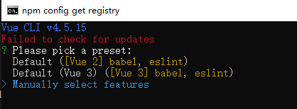
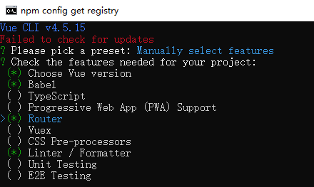
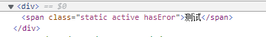
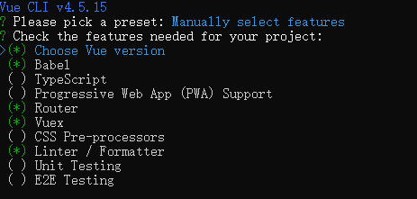

<head>
  
</head>

# Vue学习笔记
## 环境安装
### Nodejs安装
1. 从官网下载nodejs安装包
1. 运行安装包直接默认安装即可
1. 控制台输入node -v,检查是否安装成功
1. 更改npm的镜像源，此处实用淘宝的镜像，npm  install  -g  cnpm  --registry=https://registry.npm.taobao.org

### vue-cli脚手架的初始化
1. 安装vue-cli,命令：npm install -g @vue/cli
1. 以下操作将通过vue-cli初始化一个新项目
1. 在任意处创建一个文件夹，<hl>并cd进入该文件夹</hl>，该文件夹将作为项目的初始化目录
1. 使用指令：vue create "项目名称",由于配置了淘宝的镜像，他会提示是否使用，可以选择不适用并选择vue2的结构目录
1. 执行完成后进入项目，即cd 操作
1. 通过执行：npm run serve，来启动项目，默认是localhost:8080 访问

### 编辑器的选择
* 常见的编辑器有webstorm(收费)，vscode(免费)等，可视个人情况自行选择

## Vue 基础入门（直接引用vue.js形式）
### 最简单的动态绑定示例如下：

  * ~~~html
    <!DOCTYPE html>
    <html lang="en">
    <head>
      <meta charset="UTF-8">
      <title>Title</title>
    </head>
    <body>
    <!--指定id为app,用于vue的元素绑定-->
    

      {{ message }}
    

    <!--引入远程vue.js依赖-->
    
    
    </body>
    </html> 
    ~~~

* <hl>{{ }}被称为表达式，是支持一些运算语法的，如最常规的字符串拼接等，如{{ message + " 你好"}}</hl> 

### Vue常用标签介绍
|标签|标签说明|
|:-:|:-:|
|v-bind|动态绑定，将属性与值进行动态绑定|
|v-on|事件绑定|
|v-if|只有条件为true的时候加载，与v-show类似|
|v-show|与v-if相似，但v-show从一开始就会加载DOM，适合频繁切换的场景|
|v-for|循环遍历|
|v-model|一般用于表单，指数据的双向绑定，v-bind属于单向绑定|
|v-once|一次性地插值，当数据改变时，插值处的内容不会更新|
|v-html|能将文本解析成Html|
|v-else|即if-else，需要紧跟在v-if 或者 v-else-if 的元素的后面|

### v-bind
* v-bind是用于属性绑定,属性值将动态读取，也可以简写成:[attribute]，参考下例

  ~~~html
  <!DOCTYPE html>
  <html lang="en">
  <head>
    <meta charset="UTF-8">
    <title>Title</title>
  </head>
  <body>
  <!--指定id为app,用于vue的元素绑定-->
  

    <!--  :src也就是v-bind:src的简写，推荐-->
    
  

  <!--引入远程vue.js依赖-->
  
  
  </body>
  </html>

  ~~~

### v-on
* v-on的作用是事件绑定，如click等
  ~~~html
  <!DOCTYPE html>
  <html lang="en">
  <head>
    <meta charset="UTF-8">
    <title>Title</title>
  </head>
  <body>
  <!--指定id为app,用于vue的元素绑定-->
  

  <!--  指定事件类型是点击时间，并指定调用的函数，函数将在Vue的实例对象的methods属性中申明，@click也就是v-on:click的简写-->
    <button @click="sayHi">打招呼</button>
  

  <!--引入远程vue.js依赖-->
  
  
  </body>
  </html>
  ~~~

* 事件修饰符（稍微了解），如@click.stop,表示阻止事件冒泡，多嵌套标签的情况下会需要到

### 脚手架项目结构
* public：静态资源文件存储目录
* package.json：vue的总配置文件
* src/main.js：入口

  ~~~js
  import Vue from 'vue'
  import App from './App.vue'

  // 配置开发选项，当是false的时候会有一些友好提示
  Vue.config.productionTip = false

  //render的核心函数是createElement(App)，$mount('#app')表示挂载到指定元素上，此处是指public/index.html中的app元素。
  new Vue({
    render: h => h(App),
  }).$mount('#app')
  ~~~
 * src/App.vue: main.js默认引入了该文件，即该文件是默认的模板文件

    ~~~js
    <template>
    <!--  template只允许存在一个最外层的标签，所以需要套一个div-->
      

        <h1>{{message}}</h1>
      

    </template>

    

    

    ~~~ 
### v-if 和 v-show
* 这两个标签都能控制元素的显示/隐藏，区别在于v-if将会创建/删除DOM，v-show只改变display属性
  ~~~js
  <template>
  <!--  template只允许存在一个最外层的标签，所以需要套一个div-->
    

      
你好，小明

      
<a>请登录</a>

    

  </template>

  

  

  ~~~

### v-for
* 顾名思义，直接上例子
    ~~~js
    <template>
      <!--  template只允许存在一个最外层的标签，所以需要套一个div-->
      

        <ul>
          <!--      简单的for循环，套就完事了，:key="index"这句是绑定一个key作为唯一，这个唯一值就是索引-->
          <li v-for="(fruit,index) of fruits" :key="index">
            {{ fruit }}
          </li>
        </ul>
      

    </template>

    
    ~~~

### 组件的嵌套（引用）
* 自定义组件一般放置在src/components目录下，可以自定义一个vue文件，内容示例如下（Demo1组件是自定义组件）
  ~~~js
  <template>
    

      <!--    此标签也就是被引入进来的组件-->
      <Demo1/>
    

  </template>

  
  ~~~

### 组件传值（父-->子）
* 父
  ~~~js
  <template>
    

      <!--    参数传递是通过自定义的属性，此处msg是自定义的属性，子组件去接收该属性-->
      <Child :msg="message"/>
    

  </template>

  
  ~~~
* 子
  ~~~js
  <template>
    

      {{ msg }}
    

  </template>

  
  ~~~

### 组件传值（子-->父）
* 父

  ~~~js
  <template>
    

      <!--    子&ndash;&gt;父相对较为复杂，首先需要定义一个变量，也就是childData，作为动态数据-->
      <!--    值传递是通过自定义事件完成的，也就是触发一个自定义函数，此处函数为changeData-->
      <!--    此时再去子组件中查看，子组件主要做了一件事，调用父组件的自定义事件，并且回传值-->
      <!--    此时在script模块中的changeData函数，它就可以获取到子组件传递过来的值，比较特殊的是这个获取的值已经是一个形式参数了-->
      <!--    获取到以后就直接赋值即可-->

      <h1>{{ childData }}</h1>
      <Child @myevent="changeData"/>
    

  </template>

  
  ~~~

* 子

  ~~~js
  <template>
    

      <!--    子组件以点击事件为例，触发一个自定义函数，函数的核心是调用父组件的指定函数，也就是父组件的自定义函数，并将值传递过去-->
      <button @click="sendData">点击改变父组件的数据</button>
    

  </template>

  
  ~~~  

### 一个简单的小Demo
* 效果图如下：
  > 
  ~~~js
  <template>
    

      <ul>
        <li v-for="(v,i) of fruits" :key="i">
          {{ v.name + ' ' + v.price }}
          <Counter :num="v.count" :index="i" @sub="sub" @add="add"/>
        </li>
        <h1>总价为：{{ total }}</h1>
      </ul>

    

  </template>

  
  ~~~

  ~~~js
  <template>
    
      <button @click="sub">-</button>
      {{ num }}
      <button @click="add">+</button>
    
  </template>

  
  ~~~

### 同级传值
* 同级传值较为特殊，需要一个公共的文件来控制传值，此处将会新建一个store.js,放在src目录下

  ~~~js
  export default {
    // state是比较标准的写法，当然也是可以改动的，其中的内容则为自定义的传递值
    state: {
        message: "hello vue"
    },

    // 以函数的形式来进行赋值操作
    setStateMessage(str) {
        this.state.message = str
    }
  }
  ~~~

  ~~~js
  <template>
    

      <h1>Brother</h1>
      
{{ state.message }}

      <button @click="change">Brother改变数据</button>
    

  </template>

  
  ~~~

  ~~~js
  <template>
  

    <h1>Sister</h1>
    
{{ state.message }}

    <button @click="change">Sister改变数据</button>
  

  </template>

  
  ~~~

### 组件间通讯
* 可以使用EventBus来实现，他的实现类似于 订阅监听模式，一方发布，一方监听
* 在使用EventBus前需要先配置一下，在main.js中添加如下
* > Vue.prototype.$EventBus = new Vue()
  ~~~html
  <template>
    

      <button @click="sendMsg">发送EventBus消息</button>
      <router-view/>
    

  </template>

  
  ~~~

  ~~~html
  <template>
    

      
{{ msg }}

    

  </template>

  
  ~~~

### 属性计算（computed）
* computed的作用是为了一些复杂的计算，虽然在表达式中也可以进行，但是规范上还是要使用computed

  ~~~js
  <template>
    

      {{ name }}
    

  </template>

  
  ~~~

### 侦听器/监听器
* 顾名思义，用于监听值变化，同java的listener,较为简单
  ~~~js
  <template>
    

      

        单价：{{ price }}
      

      

        <button @click="sub">-</button>
        数量：{{ count }}
        <button @click="add">+</button>
      

      

        总价：{{ total }}
      

    

  </template>

  
  ~~~

### 生命周期钩子
* 参看官方示例图
* 
* |钩子|描述|
  |:-:|:-:|
  |beforeCreate|组件实例刚被创建，组件属性计算之前，在beforeCreate生命周期函数执行的时候，data 和 methods 中的数据还没有被初始化|
  |created|组件实例创建完成，属性已绑定，但DOM还未生成，$el属性还不存在。在 created 中，data 和 methods 都已经被初始化好了|
  |beforeMount|模板已经在内存中编译完成，但是尚未把模板渲染到页面中|
  |mounted|内存中的模板已经真实的挂载到页面中，用户已经可以看到渲染好的页面|
  |beforeUpdate|当执行 beforeUpdate 的时候，页面中的显示的数据，还是旧的，此时data 数据是最新的，页面尚未和 最新的数据保持同步|
  |updated|updated事件执行的时候，页面和 data 数据已经保持同步了，都是最新的|
  |beforeDestory|组件销毁前调用|
  |destoryed|组件销毁后调用|
* 通过钩子模拟一个异步加载数据的小栗子
  ~~~js
  <template>
    

      <ul>
        <li v-for="(v,i) of fruits" :key="i">
          {{ v }}
        </li>
      </ul>
    

  </template>

  
  ~~~

### 插槽
* 在一些简单的组件下，父-->子传值显得很麻烦，所以出现了插槽这种方式，最简单的示例如下
* 子
  ~~~js
  <template>
    <button>
      <!--    slot标签就是表示插槽，可以简单理解为占位符-->
      <slot/>
    </button>
  </template>

  

  
  ~~~

* 父
  ~~~js
  <template>
    

      <!--    直接在子组件的文本里写入传递的值就可以了-->
      <MyButton>so easy</MyButton>
    

  </template>

  
  ~~~

### 具名插槽
* 在使用同一组件多次且每次文本不同的情况下，便可以使用具名插槽来确定对照关系
* 子
  ~~~js
  <template>
    

      <button>
        <!--      具名插槽，顾名思义，指定名字就完事了-->
        <slot name="bt1"/>
      </button>
      <button>
        <slot name="bt2"/>
      </button>
      <button>
        <slot name="bt3"/>
      </button>
    

  </template>

  

  
  ~~~
* 父
  ~~~js
  <template>
    

      <MyButton>
        <!--      在子组件的内部，套上template标签，并且通过v-slot来指定对应的插槽。template标签的文本中写入要传入的值-->
        <template v-slot:bt1>
          插槽1
        </template>
        <template v-slot:bt2>
          插槽2
        </template>
        <template v-slot:bt3>
          插槽3
        </template>
      </MyButton>
    

  </template>

  
  ~~~

### DOM元素的获取
* vue提供了ref来获取DOM元素，当然也可以使用原生的JS，但是并不推荐
  ~~~js
  <template>
    <!--  ref可以给DOM自定义一个名称-->
    

      DOM获取
    

  </template>

  

  

  ~~~

### 过滤器
* 名字有点误导人，主要作用是对数据做格式化处理，如日期类型转换等

  ~~~js
  <template>
    <!--  date是对应的属性，dateFilter是对应的过滤器-->
    
{{ date | dateFilter }}

  </template>

  
  ~~~

### 表单（v-model的双向绑定）
* <hl>简而言之，v-model的值是动态的，改变该值应用到该值的组件也将会改变,如下两个简单的示例</hl>
* 最简单的绑定
  ~~~js
  <template>
    

      <h1>{{ message }}</h1>
      <input type="text" v-model="message"/>
    

  </template>

  
  ~~~
* 应用于表单上
  ~~~js
  <template>
    

      <!--    取消默认的跳转，很重要-->
      <form @submit.prevent="postData">
        

          <label>用户:</label>
          <input v-model="formdata.user" type="text"/>
        

        

          <label>密码:</label>
          <input v-model="formdata.pwd" type="text"/>
        

        

          <label>爱好:</label>
          <select v-model="formdata.hobby">
            <option value="football">足球</option>
            <option value="basketball">篮球</option>
          </select>
        

        

          <label>性别:</label>
          <label>男</label>
          <input type="radio" value="男" v-model="formdata.sex">
          <label>女</label>
          <input type="radio" value="女" v-model="formdata.sex">
        

        

          <label>技能:</label>
          <label>前端</label>
          <input type="checkbox" value="前端" v-model="formdata.skill"/>
          <label>java</label>
          <input type="checkbox" value="java" v-model="formdata.skill"/>
        

        <button>提交</button>
      </form>

    

  </template>

  
  ~~~

### 数据交互（axios）
* axios是ajax的封装，需要先安装
* 通过命令行工具：cnpm install --save axios进行安装
  ~~~js
  <template>
    

      <ul>
        <li v-for="(v,i) of fruits" :key="i">
          {{ v }}
        </li>
      </ul>
    

  </template>

  
  ~~~

### 路由
* 需要注意的是，项目在创建的时候就要选择好路由模式，即在创建的时候自定义，如下图
* 
* 
* 创建完成后将会在App.vue上看到如下内容
  ~~~html
  <template>
  

    

      <!--      路由地址映射，不同的访问路径将会跳转到对应的view，作用相当于是a标签-->
      <router-link to="/">Home</router-link> |
      <router-link to="/about">About</router-link>
    

    <!--    该标签就是指页面的呈现位置-->
    <router-view/>
  

  </template>
  ~~~
* 并且在src目录下将多出两个文件夹:router和views。views是存放具体的页面，router是用于地址和view之间的映射关系

### 一个简单的模拟登录代码（部分重要代码）
* 登录页面
  ~~~html
  <template>
  

    <form @submit.prevent="login">
      

        <label>用户名：</label>
        <input type="text" v-model="username"/>
      

      

        <label>密码：</label>
        <input type="password">
      

      <button>登录</button>
    </form>
  

  </template>

  
  ~~~
* 主页面（首页）
  ~~~html
  <template>
    

      

        <!--      路由地址映射，不同的访问路径将会跳转到对应的view-->
        <router-link to="/">首页</router-link>
        |
        <router-link to="/Blog">博客</router-link>
        |
        <router-link to="/Video">视频</router-link>
        
           || 你好，{{ username }}
          <button @click="logout">注销</button>
        
      

      <!--    该标签就是指页面的呈现位置-->
      <router-view/>
    

  </template>

  
  ~~~
* index.js
  ~~~js
  import Vue from 'vue'
  import VueRouter from 'vue-router'
  import Home from '../views/Home.vue'
  import Blog from '../views/Blog'
  import Video from '../views/Video'
  import Login from "../views/Login";

  Vue.use(VueRouter)

  const routes = [
      {
          path: '/',
          name: 'Home',
          component: Home
      },
      {
          path: '/blog',
          name: 'Blog',
          component: Blog
      },
      {
          path: '/Video',
          name: "Video",
          component: Video
      },
      {
          path: '/login',
          name: "/Login",
          component: Login
      }
  ]

  const router = new VueRouter({
      routes
  })

  //路由守卫，即类似于java的拦截器，在路由跳转前的拦截操作.from表示初始路由，to表示目标路由，next表示放行也可作跳转
  router.beforeEach((to, from, next) => {
      //如果访问的不是登录界面，则要进行业务拦截
      if (to.path !== "/login") {
          //检查本地存储中是否有用户信息，即判断是否登录，登录则放行，未登录则跳转到登录页面
          if (localStorage.getItem("usr")) {
              next()
          } else {
              next("/login")
          }
      } else {
          //如果访问的是登录界面，则放行
          next()
      }
  })

  export default router
  ~~~

### v-once
* 通过使用 v-once 指令，你也能执行一次性地插值，当数据改变时，插值处的内容不会更新。但请留心这会影响到该节点上的其它数据绑定
  ~~~js
  <template>
    

      <!--    此时点击按钮将不会更新msg的值，因为DOM将会变成静态，不再允许修改-->
      {{ msg }}
      <button @click="changeMsg">测试v-once</button>
    

  </template>

  
  ~~~ 

### v-html
* 为了输出真正的 HTML，可以使用v-html来解析
  ~~~js
  <template>
    

      
{{ msg }}

      

      <!--    可以解析html标签-->
      

    

  </template>

  
  ~~~

### Class 与 Style 绑定
* v-bind可用作于class和style，vue将会解析表达式
  ~~~js
  <template>
    

      测试
    

  </template>

  
  ~~~
* 

### v-if/v-else-if/v-else
* 即if / else if / else
  ~~~js
  <template>
    

      A
      B
      C
    

  </template>

  
  ~~~

### Provide / Inject
* 有一些深度嵌套的组件，而深层的子组件只需要父组件的部分内容。在这种情况下，如果仍然将 prop 沿着组件链逐级传递下去，可能会很麻烦。对于这种情况，我们可以使用一对 provide 和 inject。无论组件层次结构有多深，父组件都可以作为其所有子组件的依赖提供者
* 父组件如下
  ~~~js
  <template>
    

      <Child/>
    

  </template>

  
  ~~~
* 子组件如下
  ~~~js
  <template>
    

      {{ parentData }}
    

  </template>

  
  ~~~
* 需要注意的是Provide / Inject并不是响应式的，官方给出的解决方案是computed，但vue2.X不支持，可以将传递的对象变成{}这种对象形式就可以
  ~~~html
  <template>
    

      <Child/>
      <button @click="change">修改值</button>
    

  </template>

  
  ~~~
  ~~~html
  <template>
  

    {{ parentData.data }}
  

  </template>

  

  
  ~~~

## Vuex
### 概念
* Vuex 是一个专为 Vue.js 应用程序开发的状态管理模式。它采用集中式存储管理应用的所有组件的状态，并以相应的规则保证状态以一种可预测的方式发生变化。Vuex 也集成到 Vue 的官方调试工具 devtools extension (opens new window)，提供了诸如零配置的 time-travel 调试、状态快照导入导出等高级调试功能。简而言之，Vuex主要功能是组件间的通讯
* 使用Vuex的好处
  * 能够在Vuex中统一管理共享的数据，易于开发和后期维护
  * 高效的实现组件之间的数据共享，提高开发效率
  * Vuex的数据是响应式的，能够实时数据与页面的同步

### Vuex的基本使用
* 创建一个vuex项目，在创建的时候需要进行勾选Vuex
* 
* 项目创建完成后，将会在/src下看到一个store文件夹，里面有一个store.js(不同版本可能不同，有的是index.js)
* 并且在main.js中new Vue中引入了store

### 核心概念
* 先看一个简单的Demo,再理解概念
* store.js(index.js)
  ~~~js
  import Vue from 'vue'
  import Vuex from 'vuex'

  Vue.use(Vuex)

  export default new Vuex.Store({
      state: {
          count: 0
      },
      mutations: {
          // 值+1方法，可以供组件调用来改变state中的共享数据
          add(state) {
              state.count++
          },
          // 值-1方法，可以供组件调用来改变state中的共享数据
          sub(state) {
              state.count--
          }
      },
      actions: {},
      modules: {}
  })
  ~~~
* App.vue
  ~~~html
  <template>
    

      <Add/>
      
    

  </template>

  
  ~~~
* Add.vue
  ~~~html
  <template>
    

      <!--    this.$store.state.count可以通过该方式来获取共享数据-->
      <h1>当前最新的值为：{{ this.$store.state.count }}</h1>
      <button @click="add">+1</button>
    

  </template>

  
  ~~~
* Sub.vue
  ~~~html
  <template>
    

      <h1>当前最新的值为：{{ count }}</h1>
      <button @click="sub">-1</button>
    

  </template>

  
  ~~~

#### State 
* State提供唯一的公共数据源，所有的共享数据都要统一放到Store的State中进行存储，也就是store.js中的state属性，可以将自定义的需要共享的数据写入其中
* 共享值的获取可以有两种形式
* {{ this.$store.state.value }}
* computed: {
    ...mapState(['value'])
  }
* 具体参考上方的简单例子

#### Mutations
* 主要作用是变更Store中的数据，<hl>一般是不允许组件直接去更改共享数据的</hl>。使用该方式主要是为了集中监控数据的变化。参看上述的例子，当然很多情况下是需要传参的，mutations也是支持的，比较简单就不做具体例子了，简单如下
* ~~~js
  mutations: {
          add(state, data) {
              state.count += data
          }
      }
    
    //调用方直接传参就可以了
  this.$store.commit('add',3)
  ~~~
* mutations还可以通过第二种调用方式，如上例中使用映射的方式，也比较简单
  ~~~js
  methods: {
      ...mapMutations(['sub'])
    }
  ~~~
* <hl>mutations中不能执行异步操作,应该交由action操作</hl>

### Action
* Action的作用是异步操作变更数据，而不能通过Mutations,但是在Action中还是要触发Mutations去更改数据
* 还是根据上述例子，如下为index.js的代码
  ~~~js
  import Vue from 'vue'
  import Vuex from 'vuex'

  Vue.use(Vuex)

  export default new Vuex.Store({
      state: {
          count: 0
      },
      mutations: {
          // 值+1方法，可以供组件调用来改变state中的共享数据
          add(state, data) {
              state.count += data
          },
          // 值-1方法，可以供组件调用来改变state中的共享数据
          sub(state, data) {
              state.count -= data
          }
      },
      actions: {
          // 延迟1秒后更改值，data是传递的值,context就是store的实例本身
          addAsync(context, data) {
              setTimeout(() => {
                  //调用mutations中的add函数
                  context.commit('add', data)
              }, 1000)
          }
      },
      modules: {}
  })
  ~~~

  如下通过Add.vue代码，触发Action
  ~~~html
  <template>
    

      <!--    this.$store.state.count可以通过该方式来获取共享数据-->
      <h1>当前最新的值为：{{ this.$store.state.count }}</h1>
      <button @click="add">+1</button>
    

  </template>

  
  ~~~
* Action的触发同样有两种形式，如下Add.vue的代码
  ~~~html
  <template>
    

      <!--    this.$store.state.count可以通过该方式来获取共享数据-->
      <h1>当前最新的值为：{{ this.$store.state.count }}</h1>
      <button @click="add">+1</button>
    

  </template>

  
  ~~~

### Getter
* Getter用于对Store中的数据加工处理从而形成新的数据，类似于Vue的computed属性
* Store中的数据变化，Getter的值也会一起变化，即响应式
* 同样的，还是按照之前的例子，如下index.js
  ~~~js
  import Vue from 'vue'
  import Vuex from 'vuex'

  Vue.use(Vuex)

  export default new Vuex.Store({
      state: {
          count: 0
      },
      mutations: {
          // 值+1方法，可以供组件调用来改变state中的共享数据
          add(state, data) {
              state.count += data
          },
          // 值-1方法，可以供组件调用来改变state中的共享数据
          sub(state, data) {
              state.count -= data
          }
      },
      actions: {
          // 延迟1秒后更改值，data是传递的值
          addAsync(context, data) {
              setTimeout(() => {
                  //还是通过mutations来修改值
                  context.commit('add', data)
              }, 1000)
          }
      },
      getters: {
          //此处使用最简单的返回原值的方式
          showNum(state) {
              return `当前最新的值是${state.count}`
          }
      },
      modules: {}
  })
  ~~~
* App.vue代码
  ~~~html
  <template>
    

      <Add/>
      
      <!--    getter的第一种调用方式-->
      
{{ this.$store.getters.showNum }}

      <!--    getter的第二种调用方式-->
      
{{ showNum }}

    

  </template>

  
  ~~~

### Module
* 暂时未学，可以参看如下文档
* > https://vuex.vuejs.org/zh/guide/modules.html#%E6%A8%A1%E5%9D%97%E7%9A%84%E5%B1%80%E9%83%A8%E7%8A%B6%E6%80%81
 
