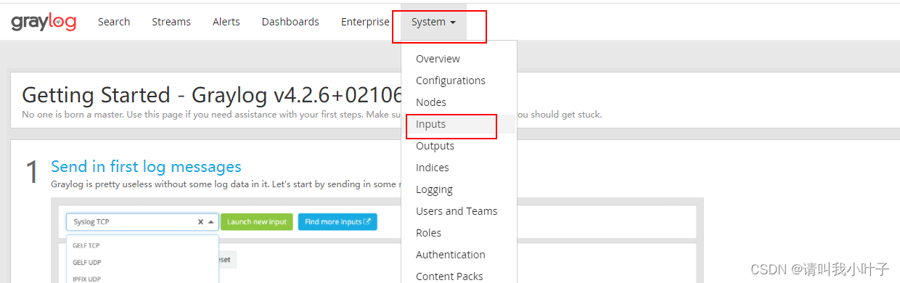
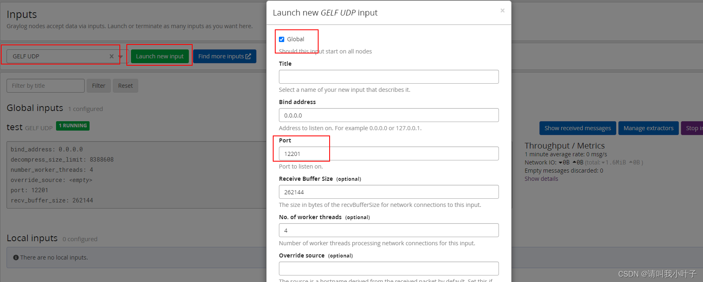

## 安装前置条件
* Graylog(此处使用是版本是4.1.1)
* ES（6.8以上，推荐使用6.8，不要超过7，7和8在启动的时候都有报错）
* Mongodb
## 注意要求
* >https://docs.graylog.org/docs/elasticsearch
* 如上是版本对照表，所以很重要

## Mongodb安装简介
* 从官网下载安装包，或者百度云，此处使用的是msi后缀的形式
* 选择自定义安装，选择安装位置
* 可以跳过图形化界面的安装，即不要选中 install MongoDB Compass
* 有个坑，在4.*的版本后，如果电脑是Win10系统，那么在安装的过程中会报错 Service 'MongoDB Server' (MongDB) failed to start. Verify that you have...，选择忽略即可
* 此时进入Windows的服务里可以看到MongoDB,但是启动会报错，也就无法启动
* 先配置一下环境变量，在Path变量中添加，示例安装位置为D:/mongodb目录下，所以配置的变量为 D:/mongodb/bin
* 使用管理员权限打开CMD
* 运行指令：sc delete MongoDB，表示删除该服务
* 打开 D:/mongodb/bin/mongod.cfg 该文件，如果最后一行是mp:,那么将其删除或者注释掉
* 然后再运行指令 mongod --install -f D:\MongoDB\bin\mongod.cfg
* 完成后就可以在服务中启动MongoDB
* 如果需要远程连接，那么同样需要在D:\MongoDB\bin\mongod.cfg的配置文件中修改，将bindIp修改为0.0.0.0，然后重启服务
* 当然也有可能是防火墙的问题

## Graylog的安装
* > https://blog.csdn.net/abu935009066/article/details/119024223
* Graylog目前只有linux环境或者是Docker,所以自学需要虚拟机
* 由于官网提供的下载非常慢，所以使用了离线安装的方式，资源数据在百度云->java毕生总结->重要资源包下
* 安装：rpm -ivh graylog-server-4.1.1-1.noarch.rpm
* 在编辑配置文件之前由于其中需要使用一段加密盐，所以建议先下载一个插件，sudo yum install pwgen
* 使用：pwgen -N 1 -s 96  来生成一个盐，复制好
* 还需要生成一个哈希密码，使用指令：echo -n "Enter Password: " && head -1 </dev/stdin | tr -d '\n' | sha256sum | cut -d" " -f1
* 然后输入自己想要生成的密码明文，此处设置的是noname,就会生成一个sha的加密字符串，也要复制好
* 编辑配置文件 vim /etc/graylog/server/server.conf，需要修改的配置
  * password_secret：刚才生成的盐
  * root_username=admin:默认的root用户名
  * root_password_sha2：刚才生成的sha加密字符串，明文是noname
  * http_bind_address : 需要修改为0.0.0.0 ，否则无法被远程连接
  * root_timezone ：更改为 Asia/Shanghai
  * allow_highlighting：可选配置，搜索结果高亮，建议改为true
  * elasticsearch_hosts：ES的地址和端口
  * mongodb_uri：mongodb的地址和端口，格式如下：mongodb://127.0.0.1:27017/graylog
* 在启动之前需要确定一下ES的配置，在ES的配置文件中需要修改两个配置 /etc/elasticsearch/elasticsearch.yml
  * network.host: 0.0.0.0
  * cluster.name: graylog 
  * action.auto_create_index: false 
* 这个其实有问题，会导致启动报错，使用false会报错 the [action.auto_create_index] setting value [false] is too restrictive. disable [action.auto_create_index] or set it to [.watches,.triggered_watches,.watcher-history-*]
* 所以可以修改成如下：
    ~~~
    network.host: 0.0.0.0
    cluster.name: graylog 
    action.auto_create_index: .watches,.triggered_watches,.watcher-history-*
    ~~~
* 完成后就可以启动了
    ~~~
    systemctl daemon-reload
    systemctl enable graylog-server.service
    systemctl start graylog-server.service
    ~~~
* 查看启动的状态可以使用
    ~~~
    systemctl status  graylog-server.service
    ~~~
* 此时大概率会启动不了，甚至连日志都不打印，这个是因为JDK没有建立软连接，首先需要定位jdk的位置
    ~~~
    which java
    ~~~
* 然后新建软连接，此处JDK的路径用?来代替
    ~~~
    ln -s ? /usr/bin/java
    ~~~
* 再次启动 systemctl start graylog-server.service，即可，默认的日志文件是在 /var/log/graylog-server
* 此时就可以启动成功了，启动速度非常慢，需要等待一段时间，然后就可以访问  ip:9000来查看页面了
* 帐号密码也就是之前设置的admin,密码是之前设置的noname

## Springboot整合Graylog
* 在整合之前需要先进入Graylog的web界面，创建一个Input
* )
* )
* 由于比较简单，只要勾选个Global然后写个标题就行了，端口可随意更改
* 引入依赖
    ~~~xml
            <dependency>
                <groupId>de.siegmar</groupId>
                <artifactId>logback-gelf</artifactId>
                <version>3.0.0</version>
            </dependency>
            <dependency>
                <groupId>ch.qos.logback</groupId>
                <artifactId>logback-classic</artifactId>
                <version>1.2.3</version>
            </dependency>
    ~~~
* 一个比较完整的logback.xml
    ~~~xml
    <?xml version="1.0" encoding="UTF-8"?>
    <!--
    scan：当此属性设置为true时,配置文件如果发生改变,将会被重新加载,默认值为true。
    scanPeriod：设置监测配置文件是否有修改的时间间隔,如果没有给出时间单位,默认单位是毫秒当scan为true时,此属性生效。默认的时间间隔为1分钟。
    debug：当此属性设置为true时,将打印出logback内部日志信息,实时查看logback运行状态。默认值为false。
    -->
    <configuration scan="false" scanPeriod="60 seconds" debug="false">
        <!-- 定义日志的根目录为项目的根目录,前面不要加"/",加了会默认会认为是根目录,提示 classnotfond -->
        <property name="LOG_HOME" value="D:/log"/>
        <!-- 定义日志文件名称 -->
        <property name="appName" value="logbackBootText"/>

        <!-- ConsoleAppender 用于控制台输出 -->
        <appender name="stdout" class="ch.qos.logback.core.ConsoleAppender">
            <!--
            日志输出格式：
                %d表示日期时间,
                %thread表示线程名,
                %-5level：级别从左显示5个字符宽度
                %logger{50} 表示logger名字最长50个字符,否则按照句点分割。
                %msg：日志消息,
                %n是换行符
            -->
            <layout class="ch.qos.logback.classic.PatternLayout">
                <!--springProfile可以指定某段配置只在某个环境下生效-->
                <!--如果使用logback.xml作为日志配置文件,还要使用profile功能,会有以下错误no applicable action for [springProfile]-->
                <springProfile name="dev">
                    <pattern>%d{yyyy-MM-dd HH:mm:ss.SSS} ----> [%thread] ---> %-5level %logger{50} - %msg%n</pattern>
                </springProfile>
                <springProfile name="!dev">
                    <pattern>%d{yyyy-MM-dd HH:mm:ss.SSS} ==== [%thread] ==== %-5level %logger{50} - %msg%n</pattern>
                </springProfile>
            </layout>
        </appender>

        <!-- 滚动记录文件,先将日志记录到指定文件,当符合某个条件时,将日志记录到其他文件 -->
        <appender name="appLogAppender" class="ch.qos.logback.core.rolling.RollingFileAppender">
            <!--定义日志输出的路径和名称-->
            <!-- 指定日志文件的名称 -->
            <!--这里的scheduler.manager.server.home 没有在上面的配置中设定,所以会使用java启动时配置的值-->
            <!--比如通过 java -Dscheduler.manager.server.home=/path/to XXXX 配置该属性-->
            <!--<file>${scheduler.manager.server.home}/${LOG_HOME}/${appName}.log</file>-->

            <!--当发生滚动时,决定 RollingFileAppender 的行为,涉及文件移动和重命名
                TimeBasedRollingPolicy： 最常用的滚动策略,它根据时间来制定滚动策略,既负责滚动也负责出发滚动。“%d”可以包含一个java.text.SimpleDateFormat指定的时间格式,-->
            <rollingPolicy class="ch.qos.logback.core.rolling.TimeBasedRollingPolicy">
                <!--滚动时产生的文件的存放位置及文件名称 %d{yyyy-MM-dd}：按天进行日志滚动
                %i：当文件大小超过maxFileSize时,按照i进行文件滚动-->
                <fileNamePattern>${LOG_HOME}/${appName}-%d{yyyy-MM-dd}-%i.log</fileNamePattern>

                <!--可选节点,控制保留的归档文件的最大数量,超出数量就删除旧文件。假设设置每天滚动,
            且maxHistory是365,则只保存最近365天的文件,删除之前的旧文件。注意,删除旧文件是,
            那些为了归档而创建的目录也会被删除。-->
                <MaxHistory>365</MaxHistory>
                <!-- 该属性在 1.1.6版本后 才开始支持,日志量最大20GB-->
                <totalSizeCap>20GB</totalSizeCap>

                <!--当日志文件超过maxFileSize指定的大小是,根据上面提到的%i进行日志文件滚动 注意此处配置 SizeBasedTriggeringPolicy 是无法实现按文件大小进行滚动的,必须配置 timeBasedFileNamingAndTriggeringPolicy-->
                <timeBasedFileNamingAndTriggeringPolicy class="ch.qos.logback.core.rolling.SizeAndTimeBasedFNATP">
                    <maxFileSize>100MB</maxFileSize>
                </timeBasedFileNamingAndTriggeringPolicy>
            </rollingPolicy>
            <!-- 日志输出格式： -->
            <layout class="ch.qos.logback.classic.PatternLayout">
                <pattern>%d{yyyy-MM-dd HH:mm:ss.SSS} [ %thread ] ->> [ %-5level ] [ %logger{50} : %line ] ->> %msg%n
                </pattern>
            </layout>
        </appender>

        <!-- 滚动记录文件,先将日志记录到指定文件,当符合某个条件时,将日志记录到其他文件 -->
        <appender name="appLogAppenderBoot" class="ch.qos.logback.core.rolling.RollingFileAppender">
            <rollingPolicy class="ch.qos.logback.core.rolling.TimeBasedRollingPolicy">

                <fileNamePattern>${LOG_HOME}/boot-${appName}-%d{yyyy-MM-dd}-%i.log</fileNamePattern>

                <MaxHistory>365</MaxHistory>

                <timeBasedFileNamingAndTriggeringPolicy class="ch.qos.logback.core.rolling.SizeAndTimeBasedFNATP">
                    <maxFileSize>100MB</maxFileSize>
                </timeBasedFileNamingAndTriggeringPolicy>
            </rollingPolicy>
            <layout class="ch.qos.logback.classic.PatternLayout">
                <pattern>%d{yyyy-MM-dd HH:mm:ss.SSS} [ %thread ] -> [ %-5level ] [ %logger{50} : %line ] -> %msg%n</pattern>
            </layout>
        </appender>

        <appender name="GELF" class="de.siegmar.logbackgelf.GelfUdpAppender">
            <!-- Graylog服务的地址 -->
            <graylogHost>192.168.0.102</graylogHost>
            <!-- UDP Input端口 -->
            <graylogPort>12201</graylogPort>
            <!-- 最大GELF数据块大小（单位：字节），508为建议最小值，最大值为65467 -->
            <maxChunkSize>508</maxChunkSize>
            <!-- 是否使用压缩 -->
            <useCompression>true</useCompression>
            <encoder class="de.siegmar.logbackgelf.GelfEncoder">
                <!-- 是否发送原生的日志信息 -->
                <includeRawMessage>false</includeRawMessage>
                <includeMarker>true</includeMarker>
                <includeMdcData>true</includeMdcData>
                <includeCallerData>false</includeCallerData>
                <includeRootCauseData>false</includeRootCauseData>
                <!-- 是否发送日志级别的名称，否则默认以数字代表日志级别 -->
                <includeLevelName>true</includeLevelName>
                <shortPatternLayout class="ch.qos.logback.classic.PatternLayout">
                    <pattern>%m%nopex</pattern>
                </shortPatternLayout>
                <fullPatternLayout class="ch.qos.logback.classic.PatternLayout">
                    <pattern>%d - [%thread] %-5level %logger{35} - %msg%n</pattern>
                </fullPatternLayout>
                <!-- 配置应用名称（服务名称），通过staticField标签可以自定义一些固定的日志字段 -->
                <staticField>app_name:zzl-test</staticField>
            </encoder>
        </appender>

        <!--root是默认的logger,root与logger是父子关系,没有特别定义则默认为root,任何一个类只会和一个logger对应,
        要么是定义的logger,要么是root,判断的关键在于找到这个logger,然后判断这个logger的appender和level。 -->
        <root level="info">
            <!--定义了三个appender,日志会通过往这这些appender里面写-->
            <appender-ref ref="GELF"/>
            <appender-ref ref="stdout"/>
            <appender-ref ref="appLogAppender"/>
            <appender-ref ref="appLogAppenderBoot"/>
        </root>

        <!--logger主要用于存放日志对象,也可以定义日志类型、级别-->
        <!--name：表示匹配的logger类型前缀,也就是包的前半部分-->
        <!--level：要记录的日志级别,包括 TRACE < DEBUG < INFO < WARN < ERROR 越往后越精简-->
        <!--additivity：作用在于children-logger是否使用 rootLogger配置的appender进行输出,-->
        <!--false：表示只用当前logger的appender-ref,true：表示当前logger的appender-ref和rootLogger的appender-ref都有效-->
        <!--    Spring framework logger 记录 spring 的日志 -->
        <logger name="org.springframework.boot" level="debug" additivity="false">
            <appender-ref ref="appLogAppenderBoot"/>
        </logger>

        <!--通过 LoggerFactory.getLogger("mytest") 可以获取到这个logger-->
        <!--由于这个logger自动继承了root的appender，root中已经有stdout的appender了，自己这边又引入了stdout的appender-->
        <!--如果没有设置 additivity="false" ,就会导致一条日志在控制台输出两次的情况,原因是:没有写additivity会用 rootlogger 输出日志,而它下面有三个appender,单appLogAppenderBoot经过自定义,不会输出,stdout则会打印两遍-->
        <!--additivity表示要不要使用rootLogger配置的appender进行输出-->
        <logger name="com.tuniu" level="debug" additivity="false">
            <!--即输出到appLogAppender,又输出到stdout-->
            <appender-ref ref="appLogAppender"/>
            <appender-ref ref="stdout"/>
        </logger>

        <!--对于类路径以 com.tuniu 开头的Logger,输出级别设置为 warn,-->
        <!--这个logger没有指定appender，它会继承root节点中定义的那些appender-->
        <!--注意,如果名称相同,两个 logger 会有属性互补机制;而且以最后一个加载的属性为准,可以理解为 boot的 bootstrap.properties与 application.yml-->
        <!--
            <logger name="com.tuniu" level="warn"/>
            如果将上面的这段配置放开,就如同写了:
            <logger name="com.tuniu" level="warn" additivity="false">
                <appender-ref ref="appLogAppender"/>
            </logger>
        -->

        <!--由于设置了 additivity="false" ，所以输出时不会使用rootLogger的appender-->
        <!--但是这个logger本身又没有配置 appender，所以使用这个logger输出日志的话就不会输出到任何地方-->
        <!--    <logger name="mytest2" level="info" additivity="false"/>-->

    </configuration>
    ~~~
* 如果ES选用了低的版本，那么很有可能会报出时间格式的异常
* 在程序中直接使用Lombok的@Sl4j注解即可。此时在Graylog的可视化界面就能收到消息了
* 如果是使用虚拟机，且程序不在本机上，那么需要注意设置虚拟机网络的桥接转发规则，因为如上图使用的是UDP连接，所以桥接转发规则也要是UDP，如果使用了TCP就不能被转发成功，大坑！！！！